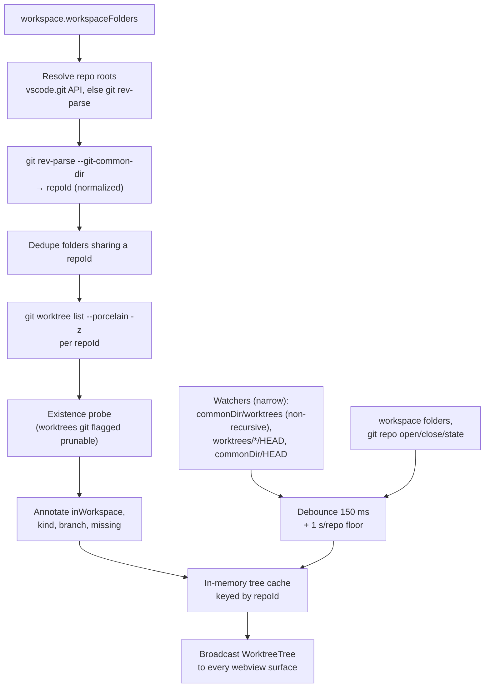
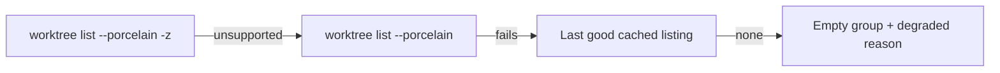

# Worktree Domain Model Design

> **Ref**: docs/DESIGN.md § 13.2 — the "Repo roots, worktree enumeration, identity, cache, watch" row
> **Consumer**: `asimov-plan` reads this to turn a PLAN.md task into spec deltas and builder tasks.

Discovery, identity, and freshness for the git worktrees shown in the AI Vault's Worktree
view. Owns **what a worktree is** and **how we learn it changed**. Agent rows attached to a
worktree are specified in [worktree-agent-presence.md](worktree-agent-presence.md); the
host↔webview contract in [worktree-rpc.md](worktree-rpc.md).

## 1. Overview



The tree is **push-based**, like the vault list: the host owns freshness and posts a new
tree; the webview never polls.

## 2. Data Model

Host-owned types, mirrored to the webview verbatim over postMessage. No datastore — the
tree is derived state, rebuilt from git on invalidation.

```
WorktreeTree {
  repos:      WorktreeRepo[]      // workspace-folder order, deduped by repoId
  unreadable: { count: number; reasons: string[] }   // same shape as VaultListResult
  gitAvailable: boolean           // false when no usable `git` executable was found
}

WorktreeRepo {
  repoId:     string              // normalized absolute git common dir — see § 3.1
  label:      string              // basename of the main worktree path
  mainPath:   string              // normalized path of the main worktree
  worktrees:  WorktreeInfo[]      // ordered per § 3.4
  degraded?:  string              // this repo's listing failed; last good tree retained
}

WorktreeInfo {
  id:          string             // normalized absolute worktree path — see § 3.1
  displayPath: string             // path exactly as git reported it (copy / reveal use this)
  kind:        "main" | "linked"
  bare:        boolean
  branch?:     string             // short name; absent when detached or bare
  head?:       string             // 40-char sha; absent when the worktree has no commit
  detached:    boolean
  locked:      boolean
  lockReason?: string
  prunable:    boolean            // registration is stale (git says so, or § 3.3 proved it)
  missing:     boolean            // path does not exist on disk
  inWorkspace: boolean            // a workspace folder is this path, or is inside it — see below
}
```

`WorktreeInfo` deliberately carries **no agent, activity, or dirty-state field**. Presence
is a separate projection with a different freshness model (see
[worktree-agent-presence.md](worktree-agent-presence.md) § 2); merging them here would make
one stale git read able to erase live agent evidence.

**`inWorkspace` tests containment in the direction that actually occurs.** The question is
whether the user has this worktree open, and a user who opened `repo-wt/packages/api` has the
worktree open — so the test is *a workspace folder equals this path or lies inside it*, not
the reverse. Testing "this path is inside a workspace folder" would answer false for exactly
that case, and false-negative here means the UI offers "add to workspace" for a folder already
in the workspace.

## 3. Algorithm / Logic

### 3.1 Path normalization — the shared invariant

Every path that crosses a comparison boundary — worktree paths from git, pane cwds from
OSC 7, session cwds from an agent's PID registry, action inputs — passes through **one**
normalizer before it is compared or used as an id.

```
normalizeWorktreePath(p):
  1. Reject empty / non-absolute → null
  2. realpath(p); on ENOENT, realpath the nearest existing ancestor and re-append the
     remaining segments (a missing worktree must still normalize)
  3. Unicode NFC
  4. Collapse repeated separators; strip trailing separators (except a bare root)
  5. Windows only: uppercase the drive letter; compare case-insensitively
  6. Return with the platform's native separator
```

Step 2 is not optional. On macOS a pane's OSC 7 cwd reports `/private/var/...` while
`git worktree list` reports `/var/...`; without realpath on both sides every worktree under
a symlinked root shows zero agents.

**`WorktreeInfo.id` is the normalized path, and nothing else** — a path belongs to exactly
one worktree, so no composite id and no separator-escaping problem exists. `repoId` is the
normalized git common dir by the same rule.

Containment — "is this folder inside that worktree / repo root?" — is a second comparison
and is **not** `startsWith(root + separator)`, which builds `//` at a filesystem root and
matches nothing. It goes through the shared boundary helper (`src/utils/pathBoundary.ts`,
extracted from the git decoration provider), which handles root-terminated roots, Windows
separator drift, and drive-letter case.

### 3.2 Repo root resolution

1. Read `vscode.workspace.workspaceFolders`. Empty → empty tree, `gitAvailable` untouched.
2. Ask the built-in git extension (`vscode.git`, API v1 — types already vendored in
   `src/providers/git.ts`) for `api.repositories`. For each workspace folder, the matching
   repository is the one whose `rootUri` is the longest prefix of the folder.
3. Folder with no matching repository → run `git rev-parse --path-format=absolute --show-toplevel`
   in that folder. Non-zero exit → the folder is not a repo; skip it silently (not an
   `unreadable` reason — "not a git repo" is normal).
4. For each resolved root, run `git rev-parse --path-format=absolute --git-common-dir`.
   Normalize the result → `repoId`. On git < 2.31 `--path-format` is unsupported; fall back
   to the bare `--git-common-dir` and resolve a relative answer against the root. An old git
   does not *fail* on the flag — it exits **zero** and echoes the flag back as an output
   line, so only an exit-zero echo marks the capability unsupported. A non-zero exit is that
   repository's own failure and must not change the shared capability, whatever its stderr
   happens to mention.
5. **Dedupe by `repoId`.** A workspace that has both a repo and one of its own linked
   worktrees open as separate folders resolves to a single `repoId` and therefore a single
   group — not two. This is why grouping keys on the common dir and never on `rootUri`.

Group order follows workspace-folder order, so the Worktree view's groups sit in the same
order as the Explorer's roots.

### 3.3 Worktree enumeration

Per unique `repoId`, run in the main worktree path:

| Attempt | Command | Requires |
|---------|---------|----------|
| Primary | `git worktree list --porcelain -z` | git ≥ 2.36 |
| Fallback | `git worktree list --porcelain` | any |

The `-z` form is preferred because a path containing a newline corrupts the line-delimited
form. Detect the unsupported-`-z` failure by **exit code 129** — the message text is
locale-dependent and is only a backup signal — then remember it process-wide and stop
retrying, the same capability-cache shape orca uses
(`orca/src/relay/git-handler-worktree-list.ts:19`).

The fallback exists for `-z` alone. **Everything else in this document assumes git ≥ 2.31**
(released 2021), which is what supplies the `locked` and `prunable` annotations. A separate
compatibility path for older git would mean carrying an existence-probe branch and a second
set of expectations for a population that has effectively disappeared; a version below that
floor is reported as unsupported instead.

Porcelain records are separated by a blank record (`\0\0` under `-z`) and carry:

| Token | Maps to | Notes |
|-------|---------|-------|
| `worktree <path>` | `displayPath`, `id` | First record is always the main worktree |
| `HEAD <sha>` | `head` | Absent on an unborn branch |
| `branch refs/heads/<name>` | `branch` (short name) | Absent when detached |
| `detached` | `detached: true` | |
| `bare` | `bare: true` | Bare main repo; rendered but never a launch target |
| `locked [<reason>]` | `locked`, `lockReason` | git ≥ 2.31 |
| `prunable [<reason>]` | `prunable` | git ≥ 2.31 |

**Record splitting and decoding.** Records split on the delimiter *byte*, before anything is
decoded. Only `worktree <path>` decodes strictly: it is the sole identity-bearing field, and
bytes UTF-8 cannot represent must be reported rather than substituted into a path naming a
different directory. `HEAD`, `branch` and the lock/prunable reasons decode leniently — they
are labels, and a replacement character in one costs less than dropping a worktree that
really exists. `kind` follows the record's **ordinal in git's output**, not the number of
records accepted so far, so a skipped leading record cannot promote a linked worktree to
main.

In the line-delimited form only, a record carrying a field matching no token above is
skipped: git emits paths **unquoted**, so an embedded newline is indistinguishable from a
field break and can be detected but never decoded. Every skipped record increments
`unreadable.count` while `unreadable.reasons` is deduplicated for display — the two numbers
differ by design.

**Missing-directory probe.** `missing` is set from a cheap `stat` of the *linked, unlocked*
worktrees git already flagged `prunable`, with concurrency 8, so the UI can say "missing"
instead of the vaguer "prunable". Never probe the main worktree or a locked one: a lock
shields a registration whose directory is intentionally absent (removable media, unmounted
volume). The concurrency bound mirrors
`orca/src/relay/git-handler-worktree-list.ts:42`.

`missing` means *absent*, so only `ENOENT` and `ENOTDIR` set it. A probe that fails for any
other reason — `EACCES`, a descriptor limit, a network-filesystem blip — leaves the worktree
as the `prunable` git already called it, which is the weaker and safer claim.

### 3.4 Ordering within a group

1. `kind === "main"` first, always.
2. Then linked worktrees that have at least one live pane in this window, newest pane
   activity first. **The ranking key is owned by the presence projection**
   (`worktree-agent-presence.md` § 3.7), not by this listing — the tree has no activity data
   of its own. When presence has not resolved yet, treat every worktree as having none, so the
   order stabilizes on the next push rather than jumping between two orders mid-render.
3. Then the rest by `branch` ascending (case-insensitive), `id` ascending as the tie-break.
4. `missing` / `prunable` worktrees sort last within their bucket.

Every comparison ends in an `id` tie-break so the order never depends on readdir order.

### 3.5 Freshness — what invalidates what

| Signal | Watch target | Invalidates |
|--------|--------------|-------------|
| Worktree added / removed | base `<repoId>`, glob `worktrees/*` — one path segment, create + delete only | That repo's listing |
| Linked worktree switched branch | base `<repoId>`, glob `worktrees/*/HEAD` — change events included | That repo's listing |
| Main worktree switched branch | base `<repoId>`, glob `HEAD` — change events included | That repo's listing |
| Repo state changed (open repos) | git API `onDidChangeState` on the matching repository | That repo's listing |
| Workspace folders changed | `workspace.onDidChangeWorkspaceFolders` | Whole tree, forced (re-resolve roots) |
| Repo opened / closed in VS Code | git API `onDidOpenRepository` / `onDidCloseRepository` | Whole tree |
| User pressed refresh | — | Whole tree, forced |

All three watches are based at the common dir itself rather than at `<repoId>/worktrees`: a
repository with no linked worktrees has no `worktrees/` directory yet, and a watcher based on
a directory that does not exist never sees it appear.

The two git-API rows are **not wired** as of WT-001.2. The extension acquires no `vscode.git`
API handle of its own today — the only acquisition pipeline is fused into
`createGitDecorationProvider` — so those signals wait on a change that extracts it. The three
filesystem watches plus the workspace-folder event cover everything except `git init` inside a
folder that was already open.

Watching uses `subscribePattern` on the shared watcher pool
(`src/providers/fsWatcherPool.ts:89`), which debounces each event kind at
`DEBOUNCE_MS = 150` and dedupes pending URIs. A worktree listing is **never polled on a
timer**.

**Watch narrowly — `<repoId>/worktrees/**` is an event storm, not a watch.** Each
`.git/worktrees/<name>/` holds `index`, `FETCH_HEAD`, `ORIG_HEAD`, `COMMIT_EDITMSG`, `logs/`
and `refs/` — files that churn on nearly every git operation. An agent working inside a linked
worktree writes to them continuously, and a recursive watch turns that into a relist (two git
spawns), a presence rebuild, and a broadcast to every webview surface, several times a second,
sustained. The membership question needs only the non-recursive directory; the branch question
needs only the two `HEAD` targets.

**A minimum rebuild interval of 1 s per repo applies to watcher-driven rebuilds**, independent
of the pool's 150 ms debounce. The debounce collapses a burst; the interval bounds a
*sustained* stream, which is the shape an active agent actually produces. User-initiated
refresh and post-mutation rebuilds bypass it — those are forced and expected to be immediate.

The git API's repository state-change event is a supplementary signal worth taking where it is
free: for repositories VS Code already has open it fires on branch changes without any watcher
at all, and it is immune to `files.watcherExclude`. It does not replace the filesystem watch,
because a repo present only as a linked worktree of an unopened parent gets no such event.

Two properties of the pool that this design must not assume away:

- **`subscribe()` is the wrong entry point here.** It creates its watcher with
  `ignoreChange = true` (`fsWatcherPool.ts:184`), so a file modified in place produces no
  event. A branch switch rewrites `HEAD` in place — using `subscribe()` would silently never
  fire. Only `subscribePattern`, with the **change** handler supplied alongside create and
  delete, sees it.
- **The pool does not pause on window blur.** It listens to window-state changes solely to
  fire a rehydrate signal on the blur→focus edge (`fsWatcherPool.ts:172-180`); watchers keep
  running while the window is unfocused. If this view wants unfocused-window quiescence it
  must implement it, or accept rebuilds in the background. Given a rebuild is two git calls
  per affected repo and events are debounced, accepting them is the default; the polled
  external scan in [worktree-agent-presence.md](worktree-agent-presence.md) § 3.7 is the part
  that genuinely must pause, because it is the part with no event to wait for.

Two watcher caveats to honour:

- `files.watcherExclude` ships with `**/.git/objects/**` and `**/.git/subtree-cache/**`
  only, so `.git/worktrees` is watchable — but a user may have added a broader `**/.git/**`
  exclude. Treat "no event ever arrived" as a possibility, not an impossibility: the manual
  refresh affordance in the panel header is the documented recovery, and the view also
  re-reads on show.
- The common dir of a repo opened *as* a linked worktree lives outside every workspace
  folder. Watch it with an absolute-base `RelativePattern`, and when the watcher cannot be
  created, fall back to re-reading on view-show only, recording `degraded` on that repo.
- **The pool reports that failure.** `subscribePattern` returns a `PatternSubscription`
  carrying `active` and, when false, a `failureReason` — so a caller can tell a working
  subscription from a dead one instead of silently believing it is receiving events. A
  repository whose watch did not come up in full is marked `degraded` with that reason on
  every rebuild, and stays reachable by a forced refresh.

### 3.6 Caching

| Cache | Key | Lifetime | Invalidation |
|-------|-----|----------|--------------|
| Per-repo worktree listing | `repoId` | Process (in-memory only) | § 3.5 signals |
| Git capability (`-z`, `--path-format`) | Capability name, process-wide | Positive: process. Negative: 30 min | Negative results expire, so the user we just told to upgrade git is not stranded on the fallback for the rest of the session |
| Resolved repo roots | — | Process | Workspace-folder / repo open-close events |

Nothing is persisted to disk. A cold window rebuilds the tree from git on first show; the
cost is one `rev-parse` plus one `worktree list` per repo, which is milliseconds.

> **Key format source of truth**: [DESIGN.md](../DESIGN.md) § 15

## 4. Interface

| Operation | Identifier | Summary |
|-----------|-----------|---------|
| Read tree | `requestWorktreeTree` | Webview asks for the current tree |
| Push tree | `worktreeTreeResponse` | Host pushes a rebuilt tree and its presence projection in one envelope (request reply *and* watcher-driven) |
| Declare visibility | `worktreeViewVisibility` | One surface says whether it is showing the view; gates every push to it |

> **Full contracts**: [worktree-rpc.md](worktree-rpc.md) § 2

## 5. Error Handling & Limits

| Condition | Behavior | User-Facing Result |
|-----------|----------|--------------------|
| No `git` executable | `gitAvailable: false`, empty repos | View explains git is required; no error toast |
| Workspace folder is not a repo | Skipped | Absent from the view; not counted as unreadable |
| `worktree list` fails for one repo | Keep that repo's **last good** listing, set `degraded` | Group renders with a "stale" affordance; other repos unaffected |
| `worktree list` fails on first ever read | Repo appears with zero worktrees + `degraded` | Group renders as unreadable with a reason |
| `-z` unsupported | Fall back to line-delimited parse, remember | Invisible |
| Porcelain record unparseable | Skip that record, add one deduped reason to `unreadable.reasons` | Inline notice, same pattern as the vault's unreadable count |
| Watcher cannot be created | Repo marked `degraded`; refresh-on-show still works | Stale data possible until refresh |
| Git command exceeds 10 s | Kill, treat as a failure for that repo (keep last good) | As above |

### Fallback Chain



**Never downgrade on a transient failure.** A repo that listed three worktrees a second ago
and now fails to list keeps showing three, marked stale. Dropping to zero would read as
"the user deleted their worktrees" — the same degraded-scan stickiness rule the agent
research calls out (`docs/research/20260822-orca-deep-dive/01-agent-detection.md` § 3.5).

## 6. Edge Cases

| Condition | Behavior |
|-----------|----------|
| Zero workspace folders | Empty tree; view shows an "open a folder" empty state |
| Workspace folder is itself a linked worktree | Resolves to the parent repo's `repoId`; the whole repo's worktrees are listed, with `inWorkspace` true on that one |
| Two workspace folders in the same repo | One group (deduped by `repoId`) |
| Two workspace folders in different repos | Two groups — the case the user asked for |
| Repo with only a main worktree | One group, one row. Still rendered — the row is the launch surface |
| Bare main repo | `bare: true`; rendered, but every path-dependent action is disabled |
| Linked worktree nested inside the main worktree | Both listed; pane→worktree mapping uses longest-prefix so a pane inside the nested one is not attributed to the parent |
| Worktree path contains spaces / newlines / non-ASCII | `-z` parse handles it; the line-delimited fallback drops the record and reports it as unreadable rather than mis-parsing |
| Detached HEAD | `branch` absent; UI shows the short sha |
| Unborn branch (fresh `git init`) | `head` absent; row still renders |
| Locked worktree with a missing directory | `locked: true`, `missing` left false — a lock is an explicit "do not touch" |
| Submodule directory | Its own `git-common-dir`; only surfaces if it is a workspace folder |
| Repo on a network / slow filesystem | 10 s command timeout, keep-last-good |
| `.git` file (linked worktree) vs `.git` dir | Handled by `rev-parse`; never parsed by hand |

## 7. Scale & Performance

| Dimension | Growth Axis | Bound |
|-----------|-------------|-------|
| Git commands per rebuild | per repo, not per worktree | 2 (`rev-parse`, `worktree list`) |
| Rebuild frequency | watcher events | Debounced 150 ms **and** floored at one rebuild per second per repo. Watchers keep running while the window is unfocused — the pool does not pause |
| Existence probes | per worktree git flagged prunable | Concurrency 8 |
| Tree payload | per worktree | Metadata only — no file lists, no diffs |
| Repos per window | workspace folders | Listings run concurrently, bounded at 8, assembled in workspace-folder order — so one repo hitting the 10 s command timeout cannot stall its siblings |

Rebuilds are per-`repoId` and merged into the pushed tree, so a watcher event in repo A does
not re-shell into repo B.

## 8. Testing

### Test Cases

- [ ] Two workspace folders in two repos → two groups, workspace-folder order
- [ ] Workspace folder that is a linked worktree of an already-listed repo → one group, not two
- [ ] `--path-format` unsupported → relative common dir resolved against the root
- [ ] `-z` unsupported → line-delimited fallback parses the same worktrees, capability remembered
- [ ] Porcelain with `detached`, `bare`, `locked <reason>`, `prunable <reason>` → mapped fields
- [ ] Git below the supported floor → reported as unsupported, not silently degraded
- [ ] Worktree git flagged prunable whose directory is gone → `missing` set
- [ ] Locked worktree with a missing directory → not probed, `missing` stays false
- [ ] A workspace folder *inside* a worktree → that worktree is `inWorkspace: true`
- [ ] Sustained writes to `.git/worktrees/<name>/index` produce **no** rebuild; a write to that worktree's `HEAD` produces exactly one
- [ ] A stream of watcher events faster than the floor collapses to one rebuild per second per repo; a forced refresh is not delayed by it
- [ ] A watcher that cannot be created reports failure to its caller and marks the repo degraded, rather than returning an inert subscription
- [ ] macOS symlinked root: git reports `/var/...`, pane reports `/private/var/...` → both normalize equal
- [ ] Windows drive-letter case difference → normalizes equal
- [ ] `worktree list` fails after a good read → last good listing retained, `degraded` set, count unchanged
- [ ] `worktree list` fails on first read → empty group with a reason, other repos still populated
- [ ] Ordering: main first; equal branches tie-break on `id`; missing sorts last
- [ ] Watcher event on `<repoId>/worktrees` → exactly one rebuild for that repo, none for siblings
- [ ] No `git` on PATH → `gitAvailable: false`, no thrown error

### Quality Criteria

| Metric | Target | How to Measure |
|--------|--------|----------------|
| Rebuild latency, 1 repo / 10 worktrees | < 150 ms | Unit bench over a fixture repo |
| Git invocations per watcher burst | 1 per affected repo | Spy on the command runner |

---

> **Sync rule**: the § 1 diagram must show the same steps and data flows as the prose below.
> **Registry**: values this doc shares with others belong in [DESIGN.md](../DESIGN.md) § 15 — do not keep a second copy here.
