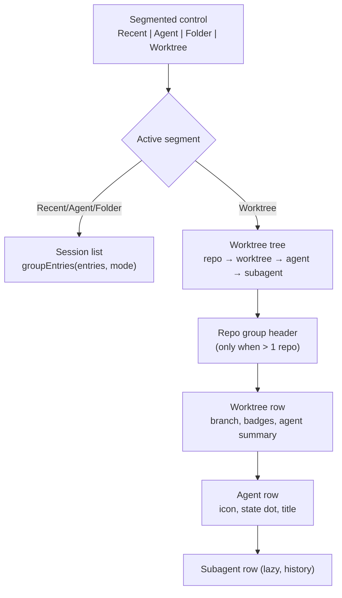

# Worktree Panel UI Design

> **Ref**: docs/DESIGN.md § 13.2 — the "The fourth segment, tree rendering, states, keyboard" row
> **Consumer**: `asimov-plan` reads this to turn a PLAN.md task into spec deltas and builder tasks.

Structure, states, and interaction for the Worktree view. Data comes from
[worktree-model.md](worktree-model.md) and
[worktree-agent-presence.md](worktree-agent-presence.md); actions from
[worktree-actions.md](worktree-actions.md).

## 1. Overview



## 2. Where it lives

The AI Vault panel already renders a segmented control with `role="tablist"` for the
grouping modes `recent | agent | folder` (`src/webview/vault/VaultPanel.ts:341`). Worktree
becomes a **fourth segment that swaps the panel body**, not a fourth grouping mode.

The distinction is load-bearing: `groupEntries()`
(`src/webview/vault/grouping.ts:41`) buckets already-loaded `VaultSessionEntry[]`, so a
worktree with no sessions would vanish. A worktree exists — and is worth showing and acting
on — with zero agents. It is a different entity, so it gets a different body.

Consequences to implement:

| Element | Sessions view | Worktree view |
|---------|---------------|---------------|
| Segmented control | 4 segments, unchanged widget | same |
| Search input | Filters session titles | Filters worktree branch + path, and agent titles |
| "This folder only" filter | Active | Hidden — the tree is already folder-scoped |
| Refresh button | Refreshes sessions | Forces a tree rebuild |
| Preview overlay | Opens on row activation | Opens on **agent row** activation, unchanged component |

Activating an agent row opens the existing floating session preview
(`PreviewController`) for its `entryId`. The Worktree view adds a navigation surface; it does
not add a second transcript renderer.

### 2.1 Persisted state

`WebviewState` currently stores `vaultGroupMode?: "recent" | "agent" | "folder"`
(`src/webview/state/WebviewState.ts:95`). Rather than widening that union — which would let
a *view* value flow into `groupEntries()` — add a sibling key:

```
vaultView?:      "sessions" | "worktree"      // which body is shown
vaultGroupMode?: "recent" | "agent" | "folder" // grouping WITHIN the sessions body
worktreeCollapsed?: string[]                   // collapsed repoIds and worktreeIds
worktreeExpandedRows?: string[]                // expanded agent rowIds
```

Existing persisted `vaultGroupMode` values stay valid and keep their meaning; a state written
by an older build simply has no `vaultView` and falls through to the default below.

**An absent array and an empty one mean different things, and conflating them loses user
state.** `worktreeCollapsed` absent means nothing was ever saved, so the view seeds its
defaults — collapsed unless the worktree is a workspace folder. `worktreeCollapsed: []` means
the user expanded everything, and seeding defaults over it would silently re-collapse what
they opened. The set records expansion by omission, so the distinction cannot be recovered
from its contents; only its presence carries it. Seeding is therefore one-shot, on the first
tree a session sees, and never re-applied to a worktree already decided.

A collapsed **repoId** is honoured only while a repo group header is rendered (§ 3.1 draws
none for a single repo). Otherwise a set persisted during a two-repo session would hide the
only repo's rows with no control left on screen to reopen them.

### 2.2 Default view

The user asked for Worktree to be the default. Applied as:

1. A persisted `vaultView` always wins — an explicit user choice is never overridden.
2. With no persisted choice: default to `worktree` when the workspace has at least one git
   repo, otherwise `sessions` with the existing default grouping.

Rule 2 exists because a workspace with no repo would open on a permanently empty view, which
reads as a broken panel rather than a default.

## 3. Tree structure

Four levels, each with a fixed role:

| Level | Row kind | Purpose | Rendered when |
|-------|----------|---------|---------------|
| 1 | Repo group header | Names the repository | Only when the tree holds > 1 repo (§ 3.1) |
| 2 | Worktree row | The branch, its state, and its agent summary | Always |
| 3 | Agent presence | Collapsed pill, or an "N agents" header plus one row per agent | Only when the worktree has ≥ 1 agent |
| 4 | Subagent row | Delegated work, as history | Only on expanding an agent row |

### 3.1 Repo group header

Rendered **only when the tree holds more than one repo**. A single-repo workspace — the
common case — shows worktree rows at the top level with no redundant wrapper.

Header shows: repo label, worktree count, and a `degraded` affordance when that repo's last
listing failed. Collapsible; collapse state persisted by `repoId`.

### 3.2 Worktree row

| Element | Content | Rule |
|---------|---------|------|
| Leading icon | **State-aware**: the branch glyph at rest, replaced by a working indicator while any agent inside is `running` | One glyph slot, never two. This is the row's at-a-glance signal and the reason the row needs no separate status column |
| Primary label | Branch short name | Detached → short sha; bare → the label `bare` |
| Main marker | A pill on `kind === "main"` | A pill, not a badge mixed in with state badges — it names *which* worktree, not *how* it is |
| In-workspace marker | Shown when `inWorkspace` | Distinguishes "open here" from "exists on disk" |
| Badges | `locked`, `missing`, `prunable` | Only when true; `missing` outranks `prunable` in the display |
| Agent presence | Collapsed pill or expanded header — see § 3.5 | |

**The path is not a row element.** The reference shows branch name and nothing else, and it
is right: at sidebar width a truncated path crowds out the branch, which is the identity the
user actually navigates by. The path lives in the row tooltip, the context menu's copy
action, and the create form. This replaces an earlier decision to truncate the path from the
left on every row.

The agent presence block is the row's most valuable pixel. Group by state first, identity
second — "2 waiting, 1 working" is the question a user scanning the list is asking; "which
model" is the follow-up.

### 3.3 Agent row

| Element | Content | Rule |
|---------|---------|------|
| Disclosure gutter | A chevron when the row has a **session to read**, otherwise an empty slot of the same width | **Always occupies space.** Reserving the gutter is what keeps state dots aligned down a mixed list of rows with and without children. Offered by the session, never by children already held: the roster is read lazily on expansion, so gating the chevron on children would leave nothing to click to cause the read, and the row could never get any |
| State dot | `running` / `waiting` / `idle` / `exited` | Colour from the state, not from the agent. Fixed width, so a column of rows scans vertically |
| Agent icon | From the existing `AGENT_ICONS` map (`src/webview/vault/agentIcons.ts`) | Absent when `agent` is unset — never a guessed icon. Also absent on subagent rows (§ 3.4) |
| Title | Decoration-stripped pane title, else the session title | Spinner frames stripped before display |
| Preview | The session's latest message or current tool, one line, after the title | Secondary emphasis; it is context, not identity. Truncates first when width is scarce |
| Model | The model id, when known | Optional and monospace, bounded width. Omitted entirely when unknown — never a placeholder |
| Child count | `+N` when the row has collapsed subagents | Disappears when expanded; the children are then visible. Absent until the roster has actually been read — an unread row has no count to state, and `+0` would claim one |
| Age | Relative time, right-aligned | Fixed-width column so titles truncate against a stable edge. Compact form (`now`, `5m`, `1h`, `3d`) |
| Scope marker | Only on `scope: "external"` | See § 4 |
| Confidence marker | Derived from `activitySource`, shown when that source is a fallback one | A quiet marker, not an error. Identity confidence is derived from `agentSource` separately and expressed by the icon's presence or absence, not by this marker — a row can be uncertain about one and sure of the other |

**Age means two different things and must not be conflated.** For a row that has finished, it
is time since it finished. For a row still working, it is time since the current state began.
One clock per row, chosen by state — a row must never rank as freshly done while displaying a
stale age.

Truncation order under pressure: preview first, then title, never the age, the model chip's
own bound, or the leading gutter and icons. The state dot and agent icon are the row's whole
point at narrow widths.

### 3.4 Subagent row

Rendered indented exactly one level under its agent row, on expansion only.

| Element | Rule |
|---------|------|
| Depth | One level, always. Subagents of subagents are not a level the tree renders |
| Agent icon | **Never shown.** A subagent's type is its role name (`pr-reviewer`, `librarian`), not an installed agent, so the icon map has nothing correct to draw and would render an unknown glyph. The indentation already says whose child this is |
| Primary text | The delegated task description, falling back to the role name |
| Activation | Focuses the **parent's** pane. A subagent has no pane of its own; sending the user to a pane that does not exist would be a dead click |
| Freshness | Children inherit the parent's freshness. When the parent's evidence goes stale, every child decays with it, together — a stale parent cannot have provably-working children |

An expanded row always renders **one of four section states**, never silence:

| Roster | Section shows |
|--------|---------------|
| Not read yet | that it is reading |
| Read, rows found | those rows, plus an admission if the reader dropped others |
| Read, nothing found, reader claims it is whole | that the session delegated nothing |
| Read, nothing found, reader admits omission — or the read failed | that it could not be read, with the reason |

The last row is the one that matters. Emptiness is a claim, and the strongest one this section
can make; a read that admits it dropped records has not earned it. Silence is the same claim
made implicitly, which is why an expanded row is never blank.

Because in this phase these are transcript-derived history and not a live roster
(`worktree-agent-presence.md` § 3.6), they must **not** reuse the live state dot vocabulary.
Use a distinct, visibly historical treatment and a section label that says so. A completed
subagent from twenty minutes ago drawn with the same dot as a live one is the exact class of
lie the evidence model exists to prevent. Once the hook phase supplies a live roster, these
rows adopt the live vocabulary — that flip is the visible payoff of Phase 6, and it must not
happen a moment earlier.

### 3.5 Collapsed and expanded agent presence

The tree has **two independent disclosure levels**, and conflating them produces a control
that cannot express "show me this worktree's agents but not every agent's children".

| Level | Control | Collapsed shows | Expands to |
|-------|---------|-----------------|------------|
| Worktree → agents | The `N agents` header row, or the collapsed pill | Grouped state dots, up to 3 icons per state, `+N` overflow | One § 3.3 row per agent |
| Agent → subagents | A chevron in that row's own disclosure gutter, on any row with a session | `+N` on the agent row, once read | The § 3.4 section — its rows, or the state that explains why there are none |

Both states are persisted independently (§ 2.1): `worktreeCollapsed` for the first,
`worktreeExpandedRows` for the second. Persisted expansion is reconciled against the rows
presence actually carries, not accumulated: a row that lost its session keeps no expansion,
because the chevron that would collapse it is offered by the session.

The rest of this section describes the first level — two presentations of the same rows, both
attached under the worktree row.

| | Collapsed | Expanded |
|---|---|---|
| Shape | One inline pill | A header row plus one row per agent |
| Content | State dots grouped by state, each carrying up to 3 agent icons, then a `+N` overflow count | Header reads `N agents`; below it the § 3.3 rows |
| Affordance | A chevron on the pill's trailing edge | A chevron on the header row |
| Purpose | Scanning many worktrees | Working inside one |

The collapsed pill groups by state before identity and overflows with a count rather than
shrinking icons, so a worktree with nine agents stays the same height as one with two. This
follows the reference's compact summary
(`orca/src/renderer/src/components/sidebar/worktree-card-compact-agents.tsx:143`).

The expanded header is a real row, not a label: it is the collapse control, and it carries
the count that the pill would otherwise have to keep showing. Expansion state is persisted
per worktree (§ 2.1).

## 4. Truthfulness rules the UI must encode

These are not stylistic preferences; each one prevents a specific false claim.

1. **An external row never offers focus.** There is no pane in this window to reveal. Its
   actions are open-folder, resume-here, copy-resume-command.
2. **An external row is visibly labelled** as running outside this window. It exists so the
   view does not claim a busy worktree is idle.
3. **A fallback-source activity is marked as such.** Output-derived "running" means the
   terminal is busy, which is not the same as an agent turn being in progress. Confidence is
   derived per source, so identity and activity are marked independently.
4. **No agent icon without a proven identity.** `agentSource: "none"` renders as a plain
   terminal row. A pane no surface has reported yet is *unknown*, not `none`, and must not be
   rendered as a proven plain terminal.
5. **Degraded data is labelled, never silently stale.** Each entry in
   `WorktreePresence.degradedSources`, and each repo's `degraded`, names the failing source and
   its reason on the affected scope. **An empty result that is genuinely empty is not
   degraded** and carries no affordance — labelling honest emptiness as stale trains the user
   to ignore the marker.
6. **Spinner frames never re-render the row.** Decorative frames are stripped before the
   render signature is computed.
7. **Subagents read as history**, per § 3.4.

## 5. States

| State | Trigger | Render |
|-------|---------|--------|
| Loading (first) | No tree yet | Skeleton rows, no spinner-in-a-void |
| Loading (refresh) | Rebuild with a tree already held | Keep the current tree, show a quiet activity marker |
| Empty — no folder | No workspace folders | "Open a folder to see its worktrees" |
| Empty — no repo | Folders present, none is a git repo | Explains the view needs a git repository |
| Empty — git missing | `gitAvailable: false` | Explains git is required, no error styling |
| Populated | ≥1 repo | The tree |
| Degraded | A non-empty `degradedSources`, or a repo's `degraded` | Tree plus a stale affordance naming the source and reason |
| Action error | `worktreeActionResult.outcome === "error"` | Inline, attached to the row it concerns, dismissible |
| Action indeterminate | `worktreeActionResult.outcome === "indeterminate"` | Inline, distinct from an error: says the mutation partly applied and names what was observed, so the user knows the repository changed |

## 6. Interaction

| Input | Target | Result |
|-------|--------|--------|
| Click / Enter | Worktree row | Toggle expand (when it has agents), else no-op |
| Click / Enter | Agent row, window scope | Per `anywhereTerminal.worktree.rowActivation`: focus that pane (default) or open its preview. A row with no session falls back to focus, whatever the setting says — there is no preview to open |
| Click / Enter | Agent row, external | Open the session preview — never focus, whatever the setting says |
| Double click | Worktree row | Open folder in a new window. No setting governs the mode: DESIGN.md § 15 registers `rowActivation` with no companion key, and one is not invented here — the other mode stays a context-menu item |
| Right click | Any row | Context menu, per [worktree-actions.md](worktree-actions.md) § 3 |
| `ArrowUp` / `ArrowDown` | Tree | Move through visible rows |
| `ArrowRight` / `ArrowLeft` | Tree | Expand / collapse, then descend / ascend |
| `Home` / `End` | Tree | First / last visible row |
| Type in search | Tree | Filter; ancestors of a match stay visible |

Keyboard model, roles, and focus handling follow the existing file-tree panel rather than
inventing a second tree idiom in the same webview.

The setting's value is delivered in the init payload and **re-sent whenever it changes**, so a
view already open picks it up without being reopened. It is read by the providers rather than the
worktree host, because it is VS Code configuration and the host deliberately holds no window API.

Focusing a pane resolves the tab that owns it and makes the pane that tab's active one *before*
showing the tab — otherwise the tab comes forward on whichever pane was last active in it, which
is not the row the user clicked. A tab is reachable through any live pane it still holds, not only
through the pane it was named after: closing a split's original root pane deletes that terminal
while the tab keeps its layout and its remaining leaves, and keying the tab switch on the original
pane made such a tab unreachable from the tab bar as well.

### 6.1 Re-render discipline

The vault list already guards against re-rendering when nothing changed, via a render
signature (`src/webview/vault/vaultRenderSignature.ts`). The Worktree view carries the same
guard, computed over the tree plus presence with **decorative title frames stripped first**.
Without it, a single agent's spinner repaints the whole tree at animation rate and destroys
scroll position and expansion state.

The key covers **every field of every wire shape**, not only the ones a renderer prints. A
row's DOM listeners close over the row object they were built with, so a render the guard
skipped hands the old value back at interaction time — which makes a routing field nobody
displays, like the pane a row would focus, just as load-bearing as a visible one. Exclusions
are therefore named one field at a time with a reason, never a whole shape, and the only
standing ones are a rescan timestamp that moves on every poll and fields that cannot vary.

## 7. Visual specification

Derived from reference screenshots of orca's worktree sidebar (collapsed list, expanded
worktree, filter popover, create dialog), reviewed 2026-08-25. § 3 already carries the row
anatomy this produced; what follows is the density, state, and colour language, plus an
explicit record of what was *not* adopted.

### 7.1 Density and rhythm

| Property | Rule |
|----------|------|
| Row height | Every row is a single line. Nothing in the tree wraps |
| Leading glyph | One fixed-width slot per row, at every level. The glyph changes, the slot does not, so labels align down the whole tree |
| Indentation | One step per level: repo → worktree → agent → subagent. Steps are equal; depth is read from alignment, not from size or weight |
| Trailing column | Agent rows reserve a fixed-width age column. Titles truncate against that stable edge, never against a ragged one |
| Emphasis | Repo name strongest, branch normal, preview text dimmed, age dimmest. Four steps, no more |

### 7.2 State vocabulary

One shape per state, used identically on the worktree row's leading glyph and on the agent
row's state dot. Shape carries the meaning; colour reinforces it, so the vocabulary survives
a monochrome theme and colour-vision differences.

| Activity | Treatment |
|----------|-----------|
| `running` | An animated working indicator, replacing the at-rest glyph |
| `waiting` | A distinct attention treatment — visually louder than `running`, because it is the only state that needs the user |
| `idle` | The at-rest glyph: branch on a worktree row, a neutral mark on an agent row |
| `exited` | Recessive; the row is history that has not been cleaned up yet |

The worktree row's glyph reflects the **strongest** state among its agents, in the order
`waiting` > `running` > `idle` > `exited`. A worktree containing one waiting agent and four
working ones reads as waiting, because that is the one a human needs to act on.

### 7.3 Selection and grouping

- The active worktree is enclosed in a card — a bordered, slightly raised surface wrapping
  its branch row and its agent rows together. This is what makes "these agents belong to
  that worktree" legible when several worktrees are expanded at once.
- Repo group headers use the repo name at the strongest emphasis with no leading glyph slot,
  so they read as separators rather than as another tree row.

### 7.4 Colour

- VS Code theme tokens only. No hard-coded colours anywhere in the view.
- Agent colour comes from the existing accent map (`src/webview/vault/agentIcons.ts`); the
  view does not introduce a second agent palette.
- State colour is independent of agent colour. A Claude row and a Codex row in the same state
  share a state colour and differ only by icon.

### 7.5 Deliberately not adopted

The reference is a standalone multi-project IDE; this is a panel inside VS Code. These were
considered and rejected, and the rejection is recorded so it is not silently re-litigated.

| Reference feature | Not adopted because |
|-------------------|---------------------|
| Always-visible project header | VS Code's common case is one repo; a permanent header for a single group is pure overhead (§ 3.1) |
| "Run on" host selector (local / remote) | This extension has no remote execution model |
| Smart / GitHub / Jira create modes | Issue-tracker integration is a separate product surface, not a worktree concern |
| PR-linked worktree rows | Requires a forge integration this extension does not have |
| Group-by / sort-by / filter popover | Ordering is deterministic (worktree-model § 3.4) and the counts here are tens. Recorded as deferred in PLAN.md |
| Path shown anywhere in the list | Crowds out the branch at sidebar width — see § 3.2 |

### 7.6 What the shell task settles

Exact spacing values, the specific token for each emphasis step, the animated indicator, and
the empty-state copy. These are settled by building the shell and reviewing it, not by
specifying them further in prose, so the built shell — not this section — is their record.
PLAN WT-002.1 remains gated on user sign-off of the rendered result.

### 7.7 Where the mockup and this document disagreed

The WT-002.0 mockup is a disposable artifact and this document outranks it on behaviour. Three
disagreements surfaced while building the shell. All three resolved in favour of this document,
and are recorded so the mockup cannot re-introduce them.

| Mockup showed | Resolution |
|---------------|------------|
| A count of dirty tracked files in the remove confirmation | The model carries dirty as **presence**, not a count ([worktree-actions.md](worktree-actions.md) § 5) — only untracked entries are counted. The confirmation names the condition; inventing a number it cannot know is the failure this whole view exists to avoid |
| The external scope marker occupying the model column | § 3.3 keeps them as separate elements. Sharing a slot would silently drop the model from any external row that has one |
| No refresh affordance during a rebuild | § 5 requires a quiet activity marker while a tree is already held. The mockup simply omitted it; the shell draws one |

## 8. Edge Cases

| Condition | Behavior |
|-----------|----------|
| One repo | No group header |
| Repo with only the main worktree | One row; still rendered, it is the launch surface |
| Worktree with zero agents | Row renders, no twisty |
| Very long branch name | Truncate with the full value on hover |
| Path needed | Not on the row; available from the row tooltip and the copy-path action |
| Many worktrees | Virtualization is **not** in scope; if a repo exceeds a render budget, cap with a "show all" affordance rather than silently truncating |
| Expansion state for a worktree that disappeared | Dropped from persisted state on the next push |
| Search matches only a subagent | Its agent and worktree ancestors stay visible |
| Panel is very narrow | Truncation order is preview, then title; the age column and the two leading icons never truncate |
| One agent `waiting`, four `running` in the same worktree | The worktree glyph reads `waiting` — the strongest state wins (§ 7.2) |
| Reduced motion | Expansion animates instantly, matching the existing aux-region behaviour |

## 9. Testing

### Test Cases

- [ ] Fourth segment renders and switches the body, leaving `groupEntries` untouched
- [ ] Persisted `vaultView` wins over the default rule
- [ ] No persisted view + workspace with a repo → Worktree is active on open
- [ ] No persisted view + workspace with no repo → Sessions view, existing default grouping
- [ ] One repo → no group header; two repos → two headers, workspace-folder order
- [ ] Worktree with zero agents renders with no twisty
- [ ] No row at any level renders a filesystem path; the path is reachable from the tooltip and the copy action
- [ ] Worktree leading glyph reflects the strongest agent state: one `waiting` among four `running` reads as `waiting`
- [ ] Collapsed presence renders the pill with grouped state dots and a `+N` overflow; expanded renders an `N agents` header row plus per-agent rows
- [ ] A worktree with nine agents collapsed occupies the same height as one with two
- [ ] Agent row truncates preview before title, and never truncates the age column or the leading icons
- [ ] External row exposes no focus affordance and is visibly labelled
- [ ] `agentSource: "none"` row shows no agent icon
- [ ] A fallback `activitySource` renders the confidence marker; a fallback `agentSource` instead suppresses the icon, and a row can do one without the other
- [ ] A genuinely empty source renders no stale affordance; a failed one names its source and reason
- [ ] An indeterminate action result renders distinctly from an error
- [ ] Subagent rows render in the historical treatment, not the live dot vocabulary
- [ ] Subagent rows render no agent icon, and nest exactly one level under their parent
- [ ] Activating a subagent row focuses the parent's pane
- [ ] A row with no subagents still reserves the disclosure gutter, so state dots stay aligned against rows that have one
- [ ] The two disclosure levels are independent: collapsing a worktree does not clear per-agent expansion, and each persists separately
- [ ] Age on a finished row counts from when it finished; on a working row, from when the state began
- [ ] The model chip is omitted when the model is unknown, never rendered as a placeholder
- [ ] Degraded repo renders a stale affordance carrying the reason
- [ ] Spinner-only title change produces no re-render (render signature unchanged)
- [ ] Collapse and expansion state survive a push that changed nothing
- [ ] Expansion state for a removed worktree is dropped, not resurrected
- [ ] Keyboard: arrows traverse, right/left expand/collapse, focus visible throughout
- [ ] Search shows ancestors of matches
- [ ] Every empty state (no folder / no repo / no git) renders its own copy

---

> **Sync rule**: the § 1 diagram must show the same hierarchy as § 3.
> **Registry**: values this doc shares with others belong in [DESIGN.md](../DESIGN.md) § 15 — do not keep a second copy here.
