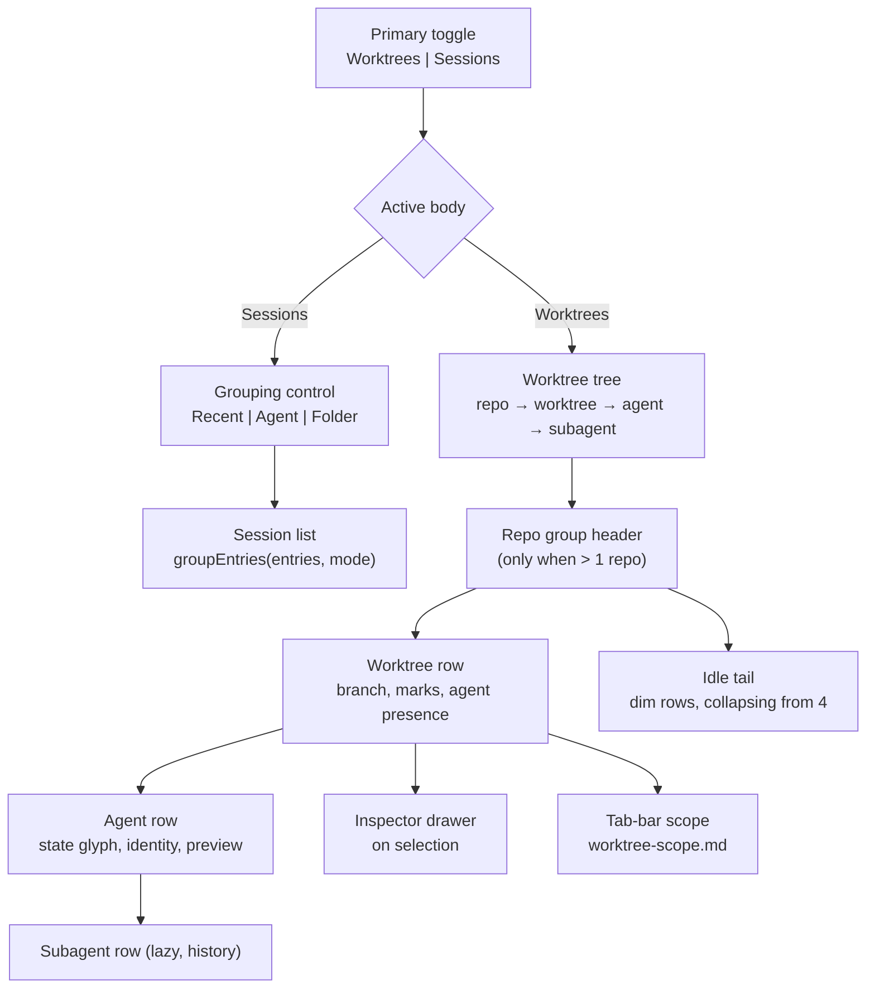

# Worktree Panel UI Design

> **Ref**: docs/DESIGN.md § 8.2 — the "The panel body, tree rendering, states, keyboard" row
> **Consumer**: `asimov-plan` reads this to turn a PLAN.md task into spec deltas and builder tasks.

Structure, states, and interaction for the Worktree view. Data comes from
[worktree-model.md](worktree-model.md) and
[worktree-agent-presence.md](worktree-agent-presence.md); actions from
[worktree-actions.md](worktree-actions.md); the tab-bar scope a selection drives from
[worktree-scope.md](worktree-scope.md); the confidence a row's activity carries from
[worktree-activity-ceiling.md](worktree-activity-ceiling.md).

## 1. Overview



## 2. Where it lives

The Worktree body is the **primary** body of the AI Vault panel, chosen by a two-level control.

| Level | Control | Values | Persisted as |
|-------|---------|--------|--------------|
| 1 | Primary toggle | `Worktrees` \| `Sessions` | `vaultView` (`worktree` \| `sessions`) |
| 2 | Grouping, **inside Sessions only** | `Recent` \| `Agent` \| `Folder` | `vaultGroupMode` |

This replaces four flat segments, and the replacement is a semantic correction rather than a
layout preference. Recent / Agent / Folder are **grouping modes of one body**; Worktree **swaps
the body**. `groupEntries()` buckets already-loaded `VaultSessionEntry[]`, so a worktree with no
sessions would vanish from a grouping mode — a worktree exists, and is worth acting on, with
zero agents. Mixing the two semantics in one row also caused the visible symptom that four
segments no longer fit at sidebar width, so labels were dropped from unselected ones.

**No state migration.** The two keys are already independent and already carry exactly these
values (D8); only their presentation changes. State written by an older build stays valid and
keeps its meaning.

Consequences to implement:

| Element | Sessions body | Worktrees body |
|---------|---------------|----------------|
| Primary toggle | Both values always shown, labelled | same |
| Grouping control | Rendered, three values | **Not rendered** — it groups sessions, and there are none here |
| Search input | Filters session titles | Filters worktree branch + path, and agent titles |
| "This folder only" filter | Active | Hidden — the tree is already folder-scoped |
| Refresh button | Refreshes sessions | Forces a tree rebuild |
| Create ("+") | Absent — nothing to create | Present; see [worktree-actions.md](worktree-actions.md) § 3.2.2 |
| Preview overlay | Opens on row activation | Opens on **agent row** activation, unchanged component |

Activating an agent row opens the existing floating session preview (`PreviewController`) for
its `entryId`. This view adds a navigation surface; it does not add a second transcript
renderer.

### 2.1 Persisted state

Per **surface**, not per window (DESIGN.md § 8.6):

```
vaultView?:      "sessions" | "worktree"      // which body is shown
vaultGroupMode?: "recent" | "agent" | "folder" // grouping WITHIN the sessions body
worktreeCollapsed?: string[]                   // collapsed repoIds and worktreeIds
worktreeExpandedRows?: string[]                // expanded agent rowIds
worktreeIdleTailSeeded?: string[]              // repoIds whose idle tail has been presented (§ 3.6)
worktreeScope?: string                         // scoped worktreeId — worktree-scope.md § 6
```

**An absent array and an empty one mean different things, and conflating them loses user
state.** `worktreeCollapsed` absent means nothing was ever saved, so the view seeds its defaults
— collapsed unless the worktree is a workspace folder. `worktreeCollapsed: []` means the user
expanded everything, and seeding defaults over it would silently re-collapse what they opened.
The set records expansion by omission, so the distinction cannot be recovered from its contents;
only its presence carries it. Seeding is therefore one-shot, on the first tree a session sees,
and never re-applied to a worktree already decided.

The idle tail's default needs a **second** key for the same reason, not a second meaning on the
first. Its fold lives in `worktreeCollapsed` under a namespaced key so it cannot collide with a
repoId or a worktreeId, but an absent key there already means *expanded* — so one key cannot
separate "this repo's tail has never been presented" (default folded) from "the user opened it"
(stay open), and an existing user would have met the feature already unfolded.
`worktreeIdleTailSeeded` records the repos whose tail has been presented, and it is what makes the
default reach a user whose persisted state predates the capability.

A collapsed **repoId** is honoured only while a repo group header is rendered (§ 3.1 draws none
for a single repo). Otherwise a set persisted during a two-repo session would hide the only
repo's rows with no control left on screen to reopen them.

### 2.2 Default body

1. A persisted `vaultView` always wins — an explicit user choice is never overridden.
2. With no persisted choice: default to `worktree` when the workspace has at least one git repo,
   otherwise `sessions` with the existing default grouping.

Rule 2 exists because a workspace with no repo would open on a permanently empty view, which
reads as a broken panel rather than a default.

### 2.3 Rollout

The structural changes — the two-level toggle, the rail composition, the scoped tab bar, and the
inspector drawer — ship behind `anywhereTerminal.worktree.workbench` (boolean, default `false`)
until the composition is whole, then the default flips and the setting is retired. The row-level
work in § 3.3, § 3.6, and § 7.2 is not gated: it improves the view the user already chose, and a
truthfulness fix hidden behind an opt-in keeps lying by default.

While the setting is off, the shipped four-segment control and stacked layout stand unchanged.

## 3. Tree structure

| Level | Row kind | Purpose | Rendered when |
|-------|----------|---------|---------------|
| 1 | Repo group header | Names the repository | Only when the tree holds > 1 repo (§ 3.1) |
| 2 | Worktree row | The branch, its state, and its agent presence | Always — dimmed and foldable when agentless (§ 3.6) |
| 3 | Agent presence | Collapsed pill, or an "N agents" header plus one row per agent | Only when the worktree has ≥ 1 agent |
| 4 | Subagent row | Delegated work, as history | Only on expanding an agent row |

Ordering: worktrees holding agents sort ahead of agentless ones, and the existing deterministic
order applies within each part. Presence is the thing the user opened the view to find, so it
decides the part, not the sort key inside it.

### 3.1 Repo group header

Rendered **only when the tree holds more than one repo**. A single-repo workspace — the common
case — shows worktree rows at the top level with no redundant wrapper.

Header shows: repo label, worktree count, a `degraded` affordance when that repo's last listing
failed, and a create control on hover or focus (§ 3.2.2 of
[worktree-actions.md](worktree-actions.md)). Collapsible; collapse state persisted by `repoId`.

The header is a `treeitem`, which takes its accessible name from its contents — so it names itself
explicitly, or the create control's label is read out as part of every header. The control stops
the activation it handles: the header binds a bubbling click and Enter/Space, so without that one
gesture would create AND collapse.

### 3.2 Worktree row

| Element | Content | Rule |
|---------|---------|------|
| Leading glyph | **State-aware**: the branch glyph at rest, replaced by the strongest agent state inside it | One glyph slot, never two. This is the row's at-a-glance signal and the reason the row needs no separate status column |
| Primary label | Branch short name | Detached → short sha; bare → the label `bare` |
| Main marker | An icon badge on `kind === "main"` | It names *which* worktree, not *how* it is |
| In-workspace marker | The word `open` when `inWorkspace` | Distinguishes "open here" from "exists on disk". It keeps a word because it has no unambiguous glyph; several worktrees can be workspace folders at once, which is why it is not `here` |
| Badges | `locked`, `missing`, `prunable` | Icon badges with hints; only when true; `missing` outranks `prunable` |
| Agent presence | Collapsed pill or expanded header — see § 3.5 | |

**The path is not a row element.** At sidebar width a truncated path crowds out the branch,
which is the identity the user actually navigates by. The path lives in the row hint, the
context menu's copy action, the inspector (§ 3.7), and the create form — and nowhere else.

The agent presence block is the row's most valuable pixel. Group by state first, identity
second — "2 waiting, 1 working" is the question a user scanning the list is asking; "which
model" is the follow-up.

### 3.3 Agent row

An agent row is **two lines**: identity and time on the first, the last thing that happened on
the second. The second line is the one users actually read — `Approve the git worktree add?`
tells them what to do; a title and a timestamp do not.

| Element | Line | Content | Rule |
|---------|------|---------|------|
| Disclosure gutter | 1 | A chevron when the row has a **session to read**, otherwise an empty slot of the same width | **Always occupies space.** Reserving the gutter keeps state glyphs aligned down a mixed list. Offered by the session, never by children already held: the roster is read lazily on expansion, so gating the chevron on children would leave nothing to click to cause the read |
| State glyph | 1 | The § 7.2 vocabulary | Colour from the state, not from the agent. Fixed width, so a column of rows scans vertically |
| Agent icon | 1 | From the existing `AGENT_ICONS` map | Absent when `agent` is unset — never a guessed icon. Also absent on subagent rows (§ 3.4) |
| Title | 1 | Decoration-stripped pane title, else the session title | Spinner frames stripped before display |
| Child count | 1 | `+N` when the row has collapsed subagents | Disappears when expanded. Absent until the roster has been read — `+0` would claim one |
| Scope marker | 1 | Only on `scope: "external"` | See § 4 |
| Age | 1 | Relative time, right-aligned | Fixed-width column so titles truncate against a stable edge. Compact form (`now`, `5m`, `1h`, `3d`) |
| **Preview** | 2 | The session's latest message or current tool, one line | Secondary emphasis. Truncates with an ellipsis; it never wraps to a third line |
| Confidence marker | 1 | Carried by the state glyph itself when activity is unconfirmed (§ 7.2); a quiet marker when `activitySource` is a fallback one | Identity confidence is derived from `agentSource` separately and expressed by the icon's presence or absence — a row can be uncertain about one and sure of the other |

The model id is **not** on the row. It competed with the preview for the same scarce width and
lost; it is shown in the inspector (§ 3.7), where there is room, and omitted entirely when
unknown — never a placeholder.

**Age means two different things and must not be conflated.** For a row that has finished, it is
time since it finished. For a row still working, it is time since the current state began. One
clock per row, chosen by state — a row must never rank as freshly done while displaying a stale
age.

Truncation order under pressure: preview first, then title, never the age, the state glyph, or
the agent icon. Those two glyphs are the row's whole point at narrow widths.

### 3.4 Subagent row

Rendered indented exactly one level under its agent row, on expansion only.

| Element | Rule |
|---------|------|
| Depth | One level, always. Subagents of subagents are not a level the tree renders |
| Agent icon | **Never shown.** A subagent's type is its role name (`pr-reviewer`, `librarian`), not an installed agent, so the icon map has nothing correct to draw. The indentation already says whose child this is |
| Primary text | The delegated task description, falling back to the role name |
| Activation | Focuses the **parent's** pane. A subagent has no pane of its own; sending the user to a pane that does not exist would be a dead click |
| Freshness | Children inherit the parent's freshness. When the parent's evidence goes stale, every child decays with it — a stale parent cannot have provably-working children |

An expanded row always renders **one of four section states**, never silence:

| Roster | Section shows |
|--------|---------------|
| Not read yet | that it is reading |
| Read, rows found | those rows, plus an admission if the reader dropped others |
| Read, nothing found, reader claims it is whole | that the session delegated nothing |
| Read, nothing found, reader admits omission — or the read failed | that it could not be read, with the reason |

The last row is the one that matters. Emptiness is a claim, and the strongest one this section
can make; a read that admits it dropped records has not earned it. Silence is the same claim
made implicitly, which is why an expanded row is never blank.

Because in this phase these are transcript-derived history and not a live roster
(`worktree-agent-presence.md` § 3.6), they must **not** reuse the live state vocabulary. Use a
distinct, visibly historical treatment and a section label that says so. A completed subagent
from twenty minutes ago drawn with the same glyph as a live one is the exact class of lie the
evidence model exists to prevent. Once the hook phase supplies a live roster, these rows adopt
the live vocabulary — that flip is the visible payoff, and it must not happen a moment earlier.

### 3.5 Collapsed and expanded agent presence

The tree has **two independent disclosure levels**, and conflating them produces a control that
cannot express "show me this worktree's agents but not every agent's children".

| Level | Control | Collapsed shows | Expands to |
|-------|---------|-----------------|------------|
| Worktree → agents | The `N agents` header row, or the collapsed pill | Grouped state glyphs, up to 3 icons per state, `+N` overflow | One § 3.3 row per agent |
| Agent → subagents | A chevron in that row's own disclosure gutter, on any row with a session | `+N` on the agent row, once read | The § 3.4 section — its rows, or the state that explains why there are none |

Both states are persisted independently (§ 2.1). Persisted expansion is reconciled against the
rows presence actually carries, not accumulated: a row that lost its session keeps no expansion,
because the chevron that would collapse it is offered by the session.

The collapsed pill groups by state before identity and overflows with a count rather than
shrinking icons, so a worktree with nine agents stays the same height as one with two. The
expanded header is a real row, not a label: it is the collapse control, and it carries the count
the pill would otherwise have to keep showing.

### 3.6 The idle tail

Worktrees with no agents are the majority in a repo that uses them heavily, and at equal visual
weight they bury the two the user opened the view to find.

| Rule | Value |
|------|-------|
| Treatment | An agentless worktree renders as a single dim line: leading branch glyph, branch name, its marks. No presence block, because there is none |
| Folding | From **4** agentless worktrees upward, they collapse under one disclosure row reading `N idle worktrees`. Three or fewer stay visible — a disclosure that hides two rows costs more than it saves |
| Persistence | The disclosure follows the same collapse state as the rest of the tree, under a namespaced key, plus the presented-marker § 2.1 describes |
| Search | A search match inside the tail **reveals it**, at render time only — the reveal never writes the fold open, so clearing the filter returns the tail to the state the user chose. While a filter reveals it, no disclosure row is drawn at all: one that hides nothing has nothing to disclose, and leaving it on screen makes it inert rather than merely un-toggleable (§ 6 treats any row carrying `aria-expanded` as expandable, so Left is consumed before it can climb out) |
| Ordering | The tail sits after the worktrees that hold agents, in the existing deterministic order |
| Counting | The count is of the rows the fold hides, and it is exact. A degraded presence source does not move a worktree into the tail — unknown is not agentless |
| Order against the cap | Filter, then partition, then cap, then fold. The disclosure counts only rows the cap admitted, so it never claims one the cap withheld; what the capping affordance itself states is unchanged (§ 8, "Many worktrees") |

This is the 80% of the reference's "hide sleeping" filter with none of its machinery. The filter
popover itself stays deferred (§ 7.5).

### 3.7 The inspector drawer

Selecting a worktree row opens a detail region **under the tree**, capped so the tree stays
visible above it.

| Property | Rule |
|----------|------|
| Placement | A drawer below the tree, never a replacement for the body. At ~300 px, swapping the body makes selection destructive — the user loses the list they were comparing against and needs a back control to return |
| Height | Capped at roughly half the panel, so the rail stays scannable while one worktree is read in full |
| Content | Branch, the full path, the row's actions, its agent rows with the model id each carries, and the historical delegations section |
| Path | This is the second of the two places a path is shown in full (the other is the row hint). Rows never show one (§ 3.2) |
| Dismissal | An explicit close control, and selecting nothing. Selecting a different worktree replaces the contents rather than stacking |
| Relationship to scope | Selection drives both the drawer and the tab-bar scope ([worktree-scope.md](worktree-scope.md)). One selection, two consequences, no second control |

## 4. Truthfulness rules the UI must encode

These are not stylistic preferences; each one prevents a specific false claim.

1. **An external row never offers focus.** There is no pane in this window to reveal. Its actions
   are open-folder, resume-here, copy-resume-command.
2. **An external row is visibly labelled** as running outside this window. It exists so the view
   does not claim a busy worktree is idle.
3. **A fallback-source activity is marked as such.** Output-derived "running" means the terminal
   is busy, which is not the same as an agent turn being in progress. Confidence is derived per
   source, so identity and activity are marked independently.
4. **An inferred `running` that nothing has confirmed stops claiming confirmation** past the
   ceiling in [worktree-activity-ceiling.md](worktree-activity-ceiling.md).
5. **No agent icon without a proven identity.** `agentSource: "none"` renders as a plain terminal
   row. A pane no surface has reported yet is *unknown*, not `none`.
6. **Degraded data is labelled, never silently stale.** Each entry in
   `WorktreePresence.degradedSources`, and each repo's `degraded`, names the failing source and
   its reason on the affected scope. **An empty result that is genuinely empty is not degraded**
   and carries no affordance — labelling honest emptiness as stale trains the user to ignore the
   marker.
7. **Spinner frames never re-render the row.** Decorative frames are stripped before the render
   signature is computed.
8. **Subagents read as history**, per § 3.4.
9. **A filter is never invisible**, per [worktree-scope.md](worktree-scope.md) § 7 — including
   the idle-tail fold, whose disclosure states its own count.

## 5. States

| State | Trigger | Render |
|-------|---------|--------|
| Loading (first) | No tree yet | Skeleton rows, no spinner-in-a-void |
| Loading (refresh) | Rebuild with a tree already held | Keep the current tree, show a quiet activity marker |
| Empty — no folder | No workspace folders | "Open a folder to see its worktrees" |
| Empty — no repo | Folders present, none is a git repo | Explains the view needs a git repository |
| Empty — git missing | `gitAvailable: false` | Explains git is required, no error styling |
| Empty — one worktree | A repo holding exactly one worktree, and it is the main checkout, with no degraded reason | Explains what a worktree buys, and carries the create action as the body CTA, beside the main row rather than instead of it. Read off the repository, never off what got drawn: a filter, the display cap and the idle fold each reduce the rows without saying anything about what the repository holds. It sits inside the tree, so it carries a row's rhythm and not a panel's — a multi-repo workspace can show several at once |
| Populated | ≥1 repo | The tree |
| Degraded | A non-empty `degradedSources`, or a repo's `degraded` | Tree plus a stale affordance naming the source and reason, scoped to what failed, with a retry |
| Action error | outcome `error` | Inline, attached to the row it concerns, dismissible |
| Action indeterminate | outcome `indeterminate` | Inline, distinct from an error: says the mutation partly applied and names what was observed |
| Action unavailable | outcome `unavailable` | Inline, and **not** error styling: nothing was attempted, because what the action would affect could not be read. It names what was unreadable |
| Action blocked | outcome `blocked` | The confirmation or refusal surface of [worktree-actions.md](worktree-actions.md) § 3.3, carrying the blocker set the fingerprint authorizes |

The scoped-terminal empty state belongs to the tab bar, not the panel — see
[worktree-scope.md](worktree-scope.md) § 4.3.

## 6. Interaction

| Input | Target | Result |
|-------|--------|--------|
| Click / Enter | Worktree row | Select it: open the inspector (§ 3.7) and scope this surface's tab bar (worktree-scope.md). Toggling its agent disclosure is the chevron's job, not the row's |
| Click / Enter | Idle-tail disclosure | Fold / unfold the tail |
| Click / Enter | Agent row, window scope | Per `anywhereTerminal.worktree.rowActivation`: focus that pane (default) or open its preview. A row with no session falls back to focus, whatever the setting says |
| Click / Enter | Agent row, external | Open the session preview — never focus, whatever the setting says |
| Double click | Worktree row | Open folder in a new window |
| Right click | Any row | Context menu, per [worktree-actions.md](worktree-actions.md) § 3 |
| `ArrowUp` / `ArrowDown` | Tree | Move through visible rows |
| `ArrowRight` / `ArrowLeft` | Tree | Expand / collapse, then descend / ascend |
| `Home` / `End` | Tree | First / last visible row |
| `Escape` | Inspector open | Close the drawer; scope is unaffected — it is cleared from the tab bar's own control |
| Type in search | Tree | Filter; ancestors of a match stay visible, and a match in the idle tail unfolds it |

Keyboard model, roles, and focus handling follow the existing file-tree panel rather than
inventing a second tree idiom in the same webview. Focus survives every disclosure toggle, the
drawer opening, and a scope change.

The `rowActivation` setting's value is delivered in the init payload and **re-sent whenever it
changes**, so a view already open picks it up without being reopened.

Focusing a pane resolves the tab that owns it and makes the pane that tab's active one *before*
showing the tab — otherwise the tab comes forward on whichever pane was last active in it. A tab
is reachable through any live pane it still holds, not only through the pane it was named after.

### 6.1 Re-render discipline

The Worktree view carries a render signature over the tree plus presence with **decorative title
frames stripped first**. Without it, a single agent's spinner repaints the whole tree at
animation rate and destroys scroll position and expansion state.

The key covers **every field of every wire shape**, not only the ones a renderer prints. A row's
DOM listeners close over the row object they were built with, so a render the guard skipped hands
the old value back at interaction time — which makes a routing field nobody displays, like the
pane a row would focus, just as load-bearing as a visible one. Exclusions are named one field at
a time with a reason, never a whole shape, and the only standing ones are a rescan timestamp that
moves on every poll and fields that cannot vary.

Two derived inputs join the key: the **scope** this surface holds, and each row's **activity
confidence** (§ 7.2).

Confidence changes with the passage of time rather than with a push, so it needs a clock the
push cycle does not provide. The renderer rebuilds the tree wholesale behind the signature guard
and has no row-level reconciliation, so the rule is expressed in terms it can actually meet:

| Rule | |
|------|---|
| Scheduling | **One** one-shot timer, set for the nearest future moment at which some row would cross the ceiling. Not an interval, and not one timer per row |
| On a push | The pending timer is cleared and re-armed against the new data, so a tree that changed cannot leave a deadline pointing at a row that is gone |
| On firing | Re-derive confidence for every row, fold the result into the signature, and render **only if the signature moved**. Then arm the next deadline |
| Cost floor | A re-derivation in which no row crossed performs **no DOM work at all** — the existing signature guard is what enforces it, not a second mechanism |
| Disposal | The timer is cleared with the view; a hidden or disposed surface arms none |
| The elapsed hint | Recomputed when the row is rendered and when it is hovered. It does not get a clock of its own — a hint that ticks would repaint the tree once a minute forever |

Row-level repaint is deliberately **not** required. It would mean introducing reconciliation to
a renderer that has none, for a visual change that happens at most once per row per state.

## 7. Visual specification

### 7.1 Density and rhythm

| Property | Rule |
|----------|------|
| Row height | Repo, worktree, idle-tail, and subagent rows are a single line. **Agent rows are two** (§ 3.3) — identity above, preview below — and never a third. Nothing wraps |
| Leading glyph | One fixed-width slot per row, at every level. The glyph changes, the slot does not, so labels align down the whole tree |
| Indentation | One step per level: repo → worktree → agent → subagent. Steps are equal; depth is read from alignment, not from size or weight |
| Trailing column | Agent rows reserve a fixed-width age column on their first line. Titles truncate against that stable edge |
| Emphasis | Repo name strongest, branch normal, preview text dimmed, age dimmest, idle-tail branch dimmed. Five steps, no more |

The single-line rule this table replaces was written before the row had a preview line to carry.
The preview is the line users read, so it earns the second line rather than competing with the
title for the first.

### 7.2 State vocabulary

One shape per state, used identically on the worktree row's leading glyph and on the agent row's
state glyph. **Shape carries the meaning; colour reinforces it**, so the vocabulary survives a
monochrome theme, colour-vision differences, and reduced motion. One hollow circle for
working, idle, and unknown alike is the failure this table exists to correct.

The vocabulary is the **activity** vocabulary registered in DESIGN.md § 10 — `running`,
`waiting`, `idle`, `exited` — plus two states this view *derives* and does not receive. The
hook layer's `working` / `done` words are deliberately not used here.

| Presented state | Derived from | Treatment | Shape, colour removed |
|-----------------|--------------|-----------|-----------------------|
| `running` | the activity value | An animated working indicator | An **open arc** — a ring whose left and bottom sides are transparent, so it stays an incomplete outline once the spin stops. The only unclosed curve |
| `running (unconfirmed)` | **derived** — [worktree-activity-ceiling.md](worktree-activity-ceiling.md) | A **static**, visibly different shape: the same claim with its animation withdrawn. Its hint names the gap | A **concentric double ring**, closed and hollow between the rings. It must read as running-with-a-doubt, so it stays a ring rather than becoming a fifth unrelated shape — and it must not converge on the arc when reduced motion stops the spin |
| `waiting` | the activity value | A distinct attention treatment, visually louder than `running` — the only state that needs a human, and the only strong animation | A **filled disc inside a halo ring** — the only solid-filled glyph in the vocabulary, which is what makes the one state needing a human the one the eye lands on first |
| `idle` | the activity value | The at-rest glyph: branch on a worktree row, a settled mark on an agent row | A **thin hollow circle**, whole and unbroken: rest is a positive claim, and a whole outline is what says so |
| `unknown` | **derived** — see below | A recessive shape meaning no source could say. Distinct from `idle`, which is a positive claim | A **dashed, broken circle** at reduced opacity. The break is the point — an incomplete answer, recessive because missing evidence does not ask for attention |
| `exited` | the activity value | Recessive and visibly terminal; the row is history that has not been cleaned up yet | A **horizontal dash** — no enclosed area at all, the only glyph that is not a circle |

**Both derived states are presentation only.** Neither is an activity value, neither appears in
any message, and neither adds a field — confidence is derived, never stored (D20). Both are
computed from data the render signature already covers, so neither widens it.

`unknown` is presented when **either** of these holds:

| Condition | |
|-----------|---|
| `activitySource: "none"` | No source spoke for this row at all |
| The degradation record for this worktree's presence names the source that would have decided this row | Mapping, one `activitySource` to one `PresenceDegradation.source`: `hook → hook`; `output` and `title` → `panes`; `registry → registry` |

Only `WorktreePresence.degradedSources` participates. A repo's own `degraded` flag does **not**:
it says the worktree *listing* failed, which is a claim about which worktrees exist, not about
what any agent is doing. Reading it here would turn every row in a repo unknown the moment a
single git listing failed — labelling honest evidence as unknown, which is § 4 rule 6 inverted.

`unknown` is what rule 6 looks like on a glyph: a failed source is labelled, never quietly
rendered as `idle`.

The worktree row's glyph reflects the **strongest** presented state among its agents, in the
order `waiting` > `running` > `unknown` > `idle` > `exited`. A worktree containing one waiting
agent and four running ones reads as waiting, because that is the one a human needs to act on.
`unconfirmed` is a confidence on `running`, not a rank: it does not move a worktree's position in
this order.

Every glyph must be legible as a static shape. Under reduced motion the animations stop and no
two states become identical.

Separation is by **outline**, not weight or tint, so it survives a monochrome theme rather than
merely surviving a colour-blind one: filled vs hollow, closed vs open, whole vs dashed, curve vs
line. Two pairs are the ones a change here is most likely to collapse — `idle` against
`running (unconfirmed)`, which differ only by the inner ring, and `waiting` against
`running (unconfirmed)`, which differ only by the fill. Both were confirmed apart at sidebar
width by rendering the shipped DOM through the shipped stylesheet with reduced motion forced and
every colour channel removed.

### 7.3 Selection, scope, and grouping

- **The card is selection.** A bordered, slightly raised surface wraps the selected worktree's
  row and its agent rows together. Exactly one worktree is selected at a time, and the card is
  what says which — it is not an emphasis for "has agents", which was read as selection by users
  who had selected nothing.
- Presence is expressed **inside** a uniform row — the leading glyph plus the presence pill —
  so every worktree row is the same kind of object whether or not agents are in it.
- Repo group headers use the repo name at the strongest emphasis with no leading glyph slot, so
  they read as separators rather than as another tree row.

### 7.4 Colour

- VS Code theme tokens only. No hard-coded colours anywhere in the view.
- Agent colour comes from the existing accent map; the view does not introduce a second agent
  palette.
- State colour is independent of agent colour. A Claude row and a Codex row in the same state
  share a state colour and differ only by icon.

### 7.5 Deliberately not adopted

The reference is a standalone multi-project IDE; this is a panel inside VS Code. These were
considered and rejected, and the rejection is recorded so it is not silently re-litigated.

| Reference feature | Not adopted because |
|-------------------|---------------------|
| Always-visible project header | VS Code's common case is one repo; a permanent header for a single group is pure overhead (§ 3.1) |
| "Run on" host selector | This extension has no remote execution model |
| Smart / GitHub / Jira create modes | Issue-tracker integration is a separate product surface |
| PR-linked worktree rows | Requires a forge integration this extension does not have |
| Group-by / sort-by / filter popover | Ordering is deterministic and counts are tens. § 3.6 takes the one part of it that pays for itself; the popover stays deferred |
| Path shown on a list row | Crowds out the branch at sidebar width — see § 3.2 |
| Cross-surface scope sync, editor tab per worktree | [worktree-scope.md](worktree-scope.md) § 2.3 |

### 7.6 What the shell task settles

Exact spacing values, the specific token for each emphasis step, the shape of each state glyph,
and the empty-state copy. These are settled by building and reviewing, not by specifying them
further in prose, so the built view — not this section — is their record.

### 7.7 Where the mockup and this document disagreed

The mockup is a disposable artifact and this document outranks it on behaviour. Disagreements
surface in both directions and are recorded so neither side re-introduces them silently.

**Round 1 (WT-002.0)** — all three resolved in favour of this document:

| Mockup showed | Resolution |
|---------------|------------|
| A count of dirty tracked files in the remove confirmation | The model carries dirty as **presence**, not a count — only untracked entries are counted |
| The external scope marker occupying the model column | § 3.3 keeps them as separate elements |
| No refresh affordance during a rebuild | § 5 requires a quiet activity marker while a tree is already held |

**Round 2 (the workbench redesign)** — the mockup wins the first three, this document the last two:

| Point | Resolution |
|-------|------------|
| Two-line agent rows vs the old single-line rule | **Mockup.** The preview line is the row's most-read content; the single-line rule predates it (§ 7.1) |
| The model id dropped from the row | **Mockup**, with a correction: it is not cut, it moves to the inspector (§ 3.3, § 3.7) |
| The inspector as a fourth place the path appears | **Mockup.** § 3.2 names the four places explicitly rather than treating the drawer as an exception |
| "Default scope is main" | **This document.** Scope defaults to `All`; a filter the user never chose is never on at first open, which is the mockup's own stated principle (worktree-scope.md § 6) |
| "Create's destination default is a sibling directory" | **Neither** — the premise is false. The shipped default already is `.claude/worktrees`, per DESIGN.md § 10. No change |

The mockup's remaining open questions are answered here: the scope chip lives on the tab bar only
(§ 3.7 — one selection, two consequences, no third control); selection scopes immediately, because
a selection that does nothing until a second gesture is not a selection; the idle-tail threshold
is four (§ 3.6).

## 8. Edge Cases

| Condition | Behavior |
|-----------|----------|
| One repo | No group header |
| Repo with only the main worktree | One row, plus the § 5 "one worktree" empty-state CTA |
| Worktree with zero agents | Dim single line; folded into the tail from four upward (§ 3.6) |
| Exactly three agentless worktrees | Shown, not folded |
| Very long branch name | Truncate with the full value on hover |
| Path needed | Not on a list row; available from the row hint, the copy-path action, the inspector, and the create form |
| Many worktrees | Virtualization is **not** in scope; if a repo exceeds a render budget, cap with a "show all" affordance rather than silently truncating |
| Expansion or scope state for a worktree that disappeared | Dropped from persisted state on the next push |
| Search matches only a subagent | Its agent and worktree ancestors stay visible |
| Search matches a worktree inside the folded tail | The tail unfolds |
| Panel is very narrow | Truncation order is preview, then title; the age column and the leading glyphs never truncate |
| One agent `waiting`, four `running` in the same worktree | The worktree glyph reads `waiting` (§ 7.2) |
| A worktree's only running agent is unconfirmed | The worktree glyph reads running-unconfirmed; it does not change rank |
| Presence degraded for a worktree | It renders `unknown`, and is not moved into the idle tail |
| Reduced motion | Expansion, the drawer, and the rail collapse animate instantly; every state glyph stays legible as a static shape |

## 9. Testing

### Test Cases

- [ ] The primary toggle switches the body; the grouping control renders only inside Sessions
- [ ] `vaultView` and `vaultGroupMode` written by an older build keep their meaning with no migration
- [ ] Persisted `vaultView` wins over the default rule; no persisted view + a repo → Worktrees; no repo → Sessions
- [ ] With the workbench setting off, the shipped four-segment control and stacked layout are unchanged
- [ ] One repo → no group header; two repos → two headers, workspace-folder order
- [ ] Worktrees with agents sort ahead of agentless ones
- [ ] Four agentless worktrees fold under one `N idle worktrees` row with an exact count; three do not fold
- [ ] A search match inside the folded tail unfolds it
- [ ] A worktree whose presence source is degraded renders `unknown` and is not folded into the tail
- [ ] No list row at any level renders a filesystem path; the path is reachable from the hint, the copy action, and the inspector
- [ ] Each state in § 7.2 renders a distinct shape, and all remain distinct under reduced motion
- [ ] `unknown` renders where activity has no source, and where the degradation record names the source that would have decided that row — by the documented mapping
- [ ] A repo whose listing is degraded does not turn its rows unknown; only a presence-source degradation does
- [ ] Crossing a ceiling with no push repaints once; a re-derivation in which nothing crossed performs no DOM work; the elapsed hint has no clock of its own
- [ ] The worktree glyph reflects the strongest agent state; `unconfirmed` does not change the rank
- [ ] An agent row renders two lines, with the preview truncating before the title and never wrapping to a third
- [ ] The model id appears in the inspector and on no list row, and is absent entirely when unknown
- [ ] Selecting a worktree opens the inspector and scopes the tab bar from one gesture
- [ ] The inspector is capped so the tree stays visible, and selecting another worktree replaces rather than stacks it
- [ ] The selection card wraps exactly the selected worktree, and a worktree with agents that is not selected gets no card
- [ ] Collapsed presence renders the pill with grouped glyphs and a `+N` overflow; expanded renders an `N agents` header plus per-agent rows
- [ ] A worktree with nine agents collapsed occupies the same height as one with two
- [ ] External row exposes no focus affordance and is visibly labelled
- [ ] `agentSource: "none"` row shows no agent icon
- [ ] A fallback `activitySource` renders the confidence marker; a fallback `agentSource` instead suppresses the icon, and a row can do one without the other
- [ ] A genuinely empty source renders no stale affordance; a failed one names its source and reason and offers a retry
- [ ] Each of the five action outcomes renders distinctly; `unavailable` carries no error styling and `indeterminate` is distinct from `error`
- [ ] Subagent rows render in the historical treatment, render no agent icon, nest one level, and activate the parent's pane
- [ ] A row with no subagents still reserves the disclosure gutter
- [ ] The two disclosure levels are independent and persist separately
- [ ] Age on a finished row counts from when it finished; on a working row, from when the state began
- [ ] Spinner-only title change produces no re-render; collapse, expansion, and scope survive a no-op push
- [ ] A confidence crossing repaints only the rows that crossed; a re-derivation that crosses nothing performs no DOM work
- [ ] Keyboard: arrows traverse, right/left expand/collapse, focus visible and preserved across disclosure, drawer, and scope changes
- [ ] Every empty state (no folder / no repo / no git / one worktree) renders its own copy

---

> **Sync rule**: the § 1 diagram must show the same hierarchy as § 3, including the idle tail and the drawer.
> **Registry**: values this doc shares with others belong in [DESIGN.md](../DESIGN.md) § 10 — do not keep a second copy here.
