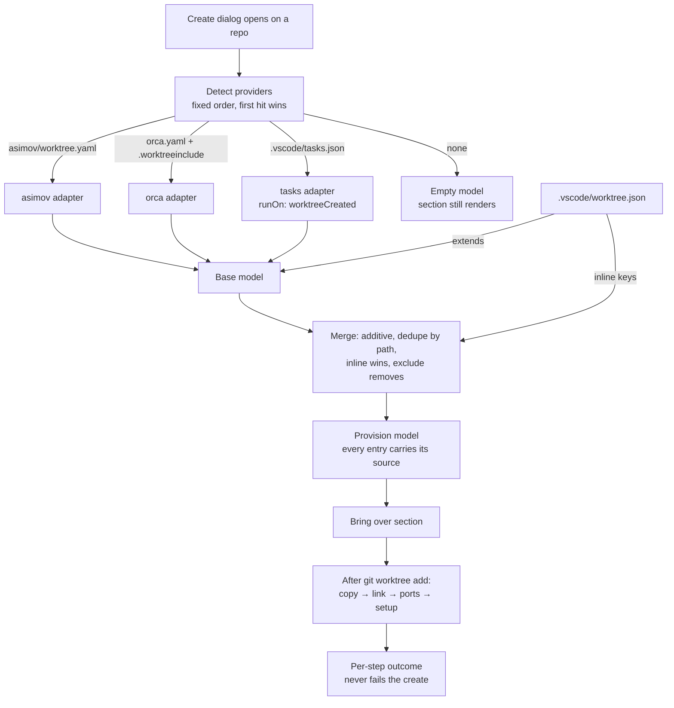

# Worktree Provisioning Design

> **Ref**: docs/DESIGN.md § 8.2 — the "Create / remove / lock / prune / launch" row
> **Consumer**: `asimov-plan` reads this to turn a PLAN.md task into spec deltas and builder tasks.

A freshly created worktree is a checkout and nothing else. It has no `.env`, no `node_modules`,
no editor-local settings — none of the untracked material the repository needs in order to run.
This document owns what the extension reads to learn that material, how it presents it before a
worktree is created, and how it applies it after.

Message shapes live in [worktree-rpc.md](worktree-rpc.md). The form that renders this is
[worktree-create.md](worktree-create.md) § 4.

## 1. Overview

The extension does not define a provisioning format. It **reads the ones the repository already
has**, normalizes them into one model, and names the source of every entry it shows.



Two properties hold everywhere in this document:

- **Provenance is per entry, not per section.** A merged model routinely holds a `copy` list
  assembled from two files. An entry that cannot name its source is a bug, not a default.
- **Detection never mutates.** Reading a provider file never writes one. `.vscode/worktree.json`
  is the only *configuration* file the extension writes, and only when the user asks it to (§ 6).
  Applying the model writes into the **new worktree** — copied files, symlinks, and
  `.env.worktree` (§ 5) — which is a different thing from editing a repository's configuration.

## 2. The normalized model

```ts
/**
 * Every selectable item carries an opaque host-issued id, unique within one offer. The webview
 * submits ids; it never submits paths or command text (§ 4.0). Ids are not stable across offers.
 */
export interface ProvisionItemId {
  readonly id: string;
}

/** One thing to materialize into a new worktree. */
export interface ProvisionEntry extends ProvisionItemId {
  /** Repo-relative POSIX path. Globs are expanded at read time, never stored. */
  readonly path: string;
  readonly mode: "copy" | "link";
  /** Provider file this entry came from, repo-relative. Never absent. */
  readonly source: string;
}

/**
 * One step to run in the new worktree after materialization. Two variants, because a shell
 * command and a VS Code task are not the same object: a task carries a type, args, options,
 * presentation and its own identity, and flattening it to a string loses what the task system
 * needs to resolve and run it.
 */
export type ProvisionSetupStep = ProvisionItemId &
  ( | {
      readonly kind: "shell";
      /** Exact script text, passed as the shell's single script argument. Never concatenated. */
      readonly script: string;
      readonly source: string;
    }
  | {
      readonly kind: "task";
      /**
       * The resolved task object the host retained, not a lookup key. Scope plus label does not
       * identify a task when labels collide or the definition changes between offer and run —
       * and re-resolving by label at execution time is exactly the re-read § 4.0 forbids.
       */
      readonly task: unknown;
      /** Scope and label, for display and for reporting which task failed. */
      readonly taskRef: { readonly scope: string; readonly label: string };
      /** Display text only. Never the thing executed. */
      readonly display: string;
      readonly source: string;
    });

/** A named port the repo wants allocated per worktree. Selectable, like every other row. */
export interface ProvisionPort extends ProvisionItemId {
  readonly name: string;
  readonly source: string;
  /**
   * The free port this create will take. Resolved when the dialog builds the model, and
   * re-resolved immediately before it is written (§ 5.3) — the dialog's number is a preview
   * and the second resolution is the one that binds.
   */
  readonly port: number;
}

export interface ProvisionModel {
  readonly entries: readonly ProvisionEntry[];
  readonly setup: readonly ProvisionSetupStep[];
  readonly ports: readonly ProvisionPort[];
  /** Providers detected, in detection order. The first is the one that supplied the base. */
  readonly providers: readonly ProvisionProvider[];
  /** Entries an `exclude` rule removed, kept so the UI can show them as deliberate. */
  readonly excluded: readonly ProvisionEntry[];
  /** Populated when a provider file was found but could not be read. */
  readonly problems: readonly ProvisionProblem[];
}

export interface ProvisionProvider {
  readonly id: "asimov" | "orca" | "vscodeTasks" | "native";
  /** Repo-relative file that produced it. */
  readonly file: string;
  /** True for the provider whose model the native file extended or detection chose. */
  readonly active: boolean;
}

export interface ProvisionProblem {
  readonly file: string;
  readonly reason: "unreadable" | "malformed" | "unknownKey" | "missingExtends";
  /** Bounded, already safe to render. Parser text is quoted, never interpreted. */
  readonly detail: string;
}
```

`mode` is deliberately two values. A third — clone-on-write, which orca uses on APFS — is an
**implementation detail of copy**, not a user-facing choice: it produces a file with independent
contents, which is what `copy` promises. Where the platform offers it, copy uses it.

## 3. Provider adapters

Each adapter is a pure function from file text to a partial model. None of them executes
anything, and none reads a file outside the repository.

### 3.1 asimov — `asimov/worktree.yaml`

The richest source, and the one this repository itself uses.

| YAML key | Maps to |
|---|---|
| `copy: [path, …]` | `entries[] { mode: "copy" }` |
| `link: [path, …]` | `entries[] { mode: "link" }` |
| `ports: { NAME: … }` | `ports[] { name }` |
| `setup: [command, …]` | `setup[] { kind: "shell" }` |

Entries may contain a `*` glob in the final segment; it is expanded against the main worktree at
read time, because the list the user is shown must be the list that will actually be copied.
An unmatched glob is not an error — it contributes nothing and is not reported as a problem, since
a repo legitimately carries optional material.

### 3.2 orca — `orca.yaml` and `.worktreeinclude`

Two files, one provider, because orca splits what asimov keeps together.

| Source | Maps to |
|---|---|
| `orca.yaml` → `scripts.setup` | `setup[] { kind: "shell" }` — a single block scalar, split on newlines, blank lines dropped |
| `orca.yaml` → `worktree.sharedDirectories[]` | `entries[] { mode: "link" }` |
| `.worktreeinclude` | `entries[] { mode: "copy" }` — line-delimited, `#` comments and blank lines dropped |

`sharedDirectories` is link-only by orca's own definition, and orca additionally requires the
directory to exist and be gitignored. The adapter **records the intent without enforcing orca's
preconditions** — an entry naming a directory that does not exist is shown, and fails at apply
time with a per-entry outcome (§ 5). Enforcing another tool's preconditions at read time would
mean the section silently disagrees with the file the user is looking at.

`orca.yaml` keys outside these two are ignored without a problem record. They configure orca, not
provisioning, and reporting them would make every orca repo look misconfigured.

### 3.3 VS Code tasks — `.vscode/tasks.json`

Tasks whose `runOptions.runOn` is `"worktreeCreated"` map to `setup[] { kind: "task" }`, in file
order, carrying the scope and label needed to re-resolve the exact task at execution time.

**This is a convention, not an API.** `runOn: "worktreeCreated"` exists in VS Code's task schema
and its dispatcher is core-internal to the Agent Sessions feature; the `TaskRunOn` enum that would
expose it to an extension is a **proposed API** (`vscode.proposed.taskRunOptions.d.ts`), which a
published extension cannot enable. The adapter therefore parses `.vscode/tasks.json` itself and
honours the same key with the same meaning. Nothing here depends on the proposal shipping, and if
it does ship, the adapter is what gets deleted — not the schema we would otherwise have invented.

`tasks.json` is JSONC: comments and trailing commas are legal and must parse. Variable
substitution (`${workspaceFolder}` and friends) is **not** performed by the adapter — the command
is displayed verbatim and executed through the task system, which does its own substitution.

### 3.4 Anywhere Terminal — `.vscode/worktree.json`

The native file. It exists to add to, subtract from, or replace what a framework declared —
and to give a repository with no framework somewhere to put its answer.

```jsonc
{
  // Optional. A repo-relative path to any file section 3.1–3.3 can read.
  "extends": "asimov/worktree.yaml",

  // Optional. Same shapes as the asimov adapter.
  "copy": [".env.local"],
  "link": ["third_party"],
  "setup": ["pnpm install --frozen-lockfile"],
  "ports": { "APP": null },

  // Optional. Removes inherited entries by path. No effect on inline keys.
  "exclude": [".code-review-graph"]
}
```

Unknown top-level keys produce a `unknownKey` problem and are otherwise ignored. The file is
never rejected wholesale for one bad key — a typo should cost the user that one line, not the
whole configuration.

## 4. Detection, merge, and provenance

### 4.0 The model the user saw is the model that runs

Everything below produces a model the dialog displays. What executes must be **that** model, not a
re-read of the provider files after the user pressed Create.

- The host resolves the model once, keeps it, and issues an opaque **offer id** with a fingerprint
  over the normalized model — every entry path, every mode, and the exact step text or task
  identity.
- The dialog submits **item ids plus that offer id**. It never submits command text or paths: a
  webview that could supply the command to run would be the authority on what runs.
- Execution uses the host-held model the offer id names.

**What happens on an unknown, expired, or invalidated offer**, stated precisely because the
obvious phrasing is impossible: the host performs **no create and no provisioning**, resolves a
fresh model, presents it, and waits for a **second submission** against the new offer id. The
property being protected is *nothing executes that the user has not seen* — not *the host never
resolves twice*, which no implementation could satisfy.

Without this, "the user saw the command" is not a property the system has — only one the UI had
momentarily. Re-reading the file at execution time is exactly the window an untrusted checked-in
file needs.

### 4.1 Detection order

`.vscode/worktree.json` → `asimov/worktree.yaml` → `orca.yaml` / `.worktreeinclude` →
`.vscode/tasks.json`.

The native file is checked first because it may name its own base via `extends`.

**A native file without `extends` is the sole active provider.** Its inline keys are the whole
model and every framework file is recorded `active: false`. The alternative — letting inline keys
implicitly overlay the first detected framework — is rejected because it would make `extends`
meaningless: a file would inherit whether or not it asked to, and there would be no way to say
"only what I wrote here".

When there is **no** native file, the first framework hit supplies the model. Either way, later
hits are recorded in `providers[]` with `active: false` so the UI can offer them without hiding
the choice ([worktree-create.md](worktree-create.md) § 4.3).

First-hit-wins rather than merge-everything, because two frameworks configured in one repository
usually means one is being migrated away from, and silently unioning them would run a setup
command the user believed they had retired.

### 4.2 Merge rule

When `.vscode/worktree.json` declares `extends`:

1. Start with the extended provider's model.
2. Append the native file's inline entries.
3. Dedupe by `path`. **The native entry wins**, including its `mode` — this is how a path the
   framework links becomes a path this repo copies.
4. Apply `exclude`: any entry whose `path` matches moves from `entries` to `excluded`, keeping its
   original `source`. `exclude` never matches an inline entry; removing something you just added
   is a contradiction to surface, not a rule to implement, so it produces an `unknownKey`-class
   problem naming the path.
5. `setup` steps are appended, never deduped — two providers may legitimately want the same
   command run twice, and reordering or dropping steps changes their meaning.

Merge is additive because provenance is per entry (§ 1) and the UI draws a source badge per row.
Whole-key replacement would collapse that to one badge per section and throw away the information
the section exists to carry.

### 4.3 Provenance is preserved through every transform

An entry's `source` is set by the adapter that produced it and is never rewritten — not by merge,
not by dedupe (the winner keeps its own source), not by exclusion. A glob expands into several
entries that all carry the glob's source file.

## 5. Applying the model

Ordering is fixed: **copy → link → ports → setup**. Ports precede setup because a setup command
is the usual consumer of the allocated values; setup runs last because setup commands routinely
depend on copied config, and never the reverse.

Applying happens **after `git worktree add` reports success** and is reported per step. It is
started by the create action ([worktree-create.md](worktree-create.md) § 6) and is the only part
of provisioning that touches the filesystem.

### 5.1 Copy

Recursive for directories, preserving mode bits but never ownership.

**Never overwrite applies to every descendant, not just the named entry.** A directory copy that
replaced files inside an existing destination because the top-level name was free would be the
same defect with more steps. Each descendant that already exists is skipped and reported.

Source and destination are validated **separately**: the source must resolve inside the main
checkout, the destination inside the new worktree. A single "inside the repository" test passes
both a source that is really a destination and a destination whose existing parent resolves out of
the new worktree.

Three rules the word "containment" does not by itself supply:

- **Special files are refused** — devices, sockets, and FIFOs are not configuration, and copying
  them is never what a provider meant.
- **Symlinks encountered while walking a source tree are not silently dereferenced.** An in-repo
  symlink is preserved as a symlink; one resolving outside the repository is refused and reported.
  Recursive symlinks therefore terminate the walk rather than expanding it.
- **Validation is redone immediately before each operation**, and creation uses the
  exclusive/no-follow primitive where the platform has one. A component validated once and written
  later is a component something else had time to replace.

Lockfiles are never copied and never linked, whether or not a provider names one. A lockfile
copied from main describes main's dependency tree, and the entire point of a per-worktree install
is that this branch's lockfile is authoritative. A provider entry naming one is reported as a
skipped step with that reason.

### 5.2 Link

A relative symlink from the worktree to the main checkout.

**A linked path writes through to the main checkout**, and every other worktree sees the write.
That is the whole reason copy is the default and link is opt-in: an agent editing a linked `.env`
silently reconfigures the user's main checkout, and branches legitimately need different ports and
endpoints. The UI states this on every linked row, and the statement is not suppressible.

Where symlinks are unavailable — Windows without Developer Mode or elevation — the entry
**degrades to a copy and says so**, rather than failing or silently promising a link it did not
make. The degradation is per entry and visible in the result.

`node_modules` is never linked as a root, by any provider, even when one asks. A shared
`node_modules` makes every worktree's dependency tree the same tree, which defeats per-branch
lockfiles and corrupts installs that run concurrently. The supported answer is pnpm's
`virtualStoreType: global` plus a per-worktree `pnpm install` in `setup` — cheap, because the
global store is already populated. An entry naming `node_modules` with `mode: "link"` is reported
as a refused step naming this rule.

### 5.3 Ports

**The extension allocates**, under a lock, because a probe alone cannot make the guarantee this
feature exists to make.

The sequence, all of it inside a lock taken on a file in the repository's **common git directory**
so that it holds across VS Code windows and across processes:

1. Read `.env.worktree` from every other worktree of the repo and collect the claimed values.
2. For each name, bind `127.0.0.1:0`, read the assigned port, close it, and reject any value in
   the claimed set. Repeat until distinct.
3. Write `.env.worktree` into the new worktree as `<NAME>=<port>` lines, atomically.
4. Release.

**What this guarantees and what it does not.** It guarantees that two worktrees created by this
extension never claim the same port, which is the collision the feature exists to prevent — and
which a bare OS probe cannot prevent, because a port nobody is listening on right now is free to
the probe and already spoken for by a sibling's config. It does **not** guarantee that an
unrelated process will not bind the port before setup runs. Nothing at this layer can, and the
acceptance says so rather than implying a stronger claim.

**The dialog's number is a preview.** The dialog resolves values outside the lock in order to show
them, and the locked pass is authoritative. A number that changed between the two is **reported**
rather than swapped silently — the user was shown a number for the express purpose of remembering
it, and a UI that quietly replaced it would be lying about the one value it asked them to keep.

**An existing `.env.worktree` in the new checkout is parsed and reused, never overwritten and
never ignored.** Allocating fresh values while a file on disk names different ones would export
one set to setup and persist another. Where the file already covers every configured name,
allocation is skipped entirely.

`.env.worktree` must not show up as untracked noise: it is added to the repository's
`info/exclude` alongside the worktree root ([worktree-create.md](worktree-create.md) § 3), never to
`.gitignore`.

A name whose port cannot be allocated is reported as a failed step; remaining names still get
theirs, because a partially ported worktree is more useful than none.

### 5.4 Setup

Commands run sequentially in the new worktree's directory, through the VS Code task system where
the step came from `tasks.json` and through a shell otherwise. argv is never assembled by string
concatenation for the shell case; the command is passed as the shell's single script argument.

**Setup steps are unchecked by default.** A default-on box that the user did not clear is not
consent to run a command a checked-in file supplied. Persisting a per-repository "always run setup
here" trust decision is a reasonable future addition and is explicitly **not** designed here —
until it is, the checkbox starts off every time.

Environment: the process environment plus `ANYWHERE_TERMINAL_WORKTREE_PATH`,
`ANYWHERE_TERMINAL_MAIN_PATH`, and `ANYWHERE_TERMINAL_BRANCH`. Where the asimov adapter supplied
the model, `ASIMOV_WORKTREE_PATH`, `ASIMOV_MAIN_ROOT` and `ASIMOV_BRANCH` are set to the same three
values, because a repo's setup script was written against those names. `ASIMOV_CHANGE_ID` is
**deliberately not set**: this model has no value to put in it, and inventing one would make a
worktree created here look like a change created by the asimov tooling.

Setup may run **concurrently with** `openAfter` or be gated ahead of it, per
[worktree-create.md](worktree-create.md) § 6. Copy, link and ports never are — they always complete
first.

Cancellation, timeout, and where output goes are the task system's for a `task` step and the
existing mutation budget's for a `shell` step ([worktree-actions.md](worktree-actions.md) § 3.6).
Retry state lives with the worktree row and does not survive a host restart — a retry offered
after a restart would be offering to re-run a model the host no longer holds (§ 4.0).

A non-zero exit stops the remaining steps and is reported. It does **not** stop the copy and link
results from standing, and it does not affect the worktree.

### 5.5 Setup failure is not create failure

**The worktree is never rolled back because provisioning failed.** By the time provisioning runs,
`git worktree add` has already succeeded; deleting the directory the user asked for in order to
tidy up an error message destroys their work to make a status line look clean.

The outcome surfaces on the created worktree's row — "setup failed — view output / retry" — and
persists there until the user acts on it. Retry re-runs the setup steps only; copy and link are
not repeated, because a retry after a partial copy would hit the never-overwrite rule (§ 5.1) and
report collisions that are not problems.

This mirrors § 3.6 of [worktree-actions.md](worktree-actions.md): a failure that leaves real state
behind is reported for what it is, not flattened into "nothing happened".

### 5.6 The manifest — what this worktree was set up with

Applying writes a **manifest** into the new worktree's administrative directory
(`.git/worktrees/<id>/anywhere-terminal-provision.json`, which git itself deletes when the worktree
is removed). It records, for one create:

```ts
interface ProvisionManifest {
  readonly version: 1;
  readonly createdAt: string;
  /** Successfully materialized paths, worktree-relative, with the mode used. */
  readonly materialized: readonly { path: string; mode: "copy" | "link" }[];
  readonly ports: readonly { name: string; port: number }[];
  readonly setup: readonly { taskRef?: string; outcome: "ok" | "failed" | "skipped" }[];
}
```

It exists because two later claims are otherwise unsupportable across a host restart:

- **Removal naming what this extension provisioned** — "the 4 files this worktree was set up with"
  rather than "1.2 GB of ignored content" ([worktree-removal.md](worktree-removal.md) § 2.3). After
  a restart there is nothing else to derive that from.
- **A retry that knows what already succeeded.** Without the manifest, a retry after a restart is
  offering to re-run a model the host no longer holds.

The manifest is a **record, not an authority**: it is never used to decide what to delete, only to
describe. A missing or unreadable manifest degrades every claim that depends on it to "could not be
determined" — it never blocks a removal and never causes one.

Living in the administrative directory is deliberate. It is outside the working tree, so it never
appears in `git status`, and git's own removal takes it with the worktree.

## 6. Writing the native file

`[Configure…]` in the create dialog writes `.vscode/worktree.json` and **nothing else, ever**.

A provider file belongs to the tool that defined it. Rewriting `asimov/worktree.yaml` to record a
preference expressed in our dialog would put our opinions in another tool's file, destroy its
comments, and surprise every other consumer of it. When the user changes something inherited, the
native file gains an inline entry or an `exclude` — which is exactly what those two mechanisms are
for.

Writing preserves the existing file's formatting and comments where one exists; a new file is
written with `extends` pointing at whatever provider detection made active, so the first write is
additive rather than a snapshot that freezes today's framework config.

## 7. Security

- **Every path is repo-relative and must resolve inside the repository.** Containment is checked
  with `isPathInside` from `src/utils/pathBoundary.ts` — the single definition in `src/`. This
  module never spells its own containment test. Where the answer authorizes a filesystem read or
  write, the resolved form (`isResolvedPathInside`) is used, per DESIGN.md § 9 D31.
- An entry escaping the repository — `../`, an absolute path, or a symlinked component resolving
  outside — is **refused and reported**, never clamped into range. Clamping turns a suspicious
  entry into a silently different one.
- **Provider files are untrusted input.** They are frequently checked into repositories the user
  cloned rather than wrote. Parser output is data: a `setup` command is displayed before it runs
  and is gated by an explicit checkbox that is off unless the user leaves it on. No provider file
  can cause a command to run without the user having seen it in the dialog.
- Problem `detail` text is bounded and rendered as text. A YAML parser's error message can quote
  arbitrary file content, so it is never interpreted as markup.
- Copy never follows a symlink out of the repository; a symlinked source resolving outside is
  refused under the same rule as an escaping path.

## 8. What this does not do

- **It does not validate another tool's semantics** beyond what it needs to render and apply.
- **It does not run on worktrees it did not create.** Provisioning is part of the create action.
  An existing worktree is not retroactively provisioned.
- **It does not tear anything down.** A worktree that provisioning started — a container, a
  database, a daemon — is not stopped when the worktree is removed. Cleanup scripts and process,
  container, and database teardown are **deferred**, and removal does not run a cleanup step.
- **It does not namespace anything but TCP ports.** Docker Compose project names, container and
  volume names, networks, and database names are not allocated or isolated. D40 is about ports and
  claims nothing about general runtime isolation.
- **It does not warn about the size or the secrecy of what it copies.** A provider can name a
  large directory or a file holding credentials — this repo's own config copies
  `.claude/settings.local.json` and `.opencode/node_modules` — and the section states the paths
  without judging them. Size and secrecy warnings are **deferred**, deliberately: they need a
  policy about what counts as a secret, and guessing produces either noise or false assurance.
- **It does not merge two frameworks.** § 4.1.

## 9. Edge cases

| Case | Behaviour |
|---|---|
| No provider file at all | Empty model. The section still renders and says the worktree will have no `.env` or `node_modules` — silence is what ships a broken worktree |
| Provider file present but malformed | `problems[]` entry; the section names the file and offers to open it. **Create stays enabled** — a broken provisioning config is not a reason to refuse to make a worktree |
| `extends` names a file that does not exist | `missingExtends` problem; the inline keys still apply |
| `extends` names a file outside the repo | Refused under § 7 |
| Two providers detected | First supplies the base; the other is offered, never hidden (§ 4.1) |
| Glob matches nothing | Contributes nothing; not a problem |
| Entry path already exists in the new checkout | Copy skipped and reported (§ 5.1) |
| Symlink unavailable on the platform | Degrades to copy and says so (§ 5.2) |
| `node_modules` declared as a link | Refused with the reason (§ 5.2) |
| Lockfile declared in copy or link | Skipped with the reason (§ 5.1) |
| Port taken between preview and apply | Applied number wins and the change is reported, never silently swapped (§ 5.3) |
| Port claimed by a sibling worktree's `.env.worktree` | Excluded from the probe (§ 5.3) |
| Setup step fails | Remaining steps stop; worktree stands; row carries retry (§ 5.5) |
| Manifest missing or unreadable | Claims that depend on it degrade to could-not-be-determined; never blocks a removal (§ 5.6) |

## 10. Testing

| Area | Cases |
|---|---|
| Adapters | Each provider's mapping; JSONC comments and trailing commas; block scalar splitting; `#` comments in `.worktreeinclude`; unknown keys produce a problem without discarding the file |
| Merge | Additive append; dedupe keeps the native entry and its mode; `exclude` moves an entry and keeps its original source; `exclude` on an inline path reports; setup steps never dedupe or reorder |
| Provenance | Every entry in every merged model has a non-empty `source`; a glob's expansions all carry the glob's source |
| Detection | Order; first-hit-wins; a second provider is recorded inactive rather than merged |
| Containment | `../`, absolute, and symlink-escaping entries are refused, not clamped; the module contains no local containment implementation |
| Apply | Ordering copy → link → ports → setup; never overwrite; lockfile refusal; `node_modules` link refusal; symlink degradation reports |
| Ports | Sibling `.env.worktree` values are excluded; re-probe before write; a changed number is reported; existing `.env.worktree` is not overwritten |
| Failure | Setup failure leaves the worktree and every prior step standing; retry re-runs setup only |
