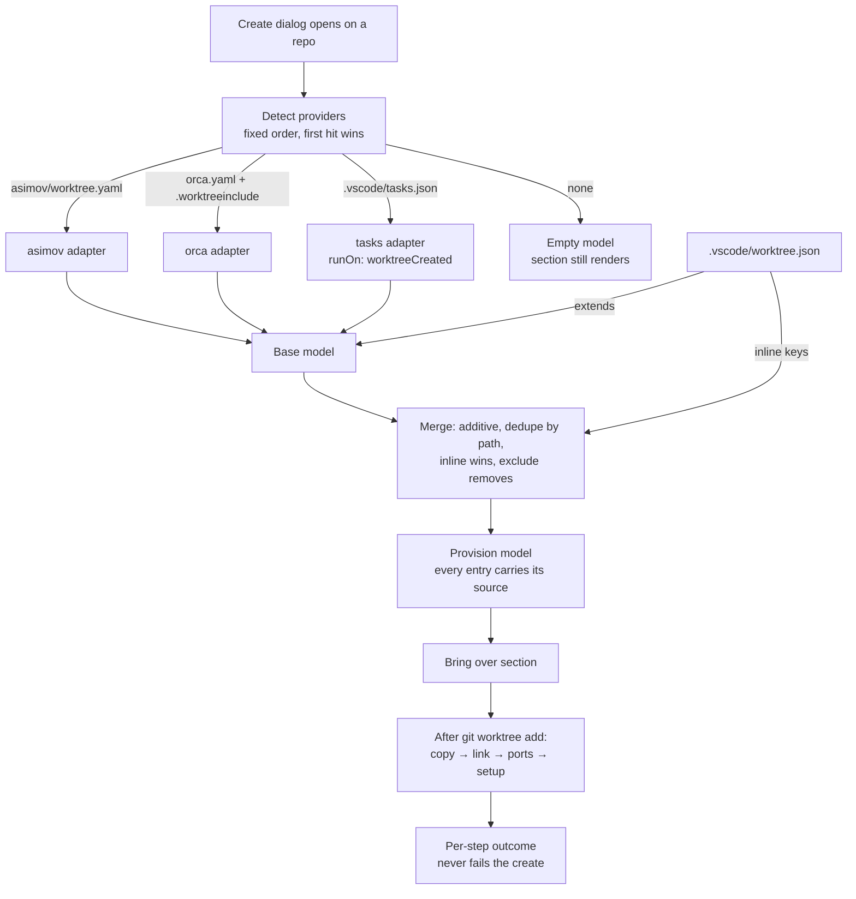

# Worktree Provisioning Design

> **Ref**: docs/DESIGN.md § 8.2 — the "Create / remove / lock / prune / launch" row
> **Consumer**: `asimov-plan` reads this to turn a PLAN.md task into spec deltas and builder tasks.

A freshly created worktree is a checkout and nothing else. It has no `.env`, no `node_modules`,
no editor-local settings — none of the untracked material the repository needs in order to run.
This document owns what the extension **reads** to learn that material and how it presents it
before a worktree is created. What happens on disk afterwards is
[worktree-apply.md](worktree-apply.md).

Message shapes live in [worktree-rpc.md](worktree-rpc.md). The form that renders this is
[worktree-create.md](worktree-create.md) § 4.

## 1. Overview

The extension does not define a provisioning format. It **reads the ones the repository already
has**, normalizes them into one model, and names the source of every entry it shows.



Two properties hold everywhere in this document:

- **Provenance is per entry, not per section.** A merged model routinely holds a `copy` list
  assembled from two files. An entry that cannot name its source is a bug, not a default.
- **Detection never mutates.** Reading a provider file never writes one. `.vscode/worktree.json`
  is the only *configuration* file the extension writes, and only when the user asks it to (§ 6).
  Applying the model writes into the **new worktree** — copied files, symlinks, and
  `.env.worktree` (§ 5) — which is a different thing from editing a repository's configuration.

## 2. The normalized model

```ts
/**
 * Every selectable item carries an opaque host-issued id, unique within one offer. The webview
 * submits ids; it never submits paths or command text (§ 4.0). Ids are not stable across offers.
 */
export interface ProvisionItemId {
  readonly id: string;
}

/** One thing to materialize into a new worktree. */
export interface ProvisionEntry extends ProvisionItemId {
  /** Repo-relative POSIX path. Globs are expanded at read time, never stored. */
  readonly path: string;
  readonly mode: "copy" | "link";
  /** Provider file this entry came from, repo-relative. Never absent. */
  readonly source: string;
}

/**
 * One step to run in the new worktree after materialization.
 *
 * There is exactly one variant. A second, carrying a resolved VS Code task so the task system
 * could run it with its identity intact, was designed and then removed: a task cannot be run
 * for a directory that is not a workspace folder, and it does not refuse — it runs in the
 * window's open folder instead. See § 3.3 for what `tasks.json` contributes now.
 *
 * `kind` survives the collapse to a single member so a later variant can be added without
 * reshaping every stored step.
 */
export type ProvisionSetupStep = ProvisionItemId & {
  readonly kind: "shell";
  /** Exact script text, passed as the shell's single script argument. Never concatenated. */
  readonly script: string;
  readonly source: string;
};

/** A named port the repo wants allocated per worktree. Selectable, like every other row. */
export interface ProvisionPort extends ProvisionItemId {
  readonly name: string;
  readonly source: string;
  /**
   * The free port this create will take.
   *
   * OPTIONAL, because a row is offered before a number exists for it. Reading a provider
   * file learns only the NAME the repo wants; allocating a free port is WT-012.6, which
   * lands after the task that materializes files. So a port row is named, attributed and
   * selectable with no number, and the dialog renders the name alone rather than a
   * placeholder that reads as an allocation nobody made.
   *
   * Once set it is still a preview: it is re-resolved immediately before it is written
   * (§ 5.3), and the second resolution is the one that binds.
   */
  readonly port?: number;
}

export interface ProvisionModel {
  readonly entries: readonly ProvisionEntry[];
  readonly setup: readonly ProvisionSetupStep[];
  readonly ports: readonly ProvisionPort[];
  /** Providers detected, in detection order. The first is the one that supplied the base. */
  readonly providers: readonly ProvisionProvider[];
  /** Entries an `exclude` rule removed, kept so the UI can show them as deliberate. */
  readonly excluded: readonly ProvisionEntry[];
  /** Advisory: spellings a volume may resolve to one destination (§ 4.4). */
  readonly contenders: readonly ProvisionContenders[];
  /** Populated when a provider file was found but could not be read. */
  readonly problems: readonly ProvisionProblem[];
}

export interface ProvisionContenders {
  /** Entry ids in one connected component of the folding key — two or more. */
  readonly members: readonly string[];
  /**
   * The members the repository's own file declared, in `members` order.
   *
   * Reported, not adjudicated: how many of them the SELECTION still holds is
   * what decides the group, and only the side holding a selection can ask.
   */
  readonly natives: readonly string[];
}

export interface ProvisionProvider {
  readonly id: "asimov" | "orca" | "vscodeTasks" | "native";
  /**
   * Repo-relative files this provider reads. Plural because orca is one
   * provider over two files, and naming either alone would tell the user
   * something other than what was read.
   */
  readonly files: readonly string[];
  /** True for the provider whose model the native file extended or detection chose. */
  readonly active: boolean;
}

export interface ProvisionProblem {
  readonly file: string;
  readonly reason: "unreadable" | "malformed" | "unknownKey" | "missingExtends" | "unsubstituted";
  /** Bounded, already safe to render. Parser text is quoted, never interpreted. */
  readonly detail: string;
}
```

`mode` is deliberately two values. A third — clone-on-write, which orca uses on APFS — is an
**implementation detail of copy**, not a user-facing choice: it produces a file with independent
contents, which is what `copy` promises. Where the platform offers it, copy uses it.

## 3. Provider adapters

Each adapter is a pure function from file text to a partial model. None of them executes
anything, and none reads a file outside the repository.

### 3.1 asimov — `asimov/worktree.yaml`

The richest source, and the one this repository itself uses.

| YAML key | Maps to |
|---|---|
| `copy: [path, …]` | `entries[] { mode: "copy" }` |
| `link: [path, …]` | `entries[] { mode: "link" }` |
| `ports: { NAME: … }` | `ports[] { name }` |
| `setup: [command, …]` | `setup[] { kind: "shell" }` |

Entries may contain a `*` glob in the final segment; it is expanded against the main worktree at
read time, because the list the user is shown must be the list that will actually be copied.
An unmatched glob is not an error — it contributes nothing and is not reported as a problem, since
a repo legitimately carries optional material.

### 3.2 orca — `orca.yaml` and `.worktreeinclude`

Two files, one provider, because orca splits what asimov keeps together.

| Source | Maps to |
|---|---|
| `orca.yaml` → `scripts.setup` | `setup[] { kind: "shell" }` — ONE step, trailing whitespace trimmed, never split |
| `orca.yaml` → `worktree.sharedDirectories[]` | `entries[] { mode: "link" }` |
| `.worktreeinclude` | `entries[] { mode: "copy" }` — line-delimited, `#` comments and blank lines dropped |

`scripts.setup` is one shell program and becomes one step. Splitting it on newlines — as an
earlier draft of this section said — turns `if [ -f package.json ]; then / pnpm install / fi` into
three steps, two of which are syntax errors on their own, and orca itself runs the block as one.

`sharedDirectories` is link-only by orca's own definition, and orca additionally requires the
directory to exist and be gitignored. The adapter **records the intent without enforcing orca's
preconditions** — an entry naming a directory that does not exist is shown, and fails at apply
time with a per-entry outcome (§ 5). Enforcing another tool's preconditions at read time would
mean the section silently disagrees with the file the user is looking at.

`orca.yaml` keys outside these two are ignored without a problem record. They configure orca, not
provisioning, and reporting them would make every orca repo look misconfigured.

### 3.3 VS Code tasks — `.vscode/tasks.json`

Tasks whose `runOptions.runOn` is `"worktreeCreated"` map to `setup[] { kind: "shell" }`, in file
order, carrying the task entry's `command` — plus its `args`, joined with the shell quoting
defined just below — as the step's `script`.

**Quoting.** Each `args` word is quoted as a single POSIX argument. The `command` is quoted too,
UNLESS the entry declares `"type": "shell"`. A `type: "process"` task runs with no shell, so
`./bin/build; touch /tmp/x` is a legal executable name there — rendering it verbatim into text a
later task hands to `sh -c` would turn one reviewed task into two commands. The quoting itself is
`src/utils/posixShellQuote.ts`, the repository's one implementation of the rule. An earlier
draft deferred this to a subsection of § 2 that was never written.

**Task identity is not preserved, and cannot be.** The design carried a `task` variant for exactly
that purpose until it was measured: a `vscode.Task` scoped to a directory that is not an open
workspace folder does not run there, and does not refuse either — on 1.105.0 it ran in the
window's opened folder for both a hand-built `WorkspaceFolder` and `TaskScope.Workspace`. A
worktree the dialog just created is never an open folder, so every such step would have run its
`pnpm install` in the main checkout and reported success. What a task entry can still supply is a
command a user already reviewed and checked in; that is what this adapter takes.

What is lost with the identity is the task system's own machinery: `problemMatchers`, presentation
options, `dependsOn`, and the entry's appearance in the task list while it runs. A repository that
needs those should declare the step in one of the native providers instead. Task fields the shell
cannot honour are ignored rather than approximated — a half-honoured `problemMatcher` is worse
than an absent one, because the user would believe it ran.

**This is a convention, not an API.** `runOn: "worktreeCreated"` exists in VS Code's task schema
and its dispatcher is core-internal to the Agent Sessions feature; the `TaskRunOn` enum that would
expose it to an extension is a **proposed API** (`vscode.proposed.taskRunOptions.d.ts`), which a
published extension cannot enable. The adapter therefore parses `.vscode/tasks.json` itself and
honours the same key with the same meaning. Nothing here depends on the proposal shipping, and if
it does ship, the adapter is what gets deleted — not the schema we would otherwise have invented.

`tasks.json` is JSONC: comments and trailing commas are legal and must parse. Variable
substitution (`${workspaceFolder}` and friends) is **not** performed by the adapter, and with the
task system out of the path nothing else performs it either. A step whose command contains a
`${...}` token is recorded in `problems[]` as `unsubstituted`, naming the task label, and the step is offered unchecked: running it would pass
the literal token to the shell, and silently substituting our own value for `${workspaceFolder}`
would guess at which of the two checkouts the author meant.

### 3.4 Anywhere Terminal — `.vscode/worktree.json`

The native file. It exists to add to, subtract from, or replace what a framework declared —
and to give a repository with no framework somewhere to put its answer.

```jsonc
{
  // Optional. A repo-relative path to any file section 3.1–3.3 can read.
  "extends": "asimov/worktree.yaml",

  // Optional. Same shapes as the asimov adapter.
  "copy": [".env.local"],
  "link": ["third_party"],
  "setup": ["pnpm install --frozen-lockfile"],
  "ports": { "APP": null },

  // Optional. Removes inherited entries by path. No effect on inline keys.
  "exclude": [".code-review-graph"]
}
```

Unknown top-level keys produce a `unknownKey` problem and are otherwise ignored. The file is
never rejected wholesale for one bad key — a typo should cost the user that one line, not the
whole configuration.

The members are read from the file's **parse tree**, never from a parsed value object. A parsed
value cannot answer what the file actually declared: a `"__proto__"` member lands on the
prototype, where ordinary lookup consumes it as `extends`, `exclude` or an inline key while key
enumeration cannot see it — so the one shape that most needs reporting is the one shape that
reports nothing. Reading the tree makes every member a real member: it is either read or reported,
and no key can supply a value invisibly. A member whose value failed to parse has no value node at
all, so the read guards for it rather than assuming every member has one; the file still recovers
around it.

## 4. Detection, merge, and provenance

### 4.0 The model the user saw is the model that runs

Everything below produces a model the dialog displays. What executes must be **that** model, not a
re-read of the provider files after the user pressed Create.

- The host resolves the model once, keeps it, and issues an opaque **offer id** with a fingerprint
  over the normalized model — every entry path, every mode, and the exact step text or task
  identity.
- The dialog submits **item ids plus that offer id**. It never submits command text or paths: a
  webview that could supply the command to run would be the authority on what runs.
- Execution uses the host-held model the offer id names.

**What happens on an unknown, expired, or invalidated offer**, stated precisely because the
obvious phrasing is impossible: the host performs **no create and no provisioning**, resolves a
fresh model, presents it, and waits for a **second submission** against the new offer id. The
property being protected is *nothing executes that the user has not seen* — not *the host never
resolves twice*, which no implementation could satisfy.

Without this, "the user saw the command" is not a property the system has — only one the UI had
momentarily. Re-reading the file at execution time is exactly the window an untrusted checked-in
file needs.

### 4.1 Detection order

`.vscode/worktree.json` → `asimov/worktree.yaml` → `orca.yaml` / `.worktreeinclude` →
`.vscode/tasks.json`.

The native file is checked first because it may name its own base via `extends`.

**A native file without `extends` is the sole active provider.** Its inline keys are the whole
model and every framework file is recorded `active: false`. The alternative — letting inline keys
implicitly overlay the first detected framework — is rejected because it would make `extends`
meaningless: a file would inherit whether or not it asked to, and there would be no way to say
"only what I wrote here".

When there is **no** native file, the first framework hit supplies the model. Either way, later
hits are recorded in `providers[]` with `active: false` so the UI can offer them without hiding
the choice ([worktree-create.md](worktree-create.md) § 4.3).

First-hit-wins rather than merge-everything, because two frameworks configured in one repository
usually means one is being migrated away from, and silently unioning them would run a setup
command the user believed they had retired.

### 4.2 Merge rule

When `.vscode/worktree.json` declares `extends`:

1. Start with the extended provider's model.
2. Append the native file's inline entries.

   The assembled model is in that order, but it is **built** native-first: the scan and row
   accounts (§ 7) are consumed as entries are appended, so starting with the inherited model
   spends the budget on inherited rows and can starve the native file's own entries at the cap —
   defeating the very rule that makes the native entry win. Building native-first and assembling
   in the order above satisfies both. This is a change in output, not a wash: a native glob that
   consumes the scan account leaves an inherited glob refused where base-first would have matched
   it. That is the intent — the repository's own file outranks what it inherits — so problem order
   is chosen deliberately rather than falling out of build order.
3. Dedupe by **identity**: the declared path normalized lexically — separators, `.` and `..`
   segments, a trailing slash — and nothing else. Two declarations merge only when their
   identities are exactly equal, and then **the native entry wins**, including its `mode` — this
   is how a path the framework links becomes a path this repo copies. Identity reads no
   filesystem, on any platform: every probe that would answer the question properly
   (`realpath`, `lstat` dev+ino, a case-toggled test file) answers for the wrong volume, the
   wrong moment, or two aliases at once, and the worktree the answer belongs to does not exist
   yet when the offer is drawn.
4. Apply `exclude` on that same identity, so a pattern cannot match one spelling of a path and
   miss the row the merge kept. Any entry that matches moves from `entries` to `excluded`,
   keeping its original `source`. An `exclude` entry that matches nothing is reported as a
   problem rather than dropped — a pattern that silently matches nothing looks identical to one
   that worked. `exclude` never matches an inline entry; removing something you just added
   is a contradiction to surface, not a rule to implement, so it produces an `unknownKey`-class
   problem naming the path.
5. `setup` steps are appended, never deduped — two providers may legitimately want the same
   command run twice, and reordering or dropping steps changes their meaning.

Merge is additive because provenance is per entry (§ 1) and the UI draws a source badge per row.
Whole-key replacement would collapse that to one badge per section and throw away the information
the section exists to carry.

### 4.3 Provenance is preserved through every transform

An entry's `source` is set by the adapter that produced it and is never rewritten — not by merge,
not by dedupe (the winner keeps its own source), not by exclusion. A glob expands into several
entries that all carry the glob's source file.

### 4.4 Spellings that may be one destination

Case and Unicode folding is a property of the volume, not of the paths, so two declarations that
differ only by folding can be one file on APFS and two on NTFS. Neither answer is safe to assume:
merging deletes a declaration the repository made, and splitting leaves two default-selected rows
whose apply order decides which `mode` lands.

So they are neither merged nor discarded. Both stay offered, each with the spelling and `source`
its own file wrote, and the model carries a **contender group** naming them — a connected
component over the folding key, not a pair, since three spellings can collide. The group records
which of its members the repository's own file declared, as `natives`. It records no winner: a
group is decided by how many of those the user's SELECTION still holds, and the offer has no
selection to ask about.

That count is the whole rule, and both sides run it over `natives` intersected with the selection:

| Selected repository declarations | Outcome |
|---|---|
| exactly one | it is favoured and materialized; every other member is refused, naming the contest |
| none | nothing claims priority, so the selected members are applied in their ordinary place |
| more than one | the group is **refused entire** — nothing available can choose between two of the repository's own declarations, and picking one would decide a user's config silently |

Carrying a winner instead of the count is what made the dialog and the apply disagree three times
over: a winner computed once against the full offer goes stale the moment the user unticks a row.
So the dialog offers a doubly-declared group SELECTED and says every member will be refused —
unticking it on the user's behalf would read back as "none", which is the state that APPLIES.

The folding key is per path segment: NFKC, lowercase, the Win32 trailing-dot/space and `::$DATA`
fold, then **uppercase, then NFKC again**. Uppercase last is load-bearing — it is what performs the
multi-character expansions (`ß` → `SS`) that lowercase alone leaves apart — and the closing NFKC
repairs the sequences uppercasing decomposes. The key is deliberately over-inclusive: a group is
advisory, so grouping two rows that a volume would keep apart costs a marker, while missing a pair
costs a declaration.

The relation is filled at the one point every model is assembled, so a model read directly from an
adapter carries it exactly as an assembled one does — and it is filled **after** the merge and the
exclusions, over the entries that survived them. Grouping earlier would let a row the merge
deduped or `exclude` removed hold a destination slot it will never be applied to, refusing a
member that has no live rival.

## 5. Applying the model — see worktree-apply.md

Ordering is fixed: **copy → link → ports → setup**, applied after `git worktree add` reports
success. The steps, their refusals, and the manifest they leave behind are
[worktree-apply.md](worktree-apply.md). This document stops at the model those steps consume.


## 6. Writing the native file

`[Configure…]` in the create dialog writes `.vscode/worktree.json` and **nothing else, ever**.

A provider file belongs to the tool that defined it. Rewriting `asimov/worktree.yaml` to record a
preference expressed in our dialog would put our opinions in another tool's file, destroy its
comments, and surprise every other consumer of it. When the user changes something inherited, the
native file gains an inline entry or an `exclude` — which is exactly what those two mechanisms are
for.

Writing preserves the existing file's formatting and comments where one exists; a new file is
written with `extends` pointing at whatever provider detection made active, so the first write is
additive rather than a snapshot that freezes today's framework config.

## 7. Security

- **Every path is repo-relative and must resolve inside the repository.** Containment is checked
  with `isPathInside` from `src/utils/pathBoundary.ts` — the single definition in `src/`. This
  module never spells its own containment test. Where the answer authorizes a filesystem read or
  write, the resolved form (`isResolvedPathInside`) is used, per DESIGN.md § 9 D31.
- An entry escaping the repository — `../`, an absolute path, or a symlinked component resolving
  outside — is **refused and reported**, never clamped into range. Clamping turns a suspicious
  entry into a silently different one.
- **Provider files are untrusted input.** They are frequently checked into repositories the user
  cloned rather than wrote. Parser output is data: a `setup` command is displayed before it runs
  and is gated by an explicit checkbox that is off unless the user leaves it on. No provider file
  can cause a command to run without the user having seen it in the dialog.
- Problem `detail` text is bounded and rendered as text. A YAML parser's error message can quote
  arbitrary file content, so it is never interpreted as markup.

## 8. What this does not do

- **It does not validate another tool's semantics** beyond what it needs to render and apply.
- **It does not run on worktrees it did not create.** Provisioning is part of the create action.
  An existing worktree is not retroactively provisioned.
- **It does not tear anything down.** A worktree that provisioning started — a container, a
  database, a daemon — is not stopped when the worktree is removed. Cleanup scripts and process,
  container, and database teardown are **deferred**, and removal does not run a cleanup step.
- **It does not namespace anything but TCP ports.** Docker Compose project names, container and
  volume names, networks, and database names are not allocated or isolated. D40 is about ports and
  claims nothing about general runtime isolation.
- **It does not warn about the size or the secrecy of what it copies.** A provider can name a
  large directory or a file holding credentials — this repo's own config copies
  `.claude/settings.local.json` and `.opencode/node_modules` — and the section states the paths
  without judging them. Size and secrecy warnings are **deferred**, deliberately: they need a
  policy about what counts as a secret, and guessing produces either noise or false assurance.
- **It does not merge two frameworks.** § 4.1.

## 9. Edge cases

| Case | Behaviour |
|---|---|
| No provider file at all | Empty model. The section still renders and says the worktree will have no `.env` or `node_modules` — silence is what ships a broken worktree |
| Provider file present but malformed | `problems[]` entry; the section names the file and offers to open it. **Create stays enabled** — a broken provisioning config is not a reason to refuse to make a worktree |
| `extends` names a file that does not exist | `missingExtends` problem; the inline keys still apply |
| `extends` names a file that is there and cannot be read | The read's own problem is reported, naming `extends` — a permission error or an unreadable encoding is a different fact from absence, and reporting it as `missingExtends` sends the user looking for a file that is sitting right there. Absence, a containment refusal, and a root that could not be read keep their existing classifications; only the unreadable-file reason splits off |
| A `"__proto__"` member in a JSONC provider file | A reported unknown key, never a source of values (§ 3.4) |
| `extends` names a file outside the repo | Refused under § 7 |
| Two providers detected | First supplies the base; the other is offered, never hidden (§ 4.1) |
| Glob matches nothing | Contributes nothing; not a problem |

## 10. Testing

| Area | Cases |
|---|---|
| Adapters | Each provider's mapping; JSONC comments and trailing commas; block scalar splitting; `#` comments in `.worktreeinclude`; unknown keys produce a problem without discarding the file; a `tasks.json` entry becomes a `shell` step carrying its command, and one containing `${...}` is recorded `unsubstituted` and offered unchecked |
| Parse-tree reading | A `__proto__` member holding `extends`, `exclude` and an inline key changes no entry and is reported as a key; a member whose value does not parse still recovers the rest of the file |
| Merge | Additive append; dedupe keeps the native entry and its mode; `exclude` moves an entry and keeps its original source; `exclude` on an inline path reports; setup steps never dedupe or reorder |
| Provenance | Every entry in every merged model has a non-empty `source`; a glob's expansions all carry the glob's source |
| Detection | Order; first-hit-wins; a second provider is recorded inactive rather than merged |
| Containment | `../`, absolute, and symlink-escaping entries are refused, not clamped; the module contains no local containment implementation |
