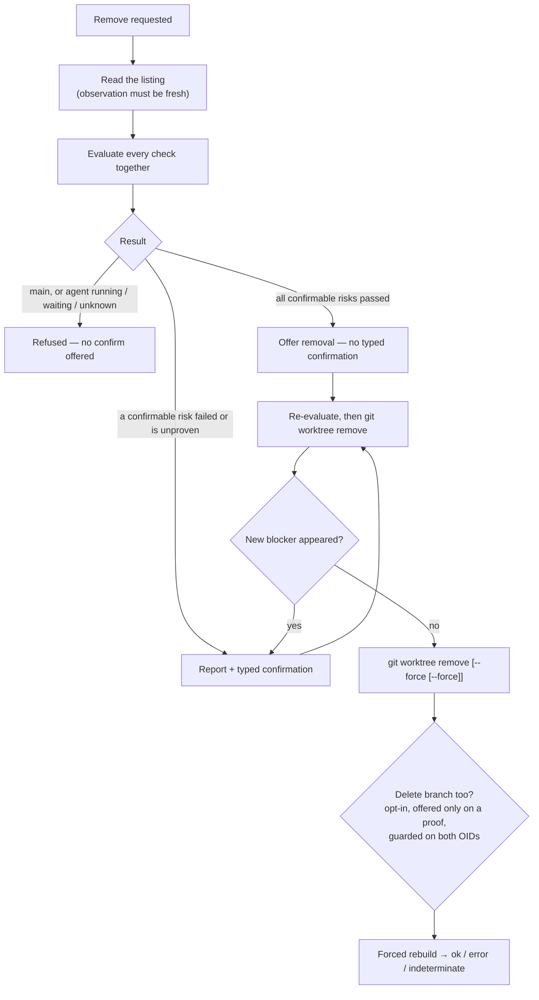

# Worktree Removal Design

> **Ref**: docs/DESIGN.md § 8.2 — the "Create / remove / lock / prune / launch" row
> **Consumer**: `asimov-plan` reads this to turn a PLAN.md task into spec deltas and builder tasks.

Removing a worktree deletes a directory recursively. It is the most dangerous thing this
extension does, and the only one whose mistakes are unrecoverable.

Split out of [worktree-actions.md](worktree-actions.md) § 3.3 — that document keeps the action
inventory, the shared mutating rules, and lock / prune / launch. Message shapes are
[worktree-rpc.md](worktree-rpc.md).

## 1. Overview

Removal is presented as a **report, not a form**. The user is shown what was checked, what passed,
what failed, and what could not be proven — and only then what is offered.

## 2. Checks

Evaluated **together**, so one report can name all of them at once.

| Check | How it is determined | Failing means |
|---------|---------------------|---|
| `isMain` | `kind === "main"` | Unconditional refusal; no confirmation overrides it |
| `locked` | From the listing | Confirmable; needs `--force --force` |
| `dirty` | `git status --porcelain` in the worktree, tracked changes present | Confirmable |
| `untracked` | Same command, untracked entry count | Confirmable |
| `idlePanes` | Panes in this window inside the worktree whose agent is not mid-turn | Confirmable |
| `busyAgents` | Rows here whose activity is `running` or `waiting` | **Refused, not confirmable** |
| `externalAgents` | Live registry sessions rooted in the worktree | **Refused** when the session's activity is `running`, `waiting`, or cannot be determined; confirmable only when it is provably idle |
| `ignored` | Bounded walk of ignored content (§ 2.3) | Confirmable |
| `branchMerged` | Is the branch an ancestor of the repo's default branch? (§ 4.1) | Unproven withholds branch deletion only (§ 5) |

`idlePanes`, `busyAgents`, and `externalAgents` are worktree-view-specific and are the reason this
action is worth building here rather than leaving to the terminal: removing the directory out from
under a running agent is the failure mode a worktree UI is uniquely positioned to prevent.

### 2.1 Passed checks are shown

A report that lists only problems gives the user no way to judge how much was actually looked at.
Every check renders with its outcome — passed, failed, or unproven — so a warning is legible
against what else was verified rather than floating alone.

### 2.2 Three classes of check, and what unproven means in each

"Unproven blocks" is too blunt to be implementable — it would let an unfetched default branch
prevent removing a worktree whose branch deletion nobody asked for. Checks fall into three classes,
and **unproven blocks only the action that needs that particular proof**.

| Class | Checks | Outcome when it holds | Outcome when unproven |
|---|---|---|---|
| **Hard refusal** | `isMain`; any agent whose activity is `running`, `waiting`, or unknown, in this window or the registry | Removal is refused. No confirmation exists | **Refused.** Activity that cannot be determined is treated as live |
| **Confirmable risk** | `dirty`, `untracked`, ignored runtime material (§ 2.3), `idlePanes`, `locked` | Named in the report; removal proceeds on an explicit confirmation | Named as unproven and confirmable — the user is told the check could not run |
| **Proof-gated option** | `branchMerged`, and the orphan proofs of § 4 | Unlocks the optional action it gates | **The gated action is not offered.** Removal itself is unaffected |

A fourth outcome, `notApplicable`, exists and is not the same as either passing or unproven: an
unlocked worktree has no lock age, and a worktree with no recorded owner has no owning process.
Rendering those as "passed" would claim a check ran that never applied.

**Typing never overrides a proof.** A typed confirmation authorizes confirmable risk; it does not
manufacture a proof, so it can never unlock a proof-gated option.

**One session is counted once.** The Claude session registry is user-wide, so an agent running in a
pane of this window writes its own live record there too. Counted twice, it is both an idle pane and
an unknown external session, and the unknown one refuses — making a worktree unremovable because of
a terminal this window can already see. A registry record is therefore dropped only where the *same*
assessment holds the pane that claimed it, resolves it inside the worktree being removed, and sees
it **idle** there. A pane that is running, waiting, unclassified, exited, or absent from that
snapshot corroborates nothing, and the registry record stands and refuses. Both directions of
failure point the same way: an unknown session refuses, and a claim that cannot be corroborated is
not a claim.

### 2.3 Removal reports what it will delete, not what git tracks

`git status --porcelain` reports tracked changes and untracked files. It says nothing about
**ignored** material — and this subsystem deliberately creates ignored material in every worktree
it provisions: `.env.worktree`, copied local configuration, installed dependencies, build output.

A report where every check passed, followed by the recursive deletion of a `node_modules` and a
copied `.env`, is a report that did not mention the thing the user most needed to hear.

Ignored content is therefore inspected and reported as its own confirmable risk, with a **bounded**
strategy: a count and a total size, gathered under a time and entry budget, degrading to "could not
be determined" rather than walking an enormous tree. Unproven here is confirmable, not refusing —
a slow disk must not make a worktree unremovable.

The budgets cover **enumerating** the content as well as measuring it, and they are one budget
rather than one per phase: listing a tree is itself unbounded work, so time spent listing is time
the sizing no longer has. Every terminating condition produces the same answer — budget exhausted,
unreadable content, or an enumeration that failed — because a partial count rendered as a total is
worse than no count at all: it reads as a number somebody measured. What the bounds cannot do is
withdraw work already handed to the operating system; a read that outlives the deadline is
abandoned rather than cancelled, and the assessment answers without it.

Material this extension itself provisioned is named as such, because "the 4 files this worktree was
set up with" is a different sentence from "1.2 GB of ignored content". That naming comes from the
provisioning manifest ([worktree-apply.md](worktree-apply.md) § 2.6), which is what
makes the claim survive a host restart. Where the manifest is missing or unreadable, the report
falls back to the undifferentiated count and says so — it never guesses which files were ours.

### 2.4 Typed confirmation is earned, not routine

A removal where every **confirmable-risk** check passed is offered with an ordinary confirm. A
typed confirmation — the user retyping the worktree's name — appears **only when a confirmable-risk
check failed or could not be evaluated**. A withheld proof-gated option never triggers it: nothing
about an unfetched default branch makes deleting the worktree more dangerous.

Requiring it every time trains the user to type past it, which is the opposite of the intent. It
is a speed bump for the cases that earned one.

## 3. What confirmation actually authorizes

Earlier drafts said a confirmation "permits rather than bypasses" the check. That is true of the
*unforced* path and false of the forced one:

- Re-evaluating checks before spawning git narrows the window. It does not close it. Git's own
  clean check is skipped entirely under `--force`, and even unforced removal has a gap between its
  status read and its recursive delete. A file written after the last check — by an agent, another
  window, an external editor — is deleted with everything else.
- Per-repo serialization covers this extension host only. Another VS Code window, a bare `git`
  invocation, or any other process is outside it.
- So `--force` is presented for what it is: **irrevocable deletion of everything under that path,
  whose contents may change after you confirm.** Not "you have reviewed the losses".

Two rules follow, and they are what make this a safety model rather than a warning label:

- **A newly appeared check failure re-prompts.** The confirmation is bound to the check set the
  user saw ([worktree-rpc.md](worktree-rpc.md) § 3.1). If execution-time re-evaluation finds a
  *different* failure — a live agent that was not there when they confirmed dirty files — the
  action returns `needsConfirm` again rather than proceeding on authority the user never granted.
- **Force never runs against a working agent.** A row whose activity is `running` or `waiting`
  blocks removal outright, with no confirm available — and so does one whose activity **cannot be
  determined**, in this window or in the registry. An external session we cannot ask about is not
  evidence of idleness. An idle *pane* remains confirmable: a terminal sitting at a prompt is a
  different risk from a turn in flight.

**Removal asks the same observation a launch does.** A repository publishes that observation only
when its own listing was read: withheld when the cache retained a listing it could not re-read,
withheld for every repository while git itself is unusable, and kept for a repository nobody can
watch. The claim is re-asked rather than remembered: across the assessment's status and session
reads, immediately before the destructive command with no `await` in between, and again across the
post-attempt filesystem read. Evidence gathered under one observation never authorizes a command
issued under another — at the same path, that is how a replacement would be removed on its
predecessor's evidence. A mismatch reports the listing as unreadable, which is indeterminate, not
a refusal.

**Panes are not killed.** Removing a worktree with idle panes inside it leaves those panes running
in a deleted directory — which is what a terminal does, and what the user asked for by confirming.
The confirmation says so.

## 4. Orphan proofs — computed and shown, never acted on alone

Three proofs identify a worktree nobody is using any more:

### 4.1 Where each proof comes from

A proof with no named source is not implementable, and two of these had none.

| Proof | Source | `notApplicable` when |
|---|---|---|
| **Lock is old enough** | The mtime of `.git/worktrees/<name>/locked`, which git itself writes on `worktree lock`. Threshold: **24 h**, a recorded constant, not a tuned one | The worktree is not locked |
| **The owning process is gone** | The **existing Claude PID registry**, read through an assessment that preserves what the presence reader discards. `runningSessions.ts` enumerates *live* sessions and skips dead-PID records, so its empty result cannot tell "no record" from "a dead record was filtered out" — and this proof needs exactly that distinction. The removal path therefore reads the raw records and classifies each as live, dead, or unreadable | **No record exists now.** Note this is an observable present-tense fact, not the unobservable claim that the registry never covered this worktree |
| **The branch is merged** | `git merge-base --is-ancestor <branch> <default>`, where the default branch is the one `refs/remotes/<remote>/HEAD` names, falling back to the repository's `init.defaultBranch` and then to a local `main` or `master`. The comparison is against the **local** ref: a fetch is never issued to answer a question the user did not ask, so a stale local default reports unproven rather than a wrong answer | — |

They render as checks alongside § 2's, under the proof-gated rule of § 2.2: **a proof that cannot
be evaluated withholds the action it gates, and does not by itself prevent removal.**

An earlier draft invented "the PID recorded for the worktree" with no writer and no lifecycle. It
is replaced above by the registry the subsystem already maintains; if that registry is unavailable,
the proof is unproven, not assumed.

**One scan yields two views, and they are not interchangeable.** The registry is read once and the
producer derives both from that read:

- the **undeduped live records** answer the ownership proof, because a duplicate that loses the
  registry's canonical selection is still a live pid rooted in that directory;
- the **canonical live list** answers the refusal, one record per session id, chosen by the
  registry's own rule — interactive over headless, then newest `startedAt`, then highest pid.

The ORDER is the contract, not just the rule. The winner is chosen over every live record
**user-wide, before anything asks which directory a session is rooted in**. Testing containment
first and keeping whatever survives selects a different record, and a session whose canonical record
is rooted elsewhere then refuses a removal it did not refuse before. The selection therefore keeps
one implementation and one home — the live reader exports it as a pure derivation over records
already in hand, rather than the removal path re-deriving it from metadata copied onto a second
type.

Dead records are carried as evidence and never resolved to real paths: they cannot make the
ownership proof fail, so realpathing user-wide stale session history was unbounded work for an
answer nobody reads.

**An incomplete scan is not evidence of absence.** A candidate registry file that could not be READ
marks the scan partial, and the ownership proof then answers `unproven` rather than `passed` — one
EACCES on a live owner's own record must not read as "nobody is here" about the one action that
cannot be undone. A partial scan that DID find a live owner still answers `failed`: a live owner
found is a fact an incomplete scan cannot weaken. A malformed payload is not partial — that file was
read and is simply not a record.

**Nothing is reaped automatically.** The proofs inform the report; the user still presses the
button. An automatic delete path justified by three heuristics is a new way to lose work, and the
three proofs exist to make a human decision better-informed, not to replace it.

## 5. Branch deletion — opt-in, proven, and guarded

**This reverses a previously recorded decision.** The earlier rule was that branch deletion is
never part of removal, on the grounds that silently bundling it would destroy work the user
believed was merely un-checked-out. That reasoning is preserved in full — what changes is that
"silently" is now doing the work. An explicit, defaulted-off, proof-gated opt-in is not the thing
that reasoning refused.

Rules, all of which hold together:

1. **Off by default**, always. It is a separate control, never implied by removing the worktree.
2. **Offered only when `branchMerged` is proven.** Unproven or false means the control is absent —
   not present-and-disabled, since an unmergeable branch is not a thing the user should be
   invited to reconsider mid-removal.
3. **Guarded by expected old value — both of them.** The merge proof is a statement about two
   refs, so both are recorded and both are verified immediately before the delete: the branch's
   OID *and* the default branch's OID. Guarding only the branch would let the default branch move
   backwards under a proof that is no longer true. Where git can express it, the verification and
   the delete go in one ref transaction.
4. **Never the default branch**, whatever it is named, and never a branch **checked out in another
   worktree** — re-checked immediately before the delete, not merely at report time.
5. **The remaining race is stated, not hidden.** Another process can check the branch out, or
   advance it, in the window the transaction does not cover. The guarantee is *guarded and
   fail-closed*, not *provably safe*: the delete fails rather than proceeding on stale evidence,
   which is a different and weaker claim than nothing bad can happen.
6. **A failed branch delete never fails the removal.** The worktree is gone; the branch remains and
   is reported. Rolling back a directory deletion is not possible, so the compound action reports
   its parts.

The control is **offered in the pre-removal report** — that is where the proof is shown — and
**executed only after the removal succeeds**.

`git worktree remove` itself never touches the branch. Deletion is a separate command with its own
guard, run after the removal succeeds.

## 6. Execution

`git worktree remove <path>`, or `git worktree remove --force <path>` only after an explicit
confirmation that named the failed checks. A locked worktree needs `--force --force` — a single
`--force` does not override a lock, so a documented "confirm past a lock" path fails outright
without the second flag. A `missing` worktree removes cleanly because git prunes the registration.

**Never delete files directly.** Directory removal is `git worktree remove`'s job; the extension
does not call `rm -rf`, ever. This bounds *our* bugs, not git's consequences: `git worktree remove`
still recursively deletes, so a wrong-but-valid path is data loss, not a safe failure. The
invariant removes an entire class of path-handling bug — it is not a safety net under the ones that
remain. The `gate:fs-deletion` script is the regression tripwire for it.

**Every mutation attempt is followed by a forced authoritative rebuild** — on success, on non-zero
exit, and on timeout — per [worktree-actions.md](worktree-actions.md) § 3.6. `git worktree remove`
deletes the working tree and the administrative metadata separately, so a non-zero exit can mean
the directory is gone, the metadata is gone, both, or neither. When git and the filesystem
disagree, the result is **indeterminate**, naming what was observed.

## 7. Partial failure never reads as success

A removal that did some of what it set out to do says so, and says exactly what is left on disk.

- The directory is gone but the registration survived, or the reverse → `indeterminate` with both
  observations named.
- The worktree was removed and the opted-in branch delete failed → the removal succeeded and the
  branch deletion is reported as failed, separately (§ 5).
- Where more than one worktree is ever removed in one action, a child that failed to unregister
  **stops the parent from being removed**. There is no such action today; the rule is recorded so
  that adding one does not have to rediscover it.

## 8. Edge cases

| Case | Behaviour |
|---|---|
| Main worktree | Refused unconditionally; no confirmation path exists |
| Locked | Confirmable, needs `--force --force` (§ 6) |
| Agent running or waiting | Refused, not confirmable (§ 3) |
| Idle pane inside | Confirmable; the pane is not killed and the confirmation says so |
| A confirmable-risk check cannot be evaluated | Unproven and still confirmable (§ 2.2) |
| A proof cannot be evaluated | The gated option is withheld; removal is unaffected (§ 2.2) |
| Worktree is not locked | Lock-age proof is `notApplicable`, not passed (§ 2.2) |
| Ignored content is large or slow to walk | Reported as could-not-be-determined under a budget; never blocks (§ 2.3) |
| Provisioning manifest missing after a restart | Ignored content is reported undifferentiated, and says so (§ 2.3) |
| Registry holds a dead-PID record | Classified dead, which proves the owner is gone — not filtered away as the presence reader does (§ 4.1) |
| External session activity unknown | Refused, not confirmable (§ 2.2) |
| All confirmable risks passed | Ordinary confirm, no typed confirmation (§ 2.4) |
| New failure appears at execution | Re-prompts rather than proceeding (§ 3) |
| Branch or default branch moved after the merge check | Guarded delete fails on either OID; worktree removal stands (§ 5) |
| Branch is the default branch, or checked out elsewhere | Deletion never offered (§ 5) |
| `missing` worktree | Removes cleanly; git prunes the registration |
| git and filesystem disagree | `indeterminate`, naming what was observed (§ 6) |
| Listing unreadable at any observation point | `indeterminate`, not a refusal (§ 3) |

## 9. Testing

| Area | Cases |
|---|---|
| Checks | Every check's pass, fail, unproven and `notApplicable` rendering; passed checks are present in the report; unproven never renders as passed and `notApplicable` never renders as either; each check carries its class, and unproven costs only what its class says it costs |
| Confirmation | Typed confirmation appears only when a **confirmable-risk** check failed or is unproven; absent when all passed; a withheld proof-gated option never triggers it |
| Refusal | `busyAgents` offers no confirm path at all; `isMain` is unconditional |
| Re-evaluation | A newly appeared failure re-prompts and does not ride the previous confirmation; fingerprint binding |
| Observation | Evidence from one observation never authorizes a command issued under another; a mismatch is indeterminate rather than a refusal |
| Force | `--force --force` for a locked worktree; a single `--force` is never used for a lock |
| Branch deletion | Absent unless `branchMerged` is proven; off by default; typing never unlocks it; both ref names and both OIDs are verified and a move in either fails the delete; the default branch is never offered; a branch checked out elsewhere is refused on a recheck immediately before the delete; a failed delete leaves the removal successful |
| Orphan proofs | Each proof's evaluated, unevaluable and inapplicable paths; the registry read distinguishes live, dead and unreadable records rather than filtering dead ones away; the merge proof issues no fetch; nothing is removed without an explicit press |
| Partial failure | Directory-gone-metadata-present and its inverse both report indeterminate with observations named |
| Ignored content | Reported under a time and entry budget; degrades to could-not-be-determined rather than blocking; named as ours only when the provisioning manifest is readable |
| Tripwire | `gate:fs-deletion` finds no destructive `node:fs` reference in this path |
