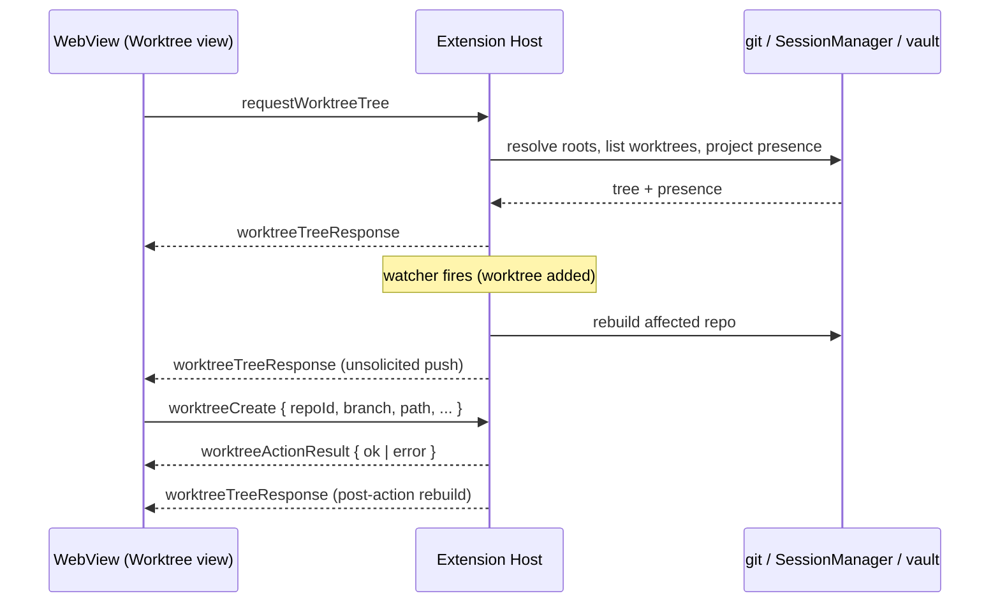

# Worktree Message Protocol Design

> **Ref**: docs/DESIGN.md § 13.2 — the "Message contract and validation" row
> **Consumer**: `asimov-plan` reads this to turn a PLAN.md task into spec deltas and builder tasks.

The messages the Worktree view exchanges with the extension host. Extends the existing
discriminated-union protocol in `src/types/messages.ts` (see
[message-protocol.md](message-protocol.md) for the protocol's shared rules) and follows its
established naming: `request<Thing>` from the webview, `<thing>Response` from the host,
imperative verbs for actions.

## 1. Overview



Two invariants carried over from the vault protocol:

- **The host owns freshness.** `worktreeTreeResponse` is sent both as a reply and unsolicited;
  the webview treats every arrival identically and never polls.
- **There is no single "the webview".** The vault panel is mounted in the same webview
  document as the terminals, and three surfaces load it — sidebar, panel, and editor — each
  with its own panel instance (`docs/DESIGN.md` § 13.6). Every push is a **broadcast** to all
  live surfaces, including the reply to a request that came from one of them, because they
  all render the same window-scoped truth. A surface whose Worktree view is not the active
  segment is skipped: all three retain their DOM while hidden, so an unfiltered broadcast
  pays render cost in panels nobody is looking at.

  Being skipped takes **two independent facts**, and neither stands for the other. The
  webview declares which body it is showing, via `worktreeViewVisibility` (§ 2.1). The window
  reports whether it is displaying that surface at all, which the webview cannot know:
  `retainContextWhenHidden` means a hidden surface keeps its DOM *and* its last declaration,
  so the declaration alone would stay true forever. The worktree body can be the shown body
  inside a panel the user has hidden, and a fully visible panel can be showing the sessions
  body — so a push goes only to a surface where both hold.

  Because a surface stops receiving while it is away, the moment it is displayed again is the
  moment it has to be current: that transition serves it **from the cache**, alone, without a
  rebuild. The watches keep running while it is away, so the cache already holds the answer
  a rebuild would go and re-read.
- **Actions on existing objects name ids, never paths.** Every action against a worktree that
  already exists names a `worktreeId` / `repoId` the host previously issued; the host
  re-resolves the path server-side from its own cache before touching git. A path in such a
  message is a UI hint at most — the same rule `VaultSessionEntry.sessionPath` already follows
  (`src/vault/types.ts:203`).
- **`worktreeCreate` is the one exception, necessarily.** It names a path for an object that
  does not exist yet, so there is no host-issued id to re-resolve it from. That path is
  **untrusted input**: canonicalized and validated host-side (§ 4), revalidated after any
  queue wait, and subject to the residual race documented in
  [worktree-actions.md](worktree-actions.md) § 3.2. An earlier draft of this document claimed
  webview paths are *never* action inputs; that claim was false for this message, and stating
  it absolutely would have hidden the only path-trust boundary in the feature.

## 2. Messages

### 2.1 WebView → Extension

| Type | Payload | Purpose |
|------|---------|---------|
| `requestWorktreeTree` | `{ force?: boolean }` | Ask for the tree. `force` bypasses the per-repo cache |
| `worktreeViewVisibility` | `{ visible: boolean }` | Declare whether this surface is showing the Worktree view. Gates every push to it (§ 1) |
| `requestWorktreeSubagents` | `{ rowId, entryId }` | Lazy subagent rows for one expanded agent row |
| `worktreeFocusPane` | `{ paneId }` | Reveal a window-scope pane. Rejected for external rows |
| `worktreeOpenFolder` | `{ worktreeId, mode: "newWindow" \| "addToWorkspace" }` | Open the worktree as a folder |
| `worktreeRevealInOS` | `{ worktreeId }` | OS file manager |
| `worktreeCopyPath` | `{ worktreeId }` | Copy the worktree path |
| `worktreeOpenTerminal` | `{ worktreeId }` | New terminal tab with cwd = worktree |
| `worktreeOpenPreview` | `{ rowId, entryId }` | Open the session preview overlay for an agent row |
| `worktreeResumeHere` | `{ worktreeId, entryId }` | Resume an existing session with cwd overridden to this worktree |
| `worktreeCopyResumeCommand` | `{ entryId, worktreeId? }` | Copy the resume command; the worktree scopes the cwd override when present |
| `worktreeLaunchAgent` | `{ worktreeId, agent, permissionChoiceId?, prompt? }` | Launch an agent in the worktree |
| `worktreeCreate` | `{ repoId, path, branch?, baseRef?, detach?: boolean, openAfter: WorktreeOpenAfterMode }` | Create a worktree. The three branch modes are mutually exclusive shapes, not flags: a new branch sends `branch` + `baseRef`, an existing one sends `branch` alone, and a detached create sends `detach` with an optional `baseRef`. Agent launch is WT-005.3 and is not sent yet |
| `worktreeRemove` | `{ worktreeId, force: boolean, fingerprint?: string }` | Remove a worktree. `force` and `fingerprint` travel together or not at all — a force carrying no fingerprint authorizes nothing, and an unforced call carrying one is a payload the host never issued |
| `worktreeLock` | `{ worktreeId, reason?: string }` | Lock a worktree |
| `worktreeUnlock` | `{ worktreeId }` | Unlock a worktree. Two messages rather than one `locked` flag: the verbs take different arguments and a boolean made the payload lie about which |
| `worktreePrune` | `{ repoId, confirmedCount: number }` | Prune stale registrations. `confirmedCount` is the number the user actually confirmed; the host re-counts before running and abandons the prune when the answer has moved |
| `requestWorktreeCreateDefaults` | `{ repoId, branch? }` | The destination this repo would use. Sent again whenever the branch settles, because the path is derived from it |

### 2.2 Extension → WebView

| Type | Payload | Purpose |
|------|---------|---------|
| `worktreeTreeResponse` | `{ tree: WorktreeTree, presence: WorktreePresence }` | The whole view state, always both halves together |
| `worktreeMutationResult` | `{ verb, repoId, worktreeId?, result }` where `result` is `{ kind: "ok", openFailed? }`, `{ kind: "error", message }`, `{ kind: "indeterminate", observed }`, `{ kind: "unavailable", unreadable }` or `{ kind: "blocked", worktreeId, fingerprint, blocker }` | Outcome of any mutating action, delivered to the SURFACE that started it. `unavailable` is not a failure — nothing was attempted, because what the action would affect could not be read. `openFailed` rides on a success: the worktree exists and the window did not open |
| `worktreeCreateDefaults` | `{ repoId, root, prefix, path, branch?, collidedWith? }` | The destination the create will actually use. `path` is free against BOTH the registry and the filesystem; `collidedWith` names the unsuffixed candidate when it was taken. `branch` echoes the question, so a form can tell a current answer from one it has typed past |

```
WorktreeOpenAfter = "none" | "terminal" | "agent" | "newWindow" | "addToWorkspace"
```

`agent` / `permissionChoiceId` / `prompt` are required exactly when `openAfter === "agent"`,
and rejected otherwise — a launch payload attached to a non-launch mode is a caller bug, not
a field to ignore. The launch runs **after** the create succeeds and reuses the same path as
`worktreeLaunchAgent`; a launch failure is reported without rolling back the create
(see [worktree-actions.md](worktree-actions.md) § 3.2).

`WorktreeTree`, `WorktreePresence`, `WorktreeAgentRow`, `DelegationRoster`, `WorktreeSubagentRow` are defined in
[worktree-model.md](worktree-model.md) § 2 and
[worktree-agent-presence.md](worktree-agent-presence.md) § 2. This document does not restate
their fields.

**A delegation roster has no message of its own.** `requestWorktreeSubagents` is answered by
the next `worktreeTreeResponse`, whose presence half carries the roster on the row it belongs
to (`WorktreeAgentRow.delegations`). A separate reply would reintroduce exactly the split this
section's next paragraph forbids — a roster arriving for a row the webview's current presence
no longer holds, or holds under a different session. It also gives the host one publish path
instead of two, so a roster and the row it decorates cannot disagree.

**Tree and presence always ship together.** Two separate messages would let the webview
render an agent row whose `worktreeId` is not in the tree it currently holds. One message
makes that unrepresentable.

## 3. Action semantics

### 3.1 Confirmation is a round trip, not a client-side guess

A destructive action the host judges unsafe does **not** fail. It returns
`worktreeActionResult { outcome: "error", needsConfirm }` describing exactly what would be
lost:

```
WorktreeRemoveBlocker {
  fingerprint:  string        // identifies THIS blocker set — see below
  dirty:        boolean       // tracked modifications present
  untracked:    number        // untracked file count (0 when none)
  idlePanes:    number        // panes in this window whose cwd is inside the worktree
  busyAgents:   number        // rows here whose activity is running or waiting
  externalAgents: number      // live registry sessions rooted in the worktree
  locked:       boolean
  isMain:       boolean       // main worktree — never removable, no confirm can override
}
```

The webview renders a confirmation naming the path and each non-zero blocker, then re-sends
the same message with `force: true` **and the `fingerprint` it was shown**.

**The fingerprint is what makes the confirmation specific.** Without it, `force: true` is a
blanket authorization: a user who confirmed "3 untracked files" would silently authorize the
deletion of a worktree that acquired a live agent in the meantime. The host recomputes the
blocker set at execution and compares:

| At execution | Result |
|--------------|--------|
| Fingerprint matches | Proceed — the user authorized exactly this |
| Blockers shrank | Proceed — strictly less is at risk than they approved |
| A blocker appeared or grew | `needsConfirm` again with the new set and a new fingerprint |
| `busyAgents > 0` | Refused outright. No fingerprint authorizes it; the agent must be stopped first |
| `isMain` | Refused unconditionally; `force` cannot override it |

`force` is **not** a claim that the removal is safe — it authorizes irrevocable deletion of
everything under that path, whose contents may still change between the check and git's
delete. [worktree-actions.md](worktree-actions.md) § 3.3 states that limit in full; the
confirmation copy must not promise more than it.

### 3.2 Every mutating action re-resolves before it runs

`worktreeId` → the host's cached `WorktreeInfo` → its `displayPath`. If the id is not in the
current tree (stale webview state after a rebuild), the action fails with a
"no longer exists — refreshing" error and the host pushes a fresh tree. No git command ever
runs against a path the webview supplied.

### 3.3 Actions rebuild afterwards — including when they fail

Every mutating action triggers an immediate forced rebuild of its repo and a push: on success,
on non-zero exit, **and on timeout**. Git mutations are not atomic, so a failure can still have
changed the repository ([worktree-actions.md](worktree-actions.md) § 3.6). When the rebuild
finds git's registration and the filesystem disagreeing, the result carries
`outcome: "indeterminate"` and an `observed` description rather than a clean error.

The watcher event still arrives and is debounced into the same rebuild window, so the user
sees one update, not two.

## 4. Validation

Applied host-side on every inbound message, before any git or shell work:

| Field | Rule |
|-------|------|
| `worktreeId` / `repoId` | Must be present in the current tree. Never used as a path directly |
| `fingerprint` | Must match a blocker set this host issued for this worktree; an unknown or expired one re-prompts rather than authorizing |
| `paneId` | Must name a live session in this window |
| `entryId` | Must resolve in the vault store; never used to open a path the webview supplied |
| `branchName` | Non-empty; passes `git check-ref-format --branch`; rejected if it starts with `-` |
| `baseRef` | Rejected if it starts with `-`; passed as a single argv token |
| `path` | Must be absolute after normalization; must not exist, or must be an empty directory; must not be inside any **linked** worktree of the same repo. A path inside the **main** worktree is allowed — that is where the default root lives ([worktree-actions.md](worktree-actions.md) § 3.2) — and must not be the main worktree itself |
| `openAfter` | One of the documented modes. `agent` requires the launch fields; every other mode rejects them |
| `agent` | Must be a known `VaultAgentId` |
| `permissionChoiceId` | Must be one the registry declares for that agent |
| `prompt` | Bounded; delivered per the launch design, never concatenated into a shell string |
| `reason` (lock) | Bounded length; single argv token |

Every git invocation uses an **argv array**, never a shell string. The leading-`-` checks are
the argv-injection guard the research calls out for session ids
(`docs/research/20260822-orca-deep-dive/04-launch-resume-permissions.md` § 2) applied to the
same class of user-supplied tokens here.

## 5. Error Handling & Limits

| Condition | Behavior | Webview Result |
|-----------|----------|----------------|
| Unknown / stale `worktreeId` | Reject, force a rebuild + push | Inline error, tree refreshes under it |
| Validation failure | Reject before running git | Field-level error in the create form; inline error elsewhere |
| Git command non-zero exit | `outcome: "error"` with git's stderr, bounded and trimmed, plus a forced rebuild | Inline error showing what git said, tree refreshed under it |
| Git command timeout | Kill, forced rebuild, `outcome: "error"` or `"indeterminate"` per what the rebuild found | Inline error naming the observed state |
| Mutation partly applied | `outcome: "indeterminate"` with `observed` | Distinct from an error: says the repository changed |
| Blocked destructive action | `outcome: "error"` + `needsConfirm` | Confirmation dialog |
| Focus requested on an external row | Reject | Never reachable from a correct UI; treated as a bug, logged |
| Message arrives while the view is hidden | Processed normally | — |
| Push while the webview is disposed | Swallowed by the existing postMessage guard | — |

Git stderr is surfaced to the user rather than replaced with a generic message — git's own
errors ("is already checked out", "contains modified or untracked files") are the most useful
thing we can show, and hiding them would make the failure unactionable.

## 6. Edge Cases

| Condition | Behavior |
|-----------|----------|
| Two `requestWorktreeTree` in flight | Coalesced; one rebuild, one push |
| Window hides a surface that is showing the view | Pushes stop; the cache is served to it alone when the window displays it again |
| That re-show delivery is skipped or throws | The transition is not consumed, so the next report serves it |
| Action arrives during a rebuild | Queued behind it, then re-resolves against the new tree |
| `worktreeCreate` with a path that exists and is non-empty | Rejected in validation, before git |
| `worktreeCreate` for a branch already checked out elsewhere | Git refuses; its message is surfaced verbatim |
| `worktreeRemove` on a `missing` worktree | Runs `git worktree remove`; git prunes the registration |
| `worktreePrune` with nothing to prune | Succeeds, no-op |
| `worktreeLaunchAgent` for an agent not installed | Fails with the launcher's existing not-found error |
| `requestWorktreeSubagents` for a row with no `entryId` | Ignored. An empty list would say the session delegated nothing, which is not what a row with no session to read means |
| `requestWorktreeSubagents` naming a session the row no longer has | Ignored — the host matches the request against the published row's own `entryId` |
| Duplicate `requestWorktreeSubagents` for one `(rowId, entryId)` | Ignored while a read is in flight and after one has landed; the roster is held under that pair, not under `rowId` |

## 7. Testing

### Test Cases

- [ ] `requestWorktreeTree` → exactly one `worktreeTreeResponse` carrying both halves
- [ ] Watcher-driven push arrives unsolicited and is handled identically to a reply
- [ ] Two concurrent tree requests → one rebuild
- [ ] Action with a stale `worktreeId` → rejected, followed by a fresh tree push
- [ ] `worktreeRemove` on a dirty worktree → `needsConfirm` with `dirty: true`, no git run
- [ ] Re-sent with `force: true` and a matching fingerprint while still dirty → runs; while now clean → runs
- [ ] Re-sent after a live agent appeared → `needsConfirm` again with a new fingerprint, git never runs
- [ ] Re-sent with a stale or unknown fingerprint → re-prompts rather than authorizing
- [ ] `busyAgents > 0` → refused with no confirm path at all
- [ ] Mutation that fails or times out → a rebuild is still pushed; a disagreeing state reports `indeterminate` with `observed`
- [ ] `worktreeRemove` on the main worktree with `force: true` → refused, `isMain: true`
- [ ] `branchName` of `-x` → rejected in validation
- [ ] `path` inside a linked worktree of the same repo → rejected; a path under the default root inside the main worktree → accepted
- [ ] `worktreeFocusPane` for an external row's identity → rejected
- [ ] Git exits non-zero → stderr reaches the webview, bounded
- [ ] `openAfter: "agent"` without the launch fields → rejected; launch fields with any other mode → rejected
- [ ] Create succeeds and the launch fails → result reports the worktree as created and the agent as not started; the worktree still exists afterwards
- [ ] Successful create → forced rebuild push, and the later watcher event does not cause a second visible update
- [ ] Every git invocation is an argv array (asserted by the command-runner spy)

---

> **Sync rule**: the § 1 diagram illustrates the representative flows, not every message.
> Every message name it does show must appear in § 2 with the same direction, and every
> *class* of flow in § 2 — request/reply, unsolicited push, action plus result — must appear
> in the diagram at least once.
> **Registry**: values this doc shares with others belong in [DESIGN.md](../DESIGN.md) § 15 — do not keep a second copy here.
