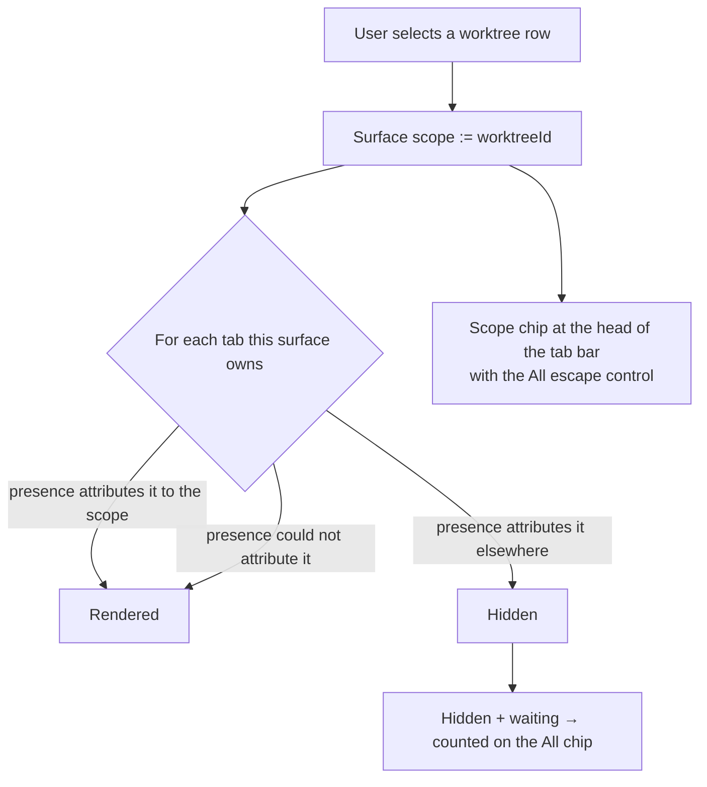

# Worktree Scope & the Scoped Tab Bar

> **Ref**: docs/DESIGN.md § 8.7 — "Selecting a worktree scopes that surface"
> **Consumer**: `asimov-plan` reads this to turn a PLAN.md task into spec deltas and builder tasks.

Selecting a worktree in the Worktree view filters **that surface's own tab bar** to the panes
running inside it. This document owns the scope model, the join it rests on, the escape hatch,
and the layout the composition takes at each location.

Row anatomy and the panel's own structure live in
[worktree-panel-ui.md](worktree-panel-ui.md); the evidence each row carries comes from
[worktree-agent-presence.md](worktree-agent-presence.md).

## 1. Overview



Three properties define the model:

1. **Scope is a filter over a list the extension already owns.** The workbench the redesign
   draws is one webview document — the tab bar, the terminal container, and the vault panel are
   siblings in it (`src/providers/webviewHtml.ts:695-703`), identical across sidebar, panel, and
   editor. No VS Code editor, tab-group, or native-terminal API is involved.
2. **Scope is per surface, and that is the feature.** The sidebar sitting on `main` while the
   panel is scoped to a feature worktree is legal and useful, not a state to reconcile.
3. **A filter that can hide something a human is waited on by must announce it.** The escape
   control carries the count; § 4.2.

## 2. The scope model

### 2.1 What scope is

```ts
/**
 * Which worktree this surface's tab bar is scoped to.
 * `null` is "All" — every pane this surface owns is shown.
 */
type WorktreeScope = string | null; // a WorktreeInfo.id
```

Scope is webview-local state. It is not sent to the host, it is not in the tree or presence
message, and no host handler reads it. Selecting a row changes what this surface renders and
nothing else.

**Scope does not change what a pane is.** A hidden pane keeps running, keeps producing output,
keeps its session, and keeps its place in every other surface. Scope decides what this tab bar
draws, never what exists.

### 2.2 Per surface, not per window

Each surface runs its own `VaultPanel` over its own persisted state (DESIGN.md § 8.6), so scope
follows the same rule as scroll, collapse, and expansion: it is per-surface state, persisted
per surface, and never broadcast. A second surface adopting the first's scope would need a
primary-surface concept the extension does not have.

### 2.3 Considered and out of scope for this round

Recorded so they are not silently re-litigated.

| Model | Shape | Why not now |
|-------|-------|-------------|
| Cross-surface sync | A rail broadcasts `scopeChanged` through the host; other surfaces follow | The host-as-hub RPC exists, but panes belong to one surface, so a sidebar "remote control" needs a *primary terminal surface* concept and a fan-out policy for multi-panel and editor. Revisit as an opt-in "sync scope across surfaces" setting holding one host-side scope every surface follows — which needs no primary |
| Editor tab per worktree | Selecting a worktree opens or focuses a dedicated editor tab | Closest to the reference's feel, but it proliferates tabs, and the editor surface is second-class today — 15 of 16 vault messages are unhandled there. That debt is paid before any default UX bets on the editor. Acceptable later as a manual "Open worktree as tab" action, never as the selection default |

## 3. The join: tab → pane → worktree

### 3.1 Where attribution comes from

The presence projection already maps this window's panes into worktrees: each window-scope row
carries the pane it was projected from, under the worktree that contains that pane's working
directory ([worktree-agent-presence.md](worktree-agent-presence.md) § 3.1). The tab bar joins
its own tabs to those rows by pane identity. No new message, no new field, no second attribution
path — a second one is how the tab bar and the worktree row start disagreeing about the same
pane.

External rows are not this surface's panes and never appear in a tab bar; they are irrelevant
to the join.

### 3.2 What scope hides — and what it never hides

**Scope hides a pane only when presence proves it belongs to a different worktree.** Three
cases, and the third is the one that matters:

| Presence says | Scoped tab bar |
|---------------|----------------|
| This pane is in the scoped worktree | Shown |
| This pane is in some other worktree | Hidden |
| Nothing — no row for this pane | **Shown, in every scope** |

The third row is not a convenience. A pane whose working directory is unknown, or which lies
outside every worktree of every workspace repo, produces no presence row at all. Hiding it
would make it unreachable from a tab bar the user cannot tell is filtered — the same class of
false claim as a spinner that never stops. It follows directly from I1: absence of evidence is
not evidence of absence.

The consequence is stated plainly rather than hidden: a scope is "the panes of this worktree,
plus the ones nothing could place". The scope chip's tooltip says so. There is no fourth outcome
— in particular, being the active pane does not exempt a tab from the filter (§ 3.3).

### 3.3 Selection is navigation

Selecting a worktree is an act of going there, so the terminal region follows the tab bar rather
than staying pinned to whatever was active before:

| After a selection | Result |
|-------------------|--------|
| The scope holds panes | The first in-scope pane becomes active — unless the already-active pane is itself in scope, in which case nothing moves |
| The scope holds none | The empty-scope region (§ 4.3) is shown |

**Nothing is stopped, closed, or detached.** The previously active pane keeps running and keeps
its session; `All` brings its tab straight back and it can be made active again. This is § 7 rule
4 applied to the active pane: scope changes rendering, never process state.

The alternative — pinning the active pane so a selection never moves the user — was rejected. It
creates a fourth attribution outcome that contradicts § 3.2, and it makes the empty-scope region
unreachable whenever any out-of-scope pane happens to be active, which is most of the time. A
selection that leaves the user looking at another worktree's terminal is not a selection.

### 3.4 Scope survives what moves underneath it

- A tree push that does not change attribution changes nothing about the tab bar, and must not
  cost DOM work — the render-signature discipline of
  [worktree-panel-ui.md](worktree-panel-ui.md) § 6.1 covers the scope-derived rendering too.
- A pane whose `cwd` moves to another worktree leaves the scope on the next push. It is not
  closed, hidden without trace, or duplicated.
- The scoped worktree being removed, pruned, or going missing drops scope to `All` and says
  why. It never leaves a surface filtered by a worktree that no longer exists.
- A degraded presence source (I8) never re-attributes a pane on its own: a source that failed
  leaves the last attribution standing rather than silently emptying a scope.

## 4. The escape hatch

### 4.1 The scope chip

While scope is set, the tab bar carries a chip at its head naming the scoped worktree's branch
and holding an **All** control. The chip is not decoration and not dismissible-by-accident: it
is the only thing on screen that says the tab bar is showing a subset, so it is present exactly
when the filter is, and absent when it is not.

`All` clears scope on this surface. It is always reachable, including when the scope is empty
(§ 4.3) and when the panel that set the scope is collapsed or hidden.

### 4.2 The attention badge

**A pane the scope hides can go `waiting` invisibly.** The chip's `All` control therefore
carries a count of hidden panes that need a human — rendered as an attention mark with the
count, e.g. `All · 2`.

The count is over **this surface's own tabs**, not the window: tabs this scope hides whose
state is `waiting`. A pane's `waiting` is taken as true when *either* the presence row for it
or the tab's own tracked status says so. The union is deliberate — the two sources have
different coverage today, and a missed `waiting` is precisely the failure this badge exists to
prevent, while a redundant one costs a glance.

Rules the badge must hold:

- Zero hidden waiting panes renders **no badge at all**, not a `0`. A permanent badge is a
  badge nobody reads.
- The badge is not an error treatment. It is the same attention vocabulary a `waiting` row uses
  ([worktree-panel-ui.md](worktree-panel-ui.md) § 7.2), so a user learns one shape.
- Clearing scope from the badge lands the user on a tab bar that includes the panes it counted;
  the count and the result cannot disagree.

### 4.3 A scope with nothing in it

A worktree with no panes is a normal, common selection — it is the state a freshly created
worktree is in. The terminal region renders the two things worth doing there (open a terminal,
launch an agent), states that other worktrees' panes are hidden, and offers `All`. It is not an
error, carries no error styling, and never auto-clears the scope the user chose.

## 5. Layout by location

The composition is location-dependent, and deliberately so: the same mechanism gets two
appropriate feels.

| Location | Layout |
|----------|--------|
| Panel, editor | Two columns — the worktree rail beside the terminal region. Both are visible at once, so scope reads as "this rail drives that terminal" |
| Sidebar (~300 px) | Stacked, as today. Two columns do not fit; the rail auto-collapses after a selection, giving a "choose → view" flow |

Sidebar auto-collapse is a behaviour of the selection, not a timer: it happens on an explicit
selection and is reversible by the same control that collapsed it. A user who re-expands the
rail keeps it expanded until they select again.

Nothing about scope depends on the layout. A surface in the stacked layout scopes exactly the
way a two-column one does.

## 6. Persisted state

One new per-surface key, alongside those in
[worktree-panel-ui.md](worktree-panel-ui.md) § 2.1:

```
worktreeScope?: string   // a WorktreeInfo.id; absent means All
```

- **Absent means All, and that is the first-run default.** A filter the user never chose is
  never on when they first open the view. Scope is entered only by an explicit selection.
- A persisted scope naming a worktree that is not in the tree the surface now holds resolves to
  `All`. It is not held in the hope the worktree comes back — a filter pinned to something
  absent is a filter with no visible cause.
- State written by an older build has no `worktreeScope` and lands on `All`, which is the
  behaviour that build had.

## 7. Truthfulness rules the scope must encode

1. **A filter is never invisible.** Scope set ⇒ the chip is rendered. There is no state in which
   the tab bar shows a subset with nothing saying so.
2. **A pane that cannot be attributed is never hidden** (§ 3.2).
3. **A hidden pane that needs a human is counted** (§ 4.2).
4. **Scope changes rendering, never process state.** Selecting a worktree starts nothing, stops
   nothing, and closes nothing.
5. **Scope is not a claim about the worktree.** A worktree with no panes in scope is not idle,
   not degraded, and not empty of agents — external rows and other surfaces may hold plenty.

## 8. Edge Cases

| Condition | Behavior |
|-----------|----------|
| Scope set, every tab hidden | § 4.3 empty-scope region; `All` reachable |
| Scope set, one tab unattributable | That tab is shown (§ 3.2) and is not counted by the badge — it was never hidden |
| Scoped worktree removed or pruned | Scope drops to `All`, with a reason |
| Scoped worktree goes `missing` | Scope is kept — the registration exists and panes may still be attributed to it |
| Presence degraded for the pane source | Last attribution stands; scope is not recomputed from an empty result |
| Selecting a scope while an out-of-scope pane is active | The filter applies to it like any other tab; the first in-scope pane becomes active, or the empty-scope region is shown (§ 3.3). The pane keeps running and returns with `All` |
| Two surfaces, different scopes | Both legal; neither is reconciled |
| Sidebar, rail auto-collapsed | The chip and `All` live on the tab bar, so the escape survives the collapse |
| Reduced motion | The rail collapse is instant; the badge does not animate |

## 9. Testing

### Test Cases

- [ ] Selecting a worktree filters this surface's tab bar to its panes and leaves other surfaces alone
- [ ] A pane presence could not attribute stays visible in every scope
- [ ] A pane attributed to another worktree is hidden, and the chip is rendered whenever anything is
- [ ] The `All` control clears scope, and the tab bar then holds every pane it had counted
- [ ] Hidden + `waiting` produces a badge with the count; zero produces no badge at all
- [ ] `waiting` reported by presence alone, and by the tab's own status alone, each raise the badge
- [ ] An empty scope renders its own region with both CTAs and an `All` escape, with no error styling
- [ ] Removing the scoped worktree drops scope to All with a reason; a `missing` one does not
- [ ] Selecting a worktree activates its first in-scope pane, leaves an already-in-scope active pane alone, and shows the empty region when the scope holds none
- [ ] The previously active pane keeps running across a scope change and is reachable again through `All`
- [ ] Scope survives a reload; an absent persisted scope is All; a persisted id not in the tree is All
- [ ] A push that changes no attribution performs no tab-bar DOM work
- [ ] Two surfaces hold different scopes simultaneously, and neither follows the other
- [ ] Sidebar: an explicit selection auto-collapses the rail; re-expanding it survives until the next selection

---

> **Sync rule**: the § 1 diagram must show the same three attribution outcomes as § 3.2.
> **Registry**: values this doc shares with others belong in [DESIGN.md](../DESIGN.md) § 10 — do not keep a second copy here.
