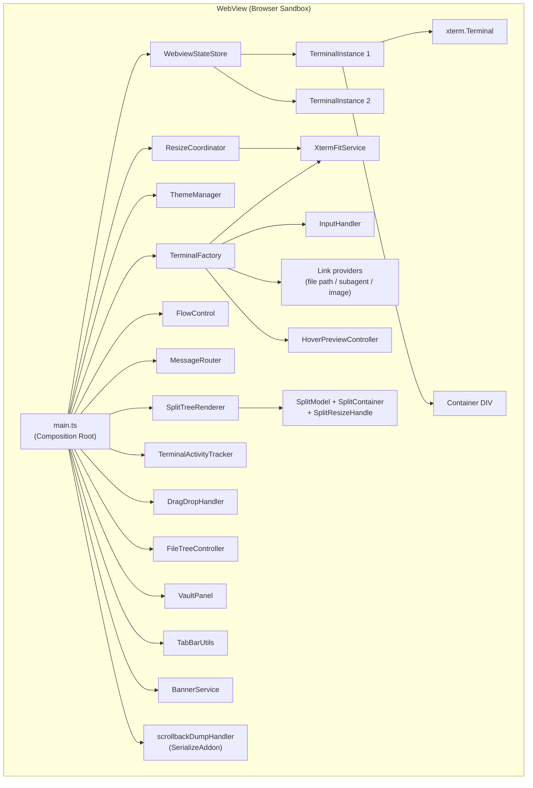
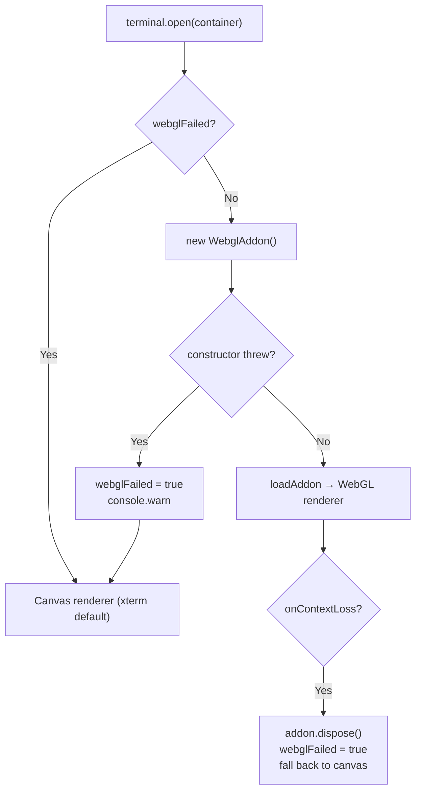
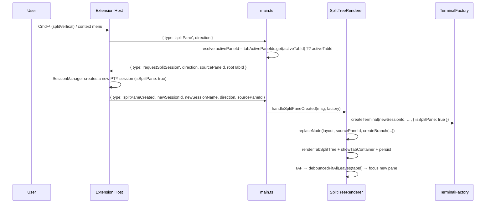

# xterm.js Integration — Detailed Design

## 1. Overview

The webview renders terminal output using [xterm.js](https://xtermjs.org/) v6, the same terminal emulator library used by VS Code's built-in terminal. This document covers initialization, configuration, addon management, link providers, renderer selection, terminal instance lifecycle, and the **split-pane layout model** — all running inside the webview's browser sandbox.

Split panes have no separate design doc; §7 of this document is their canonical description.

### Goals and constraints

- **One factory per webview.** Terminal creation, addon loading, link providers, and OSC handling all funnel through `TerminalFactory` so policy lives in one place — including the failure memory that downgrades WebGL for every subsequent terminal.
- **Nothing is fetched at runtime.** The webview is a single-file IIFE under a `script-src 'nonce-…'` CSP; every addon and grammar is bundled. That rules out lazy addon loading and any dynamic-import-based renderer strategy.
- **Private xterm API is quarantined.** Exactly one file (`XtermFitService`) may reach into `_core`; see `resize-handling.md`.
- **Panes are geometry, sessions are identity.** The split tree describes layout only and must survive `vscode.setState()` as plain JSON — hence pure functions over a discriminated union, no classes (§7).

### Reference Sources
- VS Code: `xtermTerminal.ts`, `xtermAddonImporter.ts`, `terminalInstance.ts`
- xterm.js docs: https://xtermjs.org/docs/

---

## 2. Architecture



### TerminalInstance Interface

Canonical definition: `src/webview/state/WebviewStateStore.ts:19`.

```typescript
interface TerminalInstance {
  id: string;                                        // Session ID (tab id, or split-pane id)
  name: string;                                      // Auto-derived; mutated by OSC title
  customName: string | null;                         // User rename; wins over `name`
  terminal: Terminal;
  container: HTMLDivElement;
  exited: boolean;
  activityStatus: "idle" | "running" | "waiting";
  lastTitleSignature?: string;                       // Spinner-frame render gate
  lastTitleDecorated?: boolean;
  cwd?: string;                                      // Latest OSC 7 cwd (volatile)
}
```

Addon references are not stored on the instance — they are loaded into the terminal and disposed with it.

---

## 3. xterm.js Initialization

### Module Loading

xterm.js and its addons are static `import`s at the top of `TerminalFactory.ts:8-11`. The webview is bundled by esbuild as a single-file IIFE (`esbuild.js:89-121`), so all imports are inlined — there is no lazy loading or module-level addon cache.

### Configuration Mapping Table

`TerminalFactory.createTerminal()` (`TerminalFactory.ts:233-248`) constructs every terminal from one options object. Half the fields are user-settable, half are fixed policy.

| xterm.js Option | Source | Default | Cite |
|----------------|--------|---------|------|
| `scrollback` | `anywhereTerminal.scrollback` | 10000 | `package.json:91`, `TerminalFactory.ts:234` |
| `cursorBlink` | `anywhereTerminal.cursorBlink` | true | `package.json:124`, `TerminalFactory.ts:235` |
| `fontSize` | `anywhereTerminal.fontSize` (0 → inherit) | 14 | `package.json:114`, `TerminalFactory.ts:237` |
| `fontFamily` | `anywhereTerminal.fontFamily` → CSS `--vscode-editor-font-family` → `monospace` | monospace | `package.json:119`, `TerminalFactory.ts:153-157` |
| `theme` | VS Code CSS variables via `ThemeManager.getTheme()` | (auto) | `theme/ThemeManager.ts:47` |
| `minimumContrastRatio` | `ThemeManager` — 7 for high-contrast, 4.5 otherwise | 4.5 | `theme/ThemeManager.ts:105-107` |
| `overviewRuler.width` | Fixed **10** | 10 | `TerminalFactory.ts:247` |
| `cursorStyle`, `drawBoldTextInBrightColors`, `fastScrollSensitivity` (5), `tabStopWidth` (8) | Fixed policy — not contributed settings | — | `TerminalFactory.ts:236,241-244` |
| `macOptionIsMeta` (false), `macOptionClickForcesSelection` (true), `rightClickSelectsWord` (false) | Fixed policy; see `keyboard-input.md` §2 for why Option is *not* Meta | — | `TerminalFactory.ts:239-240,242` |

> `overviewRuler.width` also drives the vertical **scrollbar** width in xterm v6 (`Viewport._getChangeOptions`). 10 px matches Monaco's default so the terminal scrollbar visually matches the file-tree list scrollbar. The decoration lane itself is hidden in CSS (`providers/webviewHtml.ts:674-677`) and its border is set to `transparent` in the theme (`theme/ThemeManager.ts:89`).

### Font Family Resolution

`TerminalFactory.getFontFamily()` (`TerminalFactory.ts:153-157`) reads `--vscode-editor-font-family` off `document.documentElement`, falling back to the literal `"monospace"`.

---

## 4. Addon Loading Strategy

All addons are bundled by esbuild — none are fetched at runtime.

| Addon | Package | Where loaded | Notes |
|-------|---------|--------------|-------|
| `FitAddon` | `@xterm/addon-fit` | `TerminalFactory.ts:251,257` | Loaded, but `.fit()` is **never** called — `XtermFitService.fitTerminal()` replaces it |
| `WebLinksAddon` | `@xterm/addon-web-links` | `TerminalFactory.ts:254-258` | Constructed with a click handler that posts `{ type: "openLink", url }` — VS Code webviews block `window.open`, so the host calls `vscode.env.openExternal()` |
| `WebglAddon` | `@xterm/addon-webgl` | `TerminalFactory.ts:412-425` (and `:117-130` for deferred terminals) | Attempted after `open()`; static failure memory |
| `SerializeAddon` | `@xterm/addon-serialize` | `main.ts:14,483` | Not attached at creation. A fresh instance is created **per scrollback dump**, loaded, serialized, disposed (`messaging/scrollbackDumpHandler.ts:119-146`) |

> `SerializeAddon` is imported eagerly rather than via `await import(...)`: the webview build is single-file IIFE, so a dynamic import would still inline the module — only its top-level execution would be deferred (`main.ts:473-479`).

### WebGL Loading Strategy

WebGL is loaded immediately after `terminal.open()`. There is no `gpuAcceleration` setting.

1. If `webglFailed` is already set, skip entirely (`TerminalFactory.ts:66,412`).
2. Construct `new WebglAddon()`, register `onContextLoss` → dispose + set `webglFailed = true`.
3. `terminal.loadAddon(webglAddon)`.
4. A synchronous throw sets `webglFailed = true`.

`webglFailed` is a **per-factory instance field** (`TerminalFactory.ts:66`), and there is exactly one factory per webview (`main.ts:109`) — so one failure disables WebGL for every subsequent terminal in that webview.

The same block is duplicated in `attachDeferredTerminal()` (`TerminalFactory.ts:115-131`), used by the session-restore path which calls `terminal.open()` late (see §6).

---

## 5. Renderer Selection



### Key Design Decisions

1. **Canvas first, upgrade immediately** — `terminal.open(container)` brings up the DOM/canvas renderer; WebGL is layered on right after. Loading WebGL before `open()` is meaningless because `open()` attaches the canvas.
2. **Failure memory is per factory, not per terminal** — avoids re-paying a failing GPU init on every new tab.
3. **Context loss is graceful** — the browser can reclaim GPU memory; `onContextLoss` disposes the addon and lets xterm's canvas renderer take over.
4. **Custom fit replaces `FitAddon.fit()`** — see `resize-handling.md`.

---

## 6. Terminal Instance Lifecycle

### Creation Sequence

`TerminalFactory.createTerminal(id, name, config, isActive, customName?, options?)` — `TerminalFactory.ts:203`.

```mermaid
sequenceDiagram
    participant TF as TerminalFactory
    participant DOM as Document
    participant XT as xterm.Terminal
    participant WGL as WebglAddon

    TF->>DOM: container DIV (100%×100%), display per isActive,<br>dataset.vscodeContext = {webviewSection, paneSessionId}
    TF->>DOM: append to #terminal-container
    TF->>XT: new Terminal(options); loadAddon(Fit, WebLinks)
    TF->>TF: hover stack — syntax + markdown renderers, popup,<br>hoverControllers.set(id), pastedImageStores.set(id)
    TF->>XT: registerLinkProvider ×3 (file path / subagent / image)
    alt deferOpen !== true
        TF->>XT: terminal.open(container)
        TF->>WGL: try WebGL (§5)
    end
    TF->>XT: wire onData / onResize / onTitleChange / OSC 7 /<br>attachCustomKeyEventHandler (see Event Wiring)
    TF->>TF: store.terminals.set(id, instance)
    alt !isSplitPane
        TF->>TF: seed tabLayouts leaf + tabActivePaneIds, persist()
        TF->>TF: setTimeout(0) → fit + focus if active
    end
```

### Event Wiring

| Event | Handler | Action | Cite |
|-------|---------|--------|------|
| `terminal.onData` | inline | `postMessage({type:'input', tabId, data})` — **skipped when `instance.exited`** | `TerminalFactory.ts:188-196` |
| `terminal.onResize` | inline | `postMessage({type:'resize', tabId, cols, rows})` — immediate, not debounced | `TerminalFactory.ts:429-431` |
| `terminal.write` callback | `flowControl.ackChars(len, tabId)` | Per-session flow-control ack | `main.ts:494-500` |
| `terminal.onTitleChange` | `applyTitleChange` | Sets `instance.name` to the raw title; re-renders the tab bar only when the *signature* changed | `TerminalFactory.ts:451-453`, `terminal/titleSignature.ts:60` |
| `terminal.onTitleChange` (2nd) | `clearWaitingOnCursorTitleLoss` | Clears the Cursor "waiting" flag when the strict Cursor title is lost | `main.ts:102-106,531` |
| `terminal.parser.registerOscHandler(7)` | inline | Parses `ESC ]7;file://host/path BEL` into `instance.cwd` | `TerminalFactory.ts:465-519` |
| `customKeyEventHandler` | `createKeyEventHandler(deps)` | Clipboard/keybinding intercept — see `keyboard-input.md` | `TerminalFactory.ts:175-186` |
| `ResizeObserver` on `#terminal-container` | `ResizeCoordinator.debouncedFit()` | 100 ms debounce — see `resize-handling.md` | `resize/ResizeCoordinator.ts:73-93` |

### OSC 7 Current-Directory Tracking

The OSC 7 handler (`TerminalFactory.ts:465-519`) is the webview's only shell-integration input. It is defensive because *any* process inside the PTY (including a remote SSH session) can emit it:

| Gate | Value | Cite |
|---|---|---|
| Max **encoded** payload | 16384 bytes (`data.length`) | `TerminalFactory.ts:470` |
| Max **decoded** path | 4096 chars (Linux `PATH_MAX`) | `TerminalFactory.ts:492` |
| Control bytes | `[\x00-\x1f\x7f]` rejected | `TerminalFactory.ts:504` |
| Absolute-path requirement | `/…` or `X:\…` / `X:/…` | `TerminalFactory.ts:507` |
| `" (deleted)"` suffix | rejected (same predicate as `src/pty/processCwd.ts` `sanitize()`) | `TerminalFactory.ts:514` |

The handler always returns `false` so other OSC 7 listeners still see the sequence.

`instance.cwd` drives the right-click "Reveal in File Tree" command and seeds the AI-vault folder filter — but the *authoritative* pane cwd comes from the host via `requestVaultContextCwd` / `vaultContextCwd` (`main.ts:271-286`), because OSC 7 requires shell integration.

### Terminal Link Providers

Three custom providers are registered per terminal, in addition to `WebLinksAddon`'s URL matching. xterm allows multiple providers; they do not interfere.

| Provider | Matches | On activate | Cite |
|---|---|---|---|
| `FilePathLinkProvider` | file paths (with optional `:line`) in output | `postMessage({type:'openFile', path, sessionId, line?})`; hover → `HoverPreviewController` | `TerminalFactory.ts:372-380` |
| `SubagentLinkProvider` | Claude CLI subagent (Task) header lines | opens the singleton subagent popup + `postMessage({type:'requestSubagentPreview', …})` | `TerminalFactory.ts:385-390,675-681` |
| `ImagePlaceholderLinkProvider` | `[Image #N]` / `[Image N]` placeholders | hover → renders the blob captured at paste time from that session's `PastedImageStore` | `TerminalFactory.ts:394-400` |

Two per-session caches back these providers and share the terminal's lifetime:

- `hoverControllers: Map<sessionId, HoverPreviewController>` (`TerminalFactory.ts:89`) — `main.ts` fans `filePreviewResult` out across it (`main.ts:643-651`).
- `pastedImageStores: Map<sessionId, PastedImageStore>` (`TerminalFactory.ts:97`) — disposed alongside the hover controller so its object URLs are revoked (`TerminalFactory.ts:646-648`).

The subagent preview popup is a **single factory-owned instance** mounted on `document.body` (`TerminalFactory.ts:75`), disposed on every teardown path — tab switch, tab close, pane close (`main.ts:394,433,594,603`).

### Deferred Open (session restore)

`createTerminal(..., { deferOpen: true })` skips `terminal.open()` and the WebGL block. The session-restore router writes the persisted buffer + restore divider into the detached terminal, then calls `attachDeferredTerminal()` so the first rendered frame already carries the restored content (`main.ts:790-848`, `TerminalFactory.ts:115-131`).

`createTerminal(..., { isSplitPane: true })` skips two per-tab side effects: the `tabLayouts` leaf initialization and the `setTimeout(0)` fit. A split child's container is reparented by `renderTabSplitTree` *after* the constructor returns, so an immediate measurement would read a detached 0×0 box and emit a stale resize IPC (`TerminalFactory.ts:524-554`).

### Disposal

`removeTerminal()` in `main.ts:424-469`:

1. `factory.disposeSubagentPopup()` — the popup lives on `document.body`, so it does not die with the container.
2. `factory.disposeHoverController(id)` — **before** the terminal goes away, so DOM listeners detach while the element still exists. This also disposes the pasted-image store.
3. `instance.terminal.dispose()` + `instance.container.remove()`.
4. Drop from `store.terminals`, `cursorHookIdentity`, `activityTracker`, `flowControl`.
5. `splitRenderer.removeTab(id)` returns every split-pane session id it tore down; each gets the same tracker/controller cleanup.
6. `store.persist()`, then switch to the last remaining tab or request a new one.

### Disposal Guard After Async Operations

The post-creation fit is deferred to a `setTimeout(0)` so the container has real dimensions. By the time it runs the tab may already be closed, so it re-checks `store.terminals` for the id before fitting or focusing — otherwise it would resurrect a disposed instance (`TerminalFactory.ts:545-548`).

---

## 7. Split Panes (canonical)

Split panes are a **webview-side layout** over host-side sessions. Every pane is a full `TerminalInstance` with its own PTY session; the tree only describes geometry.

### 7.1 Data Model — `src/webview/SplitModel.ts`

A JSON-serializable discriminated union of pure functions — no classes, so the whole tree round-trips through `vscode.setState()`.

```typescript
type SplitDirection = "horizontal" | "vertical";   // horizontal = stacked, vertical = side-by-side
interface LeafNode   { type: "leaf";   sessionId: string }
interface BranchNode { type: "branch"; direction: SplitDirection;
                       children: [SplitNode, SplitNode]; ratio: number }  // ratio = first child's share
type SplitNode = LeafNode | BranchNode;
```

Canonical definitions at `SplitModel.ts:9-30`. Branches are binary by construction — an N-way split is nested branches.

| Function | Behavior | Cite |
|---|---|---|
| `createLeaf(sessionId)` | leaf factory | `SplitModel.ts:34` |
| `createBranch(dir, a, b, ratio = 0.5)` | branch factory, **default ratio 0.5** | `SplitModel.ts:39` |
| `findLeaf(root, id)` | depth-first lookup | `SplitModel.ts:46` |
| `getAllSessionIds(root)` | in-order leaf ids | `SplitModel.ts:54` |
| `removeLeaf(root, id)` | immutable removal; collapses the parent branch into the surviving sibling; returns `null` when the root leaf itself is removed | `SplitModel.ts:68` |
| `replaceNode(root, id, sub)` | immutable leaf → subtree replacement (this is how a split is applied) | `SplitModel.ts:107` |
| `updateBranchRatio(root, branchIndex, ratio)` | immutable ratio write, addressed by **depth-first branch index** | `SplitModel.ts:127` |

### 7.2 Rendering — `src/webview/SplitContainer.ts`

`renderSplitTree(node, parent, callbacks, state?)` (`SplitContainer.ts:37`) walks the tree into nested flexbox DOM:

- **Leaf** → `div.split-leaf` with `data-session-id`, `dataset.vscodeContext = {webviewSection:'splitPane', paneSessionId}`, `flex: 1`, `min-width/min-height: 0`. `onLeafMounted(sessionId, el)` lets the caller reparent the terminal's container into it.
- **Branch** → `div.split-branch`, `flex-direction: column` for `horizontal` and `row` for `vertical`, containing `[child1, div.split-handle, child2]`. `child1.style.flex = ratio`, `child2.style.flex = 1 - ratio`.
- Each handle carries `data-branch-index` = its **pre-order** index, the same index `updateBranchRatio()` uses — this is what keeps model and DOM in sync (`SplitContainer.ts:79-91`).

Handle styling lives in the HTML shell: a 1 px separator at rest that becomes a full sash on hover (`providers/webviewHtml.ts:626-666`).

### 7.3 Drag-to-Resize — `src/webview/SplitResizeHandle.ts`

`attachResizeHandle(handle, branchEl, direction, callbacks)` (`SplitResizeHandle.ts:36`) uses `setPointerCapture` for reliable tracking and returns a cleanup function.

| Constant | Value | Cite |
|---|---|---|
| `MIN_PANE_SIZE` | **80 px** — clamps the ratio so neither child shrinks below it | `SplitResizeHandle.ts:13` |

During the drag only inline `flex` values change (no model write, no refit). On `pointerup`/`pointercancel` it fires `onRatioChange(finalRatio)` → `updateBranchRatio` + `store.persist()`, then `onResizeComplete()` → `resizeCoordinator.debouncedFitAllLeaves(tabId)` (`split/SplitTreeRenderer.ts:143-157`).

### 7.4 Orchestration — `src/webview/split/SplitTreeRenderer.ts`

| Method | Responsibility | Cite |
|---|---|---|
| `renderTabSplitTree(tabId)` | find/create `div[data-tab-id]`, run prior handle cleanups, clear + re-render the tree, reparent terminal containers, wire click-to-focus, attach resize handles | `SplitTreeRenderer.ts:61` |
| `showTabContainer` / `hideTabContainer` | `display: flex` / `none` on the tab container | `SplitTreeRenderer.ts:169,217` |
| `updateActivePaneVisual(tabId)` | `.active-pane` on the active leaf — **only when the layout is a branch** (no indicator for single-pane tabs) | `SplitTreeRenderer.ts:185-212` |
| `removeTab(tabId)` | dispose every non-root pane terminal, post `requestCloseSplitPane` per pane, remove the DOM container, drop layout/active-pane/cleanup state; returns the disposed split session ids | `SplitTreeRenderer.ts:233` |
| `closeSplitPaneById(paneSessionId)` | `removeLeaf` → if the tree empties or was a lone leaf, post `closeTab` instead; otherwise dispose the pane, post `requestCloseSplitPane`, re-render, refit, focus the surviving first leaf | `SplitTreeRenderer.ts:283` |
| `handleSplitPaneCreated(msg, factory)` | create the pane terminal with `isSplitPane: true`, `replaceNode(sourcePaneId, createBranch(direction, source, new))`, set it active, re-render, refit, focus | `SplitTreeRenderer.ts:349` |

### 7.5 Split Creation Round-Trip



The `splitPaneAt` variant carries an explicit `sourcePaneId` (right-click on a specific pane): main.ts makes that pane active first, then sends the same `requestSplitSession` (`main.ts:606-617`).

### 7.6 Active-Pane Resolution

`activeTabId` is a **root-tab** concept; a split pane is never `activeTabId` (`TerminalFactory.ts:530-533`). The active *pane* is `store.tabActivePaneIds.get(activeTabId) ?? activeTabId` — this expression is repeated at every call site that needs a routing target (`main.ts:236`, `main.ts:1084`, `main.ts:1192`, `main.ts:1238`, `SplitTreeRenderer.ts:197`).

Two events can advance it, and they race:

1. The leaf `mousedown` handler (`SplitTreeRenderer.ts:108-131`).
2. The document-level `focusin` handler, which reads DOM ground truth via `event.target.closest('.split-leaf')` because xterm calls `textarea.focus()` inside its own `mousedown` — so `focusin` can fire while `tabActivePaneIds` still points at the previous pane (`main.ts:1298-1321`).

Whichever wins performs the state write plus one `syncVaultToActivePane()`; the loser's same-pane early-return makes it a no-op.

### 7.7 Persistence

`WebviewStateStore.persist()` writes `tabLayouts` and `tabActivePaneIds` into `vscode.setState()` (`state/WebviewStateStore.ts:214-224`). `restore()` validates each entry has a `type` field, and only accepts a persisted active pane if `getAllSessionIds(layout)` still contains it (`state/WebviewStateStore.ts:231-264`).

On `init`, main.ts drops restored layouts for tabs the host did not report, re-renders every branch layout, and schedules `debouncedFitAllLeaves` per split root — without that refit, restored panes keep the 0×0 canvas they were opened with while hidden (`main.ts:856-913`).

---

## 8. Tab Switching

Multiple xterm.js instances live simultaneously; only one root tab is visible. Switching toggles CSS `display` — `switchTab()` in `main.ts:385-422`:

1. `factory.disposeSubagentPopup()` — a keyboard-driven switch would otherwise leave the body-mounted popup over the new tab.
2. Hide the previous tab: `splitRenderer.hideTabContainer(prev)` **and** `prev.container.style.display = "none"`.
3. `store.activeTabId = newTabId`; `showTabContainer(newTabId)`; `next.container.style.display = "block"`.
4. `requestAnimationFrame` → `factory.fitAllAndFocus(newTabId, next)` — fits every leaf in the tab's layout, then focuses the active pane (`TerminalFactory.ts:609-628`).
5. `updateActivePaneVisual`, `updateTabBar`, `syncVaultToActivePane`, and `postMessage({type:'switchTab', tabId})`.

### Why Not Destroy/Recreate?

Keeping hidden terminals alive preserves the scrollback buffer, cursor position and modes, and makes switching instant. The memory cost is acceptable for typical tab counts.

### Tab Bar Render Gate

`applyTitleChange` (`terminal/titleSignature.ts:60`) suppresses a tab-bar re-render when the new OSC title differs only by a decorative spinner glyph. Agent TUIs rewrite the title ~10×/second; `renderTabBar` rebuilds a Map and runs `querySelectorAll`, so ungated this is pure churn.

| Constant | Value | Cite |
|---|---|---|
| Decorative frame glyphs | `/[⠀-⣿◐-◓]/g` — Braille U+2800–U+28FF plus quarter circles U+25D0–U+25D3 | `titleSignature.ts:17` |
| `MAX_GATED_TITLE_CHARS` | 1024 — longer titles skip the gate and always render | `titleSignature.ts:31` |

Both the stripped signature **and** whether the title carried a frame glyph are compared: the label renders the raw name, so `⠋ Fix tests` → `Fix tests` is a visible change with an identical signature (`titleSignature.ts:77-80`).

---

## 9. Configuration Updates

On a `configUpdate` message, `TerminalFactory.applyConfig()` (`TerminalFactory.ts:563-603`) writes each provided field into `store.currentConfig` — so future tabs inherit it — and then into every live `terminal.options`.

Only four keys are handled — `fontSize`, `cursorBlink`, `scrollback`, `fontFamily` (`TerminalFactory.ts:565-576`). Font size/family change cell dimensions, so those two trigger a refit; the refit's `terminal.resize()` fires `onResize`, which posts the new cols/rows to the host, which calls `pty.resize()`.

---

## 10. Dependencies (npm packages)

All bundled into `media/webview.js` (`esbuild.js:106-107`). Versions from `package.json:624-629`:

| Package | Version | Purpose |
|---------|---------|---------|
| `@xterm/xterm` | `^6.0.0` | Core terminal emulator |
| `@xterm/addon-fit` | `^0.11.0` | Loaded but `.fit()` unused — `XtermFitService` replaces it |
| `@xterm/addon-serialize` | `^0.14.0` | Scrollback export + host-side snapshot persistence |
| `@xterm/addon-web-links` | `^0.12.0` | Clickable URLs, routed through the host |
| `@xterm/addon-webgl` | `^0.19.0` | GPU rendering |
| `@xterm/headless` | `^6.0.0` | Extension-host-side headless terminal (not in the webview bundle) |

### CSS

`@xterm/xterm/css/xterm.css` is copied to `media/xterm.css` by an esbuild `onEnd` plugin (`esbuild.js:39-62`) and loaded via a `<link>` tag in the HTML shell (`providers/webviewHtml.ts:68,81`). It is not inlined, which keeps it cacheable and keeps the CSP `style-src` story simple.

---

## 11. File Locations

| File | Role |
|---|---|
| `main.ts` (1347) | Composition root — wires every module below |
| `terminal/TerminalFactory.ts` | Terminal creation, addons, link providers, OSC 7, config |
| `terminal/titleSignature.ts` | Spinner-frame-insensitive tab-bar render gate |
| `terminal/TerminalActivityTracker.ts` | idle / running / waiting projection |
| `terminal/CursorApprovalDetector.ts` | Cursor approval-dialog detection from the screen tail |
| `terminal/restoreDivider.ts` | Restored-session divider formatter |
| `resize/XtermFitService.ts` | Custom `fitTerminal()` — sole xterm private-API user |
| `resize/ResizeCoordinator.ts` | ResizeObserver, debounce, visibility |
| `theme/ThemeManager.ts` | CSS variable → `ITheme`, MutationObserver |
| `state/WebviewStateStore.ts` | Terminals, layouts, active panes, persisted state |
| `state/WebviewState.ts` | Typed shape of the `vscode.setState()` payload |
| `messaging/MessageRouter.ts` | Typed dispatch table for `ExtensionToWebViewMessage` |
| `messaging/scrollbackDumpHandler.ts` | SerializeAddon dump, per-tab in-flight dedup |
| `flow/FlowControl.ts` | Per-session ack batching |
| `InputHandler.ts` | `createKeyEventHandler()` factory |
| `ui/BannerService.ts`, `ui/Tooltip.ts` | Banner + shared hover-tooltip widgets |
| `SplitModel.ts`, `SplitContainer.ts`, `SplitResizeHandle.ts`, `split/SplitTreeRenderer.ts` | Split tree — model, DOM, sash, orchestration (§7) |
| `TabBarUtils.ts`, `tabRenameOverlay.ts` | Tab bar data/render + inline rename overlay |
| `DragDropHandler.ts`, `imagePasteBridge.ts` | Drop-path insertion, image paste capture |

All paths relative to `src/webview/`.

`src/webview/ClickCursorHandler.ts` no longer exists — the plain-click cursor-movement feature was removed. Nothing in `src/` references `createClickCursorHandler`.

---

## 12. Boundaries and Non-Goals

| Not done here | Where it lives instead |
|---|---|
| Deciding *when* to fit | `ResizeCoordinator` — this doc's factory only exposes `fitTerminal(instance)` (`resize-handling.md`) |
| Building the `ITheme` | `ThemeManager`; the factory only reads `getTheme()` / `getMinimumContrastRatio()` (`theme-integration.md`) |
| Key interception policy | `InputHandler` + the document-level layers (`keyboard-input.md`) |
| Session lifecycle, PTY ownership | `SessionManager` on the host; a pane is a webview object over a host session (`webview-provider.md` §9) |
| Message payload shapes | `src/types/messages.ts` and `message-protocol.md` |

Deliberate non-goals: no renderer preference setting (WebGL is attempted once, then remembered as failed), no addon lazy-loading, and no second `TerminalFactory` per split root — panes share the webview's single factory.

